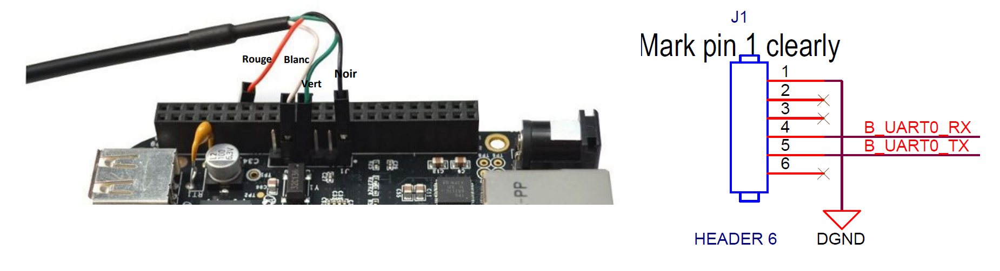
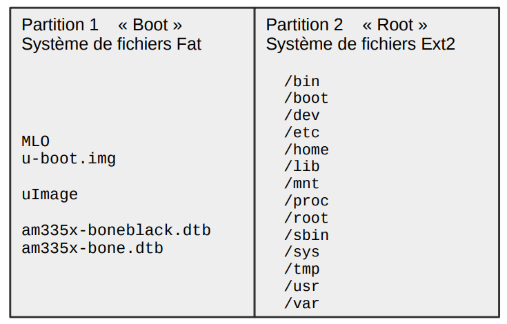

# Beaglebone
BeagleBone sont des ordinateur monocarte destiné aux développeurs. Il existe en plusieurs format : BeagleBone Al, Blue, Pocket, Black Wireless, Black, White etc ... Un tableau de comparaison est disponible ici : https://fr.farnell.com/b/beagleboard

BeagleBone® Black est la carte de développement la plus populaire chez les développeurs et les amateurs d’électronique. C’est un outil faible coût, avec beaucoup d’extension axé sur la BeagleBoard® avec un processeur ARM Cortex A8 Sitara AM3358BZCZ100 de Texas Instruments. La carte démarre sous Linux en moins de 10 sec et l’utilisateur peut commencer le développement en moins de 5 min avec un simple câble USB.

Nous utiliserons la carte BeagleBoneBlack pour la suite mais la démarche reste identique peut importe la carte.

# Flasher une nouvelle carte BeagleBone

Sous Windows : se rendre sur le site : https://beagleboard.org/latest-images
Télécharger la dernière version de Debian disponible :
AM5729 : Pour BeagleBoard-X15 et BeagleBone Al
AM3358 : Pour PocketBeagle, BeagleBone, BeagleBone Black, BeagleBone Black Wireless, BeagleBone Black Industrial, BeagleBone Blue, SeeedStudio BeagleBone Green, SeeedStudio BeagleBone Green Wireless, SanCloud BeagleBone Enhanced, Arrow BeagleBone Black Industrial and Mentorel BeagleBone uSomIQ

Pour flasher facilement une image : j'utilise l'outil ElenaBatcher https://www.balena.io/etcher/

Il suffit simplement de connecter une carte SD sur l'ordinateur (avec adaptateur si besoin).

De sélectionner le fichier image de beaglebone précédement téléchargé : de choisir le bon périphérique et de cliquer sur le boutton "Flasher".

Attendre quelques minutes : c'est FAIT !

Mettre la carte SD dans le Beaglebone (hors tension) puis brancher le beaglebone.

Pour rendre le flash persistant : il faut aller dans le fichier :
*/boot/uEnv.txt*

Et à la fin du fichier il suffit de décommenter cette ligne :
```
#cmdline=init=/opt/scripts/tools/eMMC/init-eMMC-flasher-v3.sh
```

Et lancer un reboot.

Un jeu de chenillard au niveau des leds utilisateur commence alors : le flash est terminé lorsque toutes les leds sont eteintes.

Il suffit alors de débrancher le beaglebone, retirer la carte sd et rebrancher.
C'est Terminé !

# Accéder au terminal port série du BeagleBoneBlack

Sur le connecteur J1 du BeagleBoneBlack, un point permet de repérer la broche1 du connecteur :
Faire la liaison suivante avec un cable USB --> TTL

|  Connecteur J1| USB -> TTL|
| ------------- | --------- |
|        GND    |     GND   |
|        RX     |     TX    |
|        TX     |     RX    |




A l'aide de Putty et à la vitesse de 115200 sur le port COM correct :

On obtient la sortie UART avec l'U-Boot au démarrage de ce dernier:

```
U-Boot SPL 2019.04-00002-g07d5700e21 (Mar 06 2020 - 11:24:55 -0600)
Trying to boot from MMC2
Loading Environment from EXT4... Card did not respond to voltage select!


U-Boot 2019.04-00002-g07d5700e21 (Mar 06 2020 - 11:24:55 -0600), Build: jenkins-github_Bootloader-Builder-137

CPU  : AM335X-GP rev 2.1
I2C:   ready
DRAM:  512 MiB
No match for driver 'omap_hsmmc'
No match for driver 'omap_hsmmc'
Some drivers were not found
Reset Source: Power-on reset has occurred.
RTC 32KCLK Source: External.
MMC:   OMAP SD/MMC: 0, OMAP SD/MMC: 1
Loading Environment from EXT4... Card did not respond to voltage select!
Board: BeagleBone Black
<ethaddr> not set. Validating first E-fuse MAC
BeagleBone Black:
Model: Element14 BeagleBone Black Industrial:
BeagleBone: cape eeprom: i2c_probe: 0x54:
BeagleBone: cape eeprom: i2c_probe: 0x55:
BeagleBone: cape eeprom: i2c_probe: 0x56:
BeagleBone: cape eeprom: i2c_probe: 0x57:
Net:   eth0: MII MODE
cpsw, usb_ether
Press SPACE to abort autoboot in 0 seconds
board_name=[A335BNLT] ...
board_rev=[EIA0] ...
Card did not respond to voltage select!
Card did not respond to voltage select!
Card did not respond to voltage select!
gpio: pin 56 (gpio 56) value is 0
gpio: pin 55 (gpio 55) value is 0
gpio: pin 54 (gpio 54) value is 0
gpio: pin 53 (gpio 53) value is 1
Card did not respond to voltage select!
Card did not respond to voltage select!
switch to partitions #0, OK
mmc1(part 0) is current device
Scanning mmc 1:1...
gpio: pin 56 (gpio 56) value is 0
gpio: pin 55 (gpio 55) value is 0
gpio: pin 54 (gpio 54) value is 0
gpio: pin 53 (gpio 53) value is 1
switch to partitions #0, OK
mmc1(part 0) is current device
gpio: pin 54 (gpio 54) value is 1
Checking for: /uEnv.txt ...
Checking for: /boot.scr ...
Checking for: /boot/boot.scr ...
Checking for: /boot/uEnv.txt ...
gpio: pin 55 (gpio 55) value is 1
2062 bytes read in 12 ms (167 KiB/s)
Loaded environment from /boot/uEnv.txt
Checking if uname_r is set in /boot/uEnv.txt...
gpio: pin 56 (gpio 56) value is 1
Running uname_boot ...
loading /boot/vmlinuz-4.19.94-ti-r42 ...
10095592 bytes read in 651 ms (14.8 MiB/s)
debug: [enable_uboot_overlays=1] ...
debug: [enable_uboot_cape_universal=1] ...
debug: [uboot_base_dtb_univ=am335x-boneblack-uboot-univ.dtb] ...
uboot_overlays: [uboot_base_dtb=am335x-boneblack-uboot-univ.dtb] ...
uboot_overlays: Switching too: dtb=am335x-boneblack-uboot-univ.dtb ...
loading /boot/dtbs/4.19.94-ti-r42/am335x-boneblack-uboot-univ.dtb ...
162266 bytes read in 41 ms (3.8 MiB/s)
uboot_overlays: [fdt_buffer=0x60000] ...
uboot_overlays: loading /lib/firmware/BB-ADC-00A0.dtbo ...
867 bytes read in 218 ms (2.9 KiB/s)
uboot_overlays: loading /lib/firmware/BB-BONE-eMMC1-01-00A0.dtbo ...
1584 bytes read in 131 ms (11.7 KiB/s)
uboot_overlays: loading /lib/firmware/BB-HDMI-TDA998x-00A0.dtbo ...
4915 bytes read in 308 ms (14.6 KiB/s)
uboot_overlays: loading /lib/firmware/AM335X-PRU-RPROC-4-19-TI-00A0.dtbo ...
3801 bytes read in 201 ms (17.6 KiB/s)
loading /boot/initrd.img-4.19.94-ti-r42 ...
6589689 bytes read in 430 ms (14.6 MiB/s)
debug: [console=ttyO0,115200n8 bone_capemgr.uboot_capemgr_enabled=1 root=/dev/mmcblk1p1 ro rootfstype=ext4 rootwait coherent_pool=1M net.ifnames=0 lpj=1990656 rng_core.default_quality=100 quiet] ...
debug: [bootz 0x82000000 0x88080000:648cf9 88000000] ...
## Flattened Device Tree blob at 88000000
   Booting using the fdt blob at 0x88000000
   Loading Ramdisk to 8f9b7000, end 8ffffcf9 ... OK
   Loading Device Tree to 8f92b000, end 8f9b6fff ... OK

Starting kernel ...

[    0.002161] timer_probe: no matching timers found
[    0.195606] l4_wkup_cm:clk:0010:0: failed to disable
[    1.415268] omap_voltage_late_init: Voltage driver support not added

Debian GNU/Linux 10 beaglebone ttyS0

BeagleBoard.org Debian Buster IoT Image 2020-04-06

Support: http://elinux.org/Beagleboard:BeagleBoneBlack_Debian

default username:password is [debian:temppwd]

beaglebone login: debian
Password:
Last login: Mon Mar  8 12:59:53 UTC 2021 on ttyS0

The programs included with the Debian GNU/Linux system are free software;
the exact distribution terms for each program are described in the
individual files in /usr/share/doc/*/copyright.

Debian GNU/Linux comes with ABSOLUTELY NO WARRANTY, to the extent
permitted by applicable law.
debian@beaglebone:~$
```
# Construction d'une image BeagleBone

Nous allons à présent installer notre « Linux embarqué » sur la carte SD afin de l’utiliser pour notre
BeagleBone.
Pour se faire, il nous faut préparer la carte micro SD dans un premier temps.
Il convient de formater correctement la carte SD.

De créer les fichiers qui vont être inclus dans la carte SD Bootable.
Afin d'y mettre les fichiers qui permettront au système de s'executer correctement.

## Formatage de la carte SD

Nous devons créer deux partitions sur la carte micro SD :
- Une première partition pour le bootloader. Cette partition doit être conforme avec les exigences
de la plateforme AM335x afin qu’elle puisse trouver le programme de démarrage sur la partition.
On utilisera le système de fichiers FAT16. Nous allons y stocker le bootloader (MLO et u-boot.img),
l’image du noyau (zImage), la device tree (am335x-boneblack.dtb), et un script U-Boot spécial
permettant de définir la séquence de démarrage (uEnv .txt).
- La deuxième partition contiendra le système de fichiers à déployer sur la carte. On peut utiliser
n’importe quel système de fichiers. Nous choisissons ext4.



La première chose à faire est d’identifier le nom de la carte micro SD une fois connectée à votre PC. Comme
nous travaillons sur la VM, nous allons d’abord connecter la carte (grâce au lecteur de carte disponible à la 
demande) au PC, puis l’activer sur la VM (sur le menu de la VM, allez sur « Périphérique », puis « USB » et
sélectionnez le lecteur de cartes.
Ubuntu devrait monter le système de fichiers automatiquement, vous pouvez donc regarder sur
/proc/partitions pour y trouver votre carte SD.

Le nom devrait commencer par sdX2
(sdb, sdc, ...). Attention à
ne pas utiliser sda qui représente le disque de votre machine (VM dans votre cas).
Si votre carte micro SD est représentée par le périphérique /dev/sdc, les partitions seront donc nommées
/dev/sdc1 et /dev/sdc2 respectivement.

Afin de formater la carte SD, il y a plusieurs alternatives : 

### Alternative 1
On exécutera les étapes suivantes en ligne de commande: 

- Démonter les partitions de la carte SD
- Effacer le début de la carte SD : pour faire de la place à la partition boot

Utilisez le bon sdX en fonction de votre système.
```
sudo dd if=/dev/zero of=/dev/sdX bs=1M count=16 
```

Créer deux partitions :
o Lancez l’outil cfdisk avec : $ sudo cfdisk /dev/sdX
o Choisissez la table de partition « dos »
o Créer une « nouvelle » petite partition (16Mo), primaire, avec le type « e » (W95 FAT16) et
marquez cette partition comme « bootable » (ou amorçable)
o Créez une seconde partition, « primaire » aussi, avec le reste d’espace disponible, comme
type, vous utiliserez le « 83 » (Linux).
o Vous pouvez « Ecrire » la table des partitions et sortir de cfdisk
- Nous allons, à présent, formater les partitions, on commence par celle en FAT16

```
 sudo mkfs.vfat –F 16 –n boot /dev/sdX1
```

Puis la seconde partition  en ext4:

```
sudo mkfs.ext4 –L rootfs –E nodiscard /dev/sdX2
ou
sudo mkfs.ext4 -F -O ^64bits -L "'/dev/sdX2'
```

Nous pouvons à présent débrancher la carte et la rebrancher afin qu’elle soit détectée par Ubuntu.
Normalement, vous devriez trouver une partition /media/boot et une autre /media/rootfs pour les 2 partitions
sur la carte.

### Alternative 2
En utilisant l'utilitaire gparted ou fdisk.
Pour mieux s'y retrouver on peut rajouter une étiquette aux deux partitions.
-> *boot* pour la partition boot
-> Et *rootfs* pour la partition filesystem.


Nous pouvons à présent débrancher la carte et la rebrancher afin qu’elle soit détectée par Ubuntu.
Normalement, vous devriez trouver une partition /media/boot et une autre /media/rootfs pour les 2 partitions
sur la carte.


# Construction des fichiers

## Avec Buildroot

Prérequis :
```
sudo apt-get install sed make binutils gcc g++ bash patch gzip
bzip2 perl tar cpio python unzip rsync wget libncurses-dev
```

Cloner le dépot :
```
git clone git://git.busybox.net/buildroot
```

Parcourons ensuite la configuration de buildroot:
```
make menuconfig
```

Nous utiliserons exclusivement cet environnement pour les développements embarqués.

Dans la partie « Target Options » vous retrouverez les informations sur la cible de compilation :
Par exemple pour BeagleBone Black :
- La plateforme utilisée par la BeagleBone Black est une plateforme ARM (little endian)
- Cette carte utilise un SoC Texas Instruments (TI) AM335x qui est basé sur un ARM Cortex-A8 (qu’il
faudrait sélectionner comme « Target Architecture Variant »).
- Le format binaire utilisé est l’ELF, pour l’unité flottante VFPv3-D16 est une option utilisable et
l’utilisation de l’ensemble d’instructions ARM est à utiliser par défaut (même si l’ensemble
d’instruction Thumb-2 est possible aussi et plus compact)

Pour ce qui est de la chaine de compilation (menu « Toolchain ») :
- Ici on peut sélectionner la chaine créée par buildroot ou une chaine externe comme celle de
Linaro.

Dans ce menu : on peut :
Configuration système (menu « system configuration »):
- Vous pouvez modifier ici le nom de l’hôte, le mot de passe root, etc.

Pour le menu « Kernel menu » :
- Vous pouvez sélectionner une version du noyau à utiliser. On peut, par exemple, choisir le plus
récent
- On peut choisir le format binaire
- On peut choisir aussi d’utiliser des « Device Tree » pour la description du matériel (cf cours de M.
Rubini).


Dans le répertoire "Board" on retrouve un répertoire des cartes supportées : aller dans le readme pour voir la commande à effectuer :

Pour récupérer la configuration  il suffit donc de faire la commande:

Pour Beaglebone :
```
make beaglebone_defconfig
```

Une fois cela réalisé, vous pouvez refaire un : ```make menuconfig``` afin de voir les options qui ont été
sélectionnées.

Nous pouvons à présent lancer la compilation de l’ensemble des éléments constituant notre environnement embarqué. Faites donc un : 

```
make -j$(nproc)
```
Puis faites une pause et aller prendre un café.

Nous pouvons à présent copier notre système sur la carte SD :
- Copiez les fichiers suivants se trouvant dans le répertoire « ./output/images » de votre répertoire
buildroot dans la partition « boot » : MLO, u-boot.img, zImage, uEnv.txt, et am335x-boneblack.dtb
- Extrayez le fichier rootfs.tar dans la partition rootfs :
```
sudo tar –C /media/rootfs/ -xf output/images/rootfs.tar
```

Nous allons à présent démarrer la carte BeagleBone en utilisant l’environnement nouvellement créé. Insérez la
carte micro SD dans la BeagleBone (en vous assurant que cette dernière n’est pas sous tension ou branchée).

Démontez la carte micro SD et éjectez là du lecteur.

## Manuellement

Prérequis :
```
sudo apt-get install bison flex lzop u-boot-tools
```
### U-Boot sur BeagleBoneBlack

Cloner le dépot U-Boot :
```
git clone https://github.com/u-boot/u-boot.git
cd u-boot
```
La configuration pour BeagleBoard et BeagleBoard-xM est *omap3_beagle*. Concernant le Beaglebone il s'agit plutôt de *am335x_evm*.

Pour compiler U-Boot en cross compilation il faut installer le toolchain de cross-compilation :
```
sudo apt-get install gcc-arm-linux-gnueabi
```

Lancer la compilation
```
make ARCH=arm CROSS_COMPILE=arm-linux-gnueabi- am335x_evm_config
```

Lancer la compilation :
```
make ARCH=arm CROSS_COMPILE=arm-linux-gnueabi- -j$(nproc)
```

Le processus de boot typique du BeagleBone est le suivant et se déroule en deux phases :
- La ROM du Beagle charge le fichier appelé *MLO*. Ceci requiert un formatage spécial de la carte SD pour copier le MLO sur la carte (Cf voir section précédement).
Le fichier *MLO* est fournis par le SPL de U-Boot. Il est placé dans le dossier *u-boot* après le make.

Le U-Boot SPL configure la mémoire off-chip et charge ensuite le U-Boot complet. Le fichier est généralement appelé "u-boot.img" et SPL va généralement le chercher dans le dossier racine d’une partition FAT.

Copiez les fichiers suivants se trouvant dans le répertoire de votre répertoire u-boot dans la partition « boot » : MLO, u-boot.img

### Compiler le Kernel Linux pour BeagleBoneBlack

Prérequis :
```
sudo apt-get install libssl-dev
```


Cloner le dépot BeagleBone Linux :
```
git clone https://github.com/beagleboard/linux.git
cd linux
```

Mettez un coup de propre avant de commencer
```
make CROSS_COMPILE=arm-linux-gnueabihf- distclean
```

Aller chercher la configuration pour beaglebone Black avec la commande :
```
make ARCH=arm CROSS_COMPILE=arm-linux-gnueabi- bb.org_defconfig
```

(Optionnel) Vérifier la configuration :
```
make ARCH=arm CROSS_COMPILE=arm-linux-gnueabihf- menuconfig
```

Compiler le noyau avec la commande :
```
make ARCH=arm CROSS_COMPILE=arm-linux-gnueabi- LOADADDR=0x80008000 uImage dtbs -j$(nproc)
```

Récupérer les fichiers qui se trouvent dans :
- linux/arch/arm/boot/dts/am335x-boneblack.dtb
- linux/arch/arm/boot/uImage

On a aussi besoin des modules du kernel :
```
make ARCH=arm CROSS_COMPILE=arm-linux-gnueabi- modules -j$(nproc)
```

Installer les modules dans la partition qui correspond à rootfs. (__Doit être fait après l'installation du RootFs__)
```
make ARCH=arm CROSS_COMPILE=arm-linux-gnueabi- INSTALL_MOD_PATH=/media/pathto/rootfs modules_install -j$(nproc)
```

### Installation du RFS (Root File System)

Root Files system est l'arborescence Linux telle qu'on la connait il faut générer la base avec les programmes "basiques" pour que le tout fonctionne.

Télécharger les sources de RFS : https://busybox.net/downloads/

```
wget https://busybox.net/downloads/busybox-1.33.0.tar.bz2
```

Puis extraire les fichiers :
```
tar -xvf busybox-*
cd busybox
```

Générer le fichier en configuration avec la configuration basique.
```
make ARCH=arm CROSS_COMPILE=arm-linux-gnueabihf- defconfig
```

Construire busybox comme une bibliothèque standard :
```
make ARCH=arm CRSOO_COMPILE=arm-linux-gnueabihf- menuconfig
```

Puis selectionner : Busybox Settings -> Build Options -> Build static binary (no shared libs)

Installer busybox dans la partition
```
make ARCH=arm CROSS_COMPILE=arm-linux-gnueabihf- CONFIG_PREFIX=/media/pathto/rootfs install -j$(nproc)
```

A la fin de l'installation on doit trouver 3 dossiers : bin,sbin and usr

Il faut maintenant créer de nouveaux répertoires et fichiers pour démarrer le noyau.

Dans la partition rootfs :
- Créer le dossier /dev et ajouter quelques fichier à l'intérieur :
```
mkdir dev
mknod dev/console c 5 1
mknod dev/null c 1 3
mknod dev/zero c 1 5
```

- /lib et /usr/lib : pour les libraries statiques, copié depuis l'ARM cross compiler toolchain path :
```
mkdir lib usr/lib
rsync -a /opt/arm-linux-gnueabihf/lib/ ./lib/
rsync -a /opt/arm-linux-gnueabihf/lib/ ./usr/lib/
```

- /proc,/sys et /root : Créer ces dossiers pour monter les filessystems virtuels (procfs,sysfs) et le repertoire root

```
mkdir proc sys root
```
- /etc et ajout des fichiers supplémentaires :
```
mkdir etc
cat >> etc/inittab
null::sysinit:/bin/mount -a
null::sysinit:/bin/hostname -F /etc/hostname
null::respawn:/bin/cttyhack /bin/login root
null::restart:/sbin/reboot
[ctrl-D]
```

Créer le fichier fstab et le remplir avec ceci : ce fichier va monter les file systems virtuel :
```
cat >> etc/fstab
proc  /proc proc  defaults  0 0
sysfs /sys  sysfs defaults  0 0
[ctrl-D]
```

Et enfin les fichiers hostname and passwd :
```
cat >> etc/hostname
myhostemedded
[ctrl-D]
cat >> etc/passwd
root::0:0:root:/root:/bin/sh
[ctrl-D]
```

### Copier les fichiers nécéssaires :

Copier les fichiers uboot.img et MLO vers la partition BOOT :
```
cd u-boot
cp MLO u-boot.img /media/user_name/boot/
sync
```

Intaller les modules si ce n'est pas déjà fait.
```
make ARCH=arm CROSS_COMPILE=arm-linux-gnueabi- INSTALL_MOD_PATH=/media/pathto/rootfs modules_install
```

Créer le dossier boot dans le RFS et copier le kernel et les devices tree (dtb)
```
mkdir /media/pathto/rootfs/boot/
cp linux/arch/arm/boot/zImage linux/arch/arm/boot/dts/am335x-boneblack.dtb /media/pathto/rootfs/boot/
```

# Séquence de Boot

Insérer la carte SD dans le BeagleBone et le mettre sous tension.

Dans le terminal vous devriez obtenir ceci :


L'U-Boot charge le kernel et les dtb ...


Le Noyau charge les modules drivers et initializes les filesystem root. Ensuite on a accès à l'invite de commande Linux :


A partir de la, la carte a booté avec succès !

# Références :
http://syst.univ-brest.fr/boukhobza/images/stories/Documents/Teachings2/SEE/TP/TP5-9_LinuxBB.pdf
http://www.blackpeppertech.com/pepper/tech-tree/boot-your-beaglebone-black-in-60-minutes/
