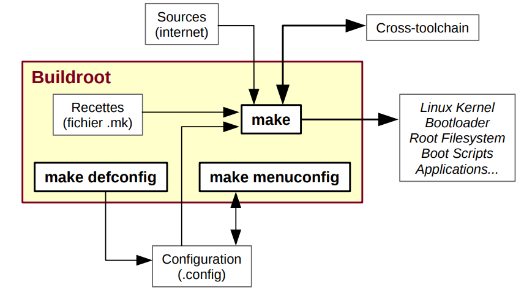

# Buildroot

Buildroot est un ensemble de scripts et de fichiers de configuration permettant la
construction complète d'un système Linux pour une cible embarquée. Il télécharge
automatiquement les paquetages nécessaires pour la compilation et l'installation.
Buildroot permet de construire une image complète « prête à flasher » comprenant tout
l'environnement d'exécution (noyau, bibliothèques, utilitaires, applications, système graphique, etc.)



Avantages :
• Système relativement simple à comprendre et à modifier
• Possibilité d'ajouter assez aisément des patches pour les composants système.
• Intégration aisée du code métier.


Inconvénients :
• Difficile de gérer plusieurs architectures en parallèles pour du code métier à rendre disponible
sur plusieurs plates-formes.
• Pas de gestion de packages, génération d'une image contenant tout le système.

## Installation de Buildroot et compilation du noyau

Prérequis :
```
sudo apt-get install sed make binutils gcc g++ bash patch gzip
bzip2 perl tar cpio python unzip rsync wget libncurses-dev
```

Cloner le dépot :
```
git clone git://git.busybox.net/buildroot
```

Parcourons ensuite la configuration de buildroot:
```
make menuconfig
```

Nous utiliserons exclusivement cet environnement pour les
développements embarqués.

Dans la partie « Target Options » vous retrouverez les informations sur la cible de compilation :
Par exemple pour BeagleBone Black :
- La plateforme utilisée par la BeagleBone Black est une plateforme ARM (little endian)
- Cette carte utilise un SoC Texas Instruments (TI) AM335x qui est basé sur un ARM Cortex-A8 (qu’il
faudrait sélectionner comme « Target Architecture Variant »).
- Le format binaire utilisé est l’ELF, pour l’unité flottante VFPv3-D16 est une option utilisable et
l’utilisation de l’ensemble d’instructions ARM est à utiliser par défaut (même si l’ensemble
d’instruction Thumb-2 est possible aussi et plus compact)

Pour ce qui est de la chaine de compilation (menu « Toolchain ») :
- Ici on peut sélectionner la chaine créée par buildroot ou une chaine externe comme celle de
Linaro.

Dans ce menu : on peut :
Configuration système (menu « system configuration »):
- Vous pouvez modifier ici le nom de l’hôte, le mot de passe root, etc.

Pour le menu « Kernel menu » :
- Vous pouvez sélectionner une version du noyau à utiliser. On peut, par exemple, choisir le plus
récent
- On peut choisir le format binaire
- On peut choisir aussi d’utiliser des « Device Tree » pour la description du matériel (cf cours de M.
Rubini).


Dans le répertoire "Board" on retrouve un répertoire des cartes supportées : aller dans le readme pour voir la commande à effectuer :

Pour récupérer la configuration  il suffit donc de faire la commande:

Pour Beaglebone :
```
make beaglebone_defconfig
```

Pour RaspberryPi 4 B :
```
make raspberrypi4_defconfig
```

Une fois cela réalisé, vous pouvez refaire un : ```make menuconfig``` afin de voir les options qui ont été
sélectionnées.

Nous pouvons à présent lancer la compilation de l’ensemble des éléments constituant notre environnement embarqué. Faites donc un : 
```
make
```