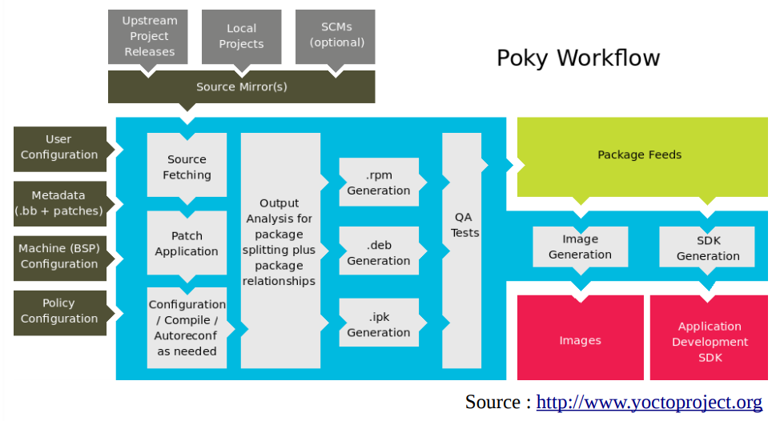

# Yocto

Yocto est un outil complet pour créer une plate-forme embarquée et son environnement de développement
d'applications-métier.

(todo)

## Références :

https://www.blaess.fr/christophe/files/Solutions-pour-Linux-embarqu%C3%A9-Panorama-et-crit%C3%A8res-de-choix.pdf