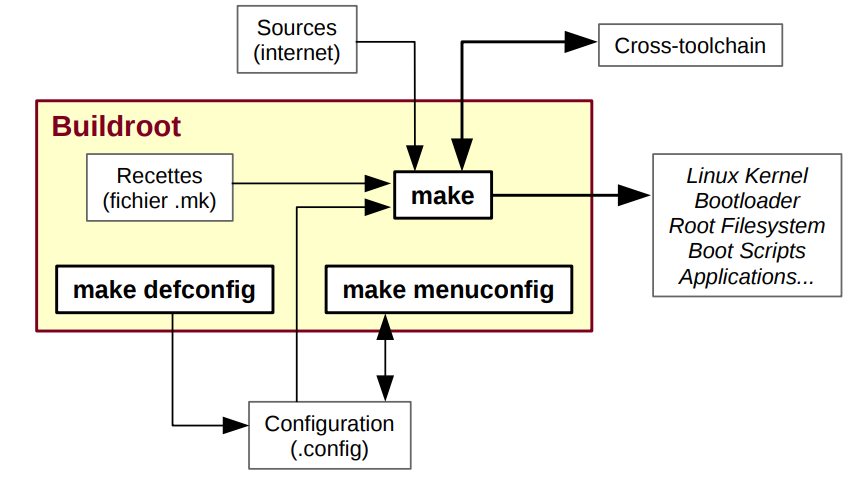

# Buildroot


# Introduction


Buildroot est un ensemble de scripts et de fichiers de configuration permettant la construction complète d'un système Linux pour une cible embarquée. Il télécharge automatiquement les paquetages nécessaires pour la compilation et l'installation.
Buildroot permet de construire une image complète « prête à flasher »  comprenant tout l'environnement d'exécution (noyau, bibliothèques, utilitaires, applications, système graphique, etc.)



Avantages :
• Système relativement simple à comprendre et à modifier
• Possibilité d'ajouter assez aisément des patches pour les composants système.
• Intégration aisée du code métier.


Inconvénients :
• Difficile de gérer plusieurs architectures en parallèles pour du code métier à rendre disponible
sur plusieurs plates-formes.
• Pas de gestion de packages, génération d'une image contenant tout le système.

## Installation de Buildroot et compilation du noyau

Buildroot est un outil en ligne de commande permettant de générer sa propre image de GNU/Linux optimisée pour l'embarqué.

Prérequis :
```
sudo apt-get install sed make binutils gcc g++ bash patch gzip
bzip2 perl tar cpio python unzip rsync wget libncurses-dev libncurses5-dev bc
```

Cloner le dépot :
```
git clone https://github.com/buildroot/buildroot.git
```

Le dossier Buildroot créé contient les répertoires suivants, voici une description des principaux dossiers :

- docs : une documentation au format texte ;
- package : les fichiers de configuration et de compilation (Makefile) pour les applications fournies avec Buildroot ;
- project : les fichiers de configuration et de compilation pour la création de projet. Un projet permet de générer automatiquement un système cible ;
- board : les fichiers de configuration pour les différentes cartes supportées par Buildroot ;
- configs : les fichiers de configuration pour le noyau spécifique à la carte (Raspberry...) ;
- arch : les fichiers de configuration pour le noyau spécifique à l'architecture (ARM...) ;
- target/linux : contiendra le noyau recompilé ;
- target/<fstype> : contiendra l'image du système racine (le contenu de notre carte SD, dans notre cas)
- toolchain : la chaine de cross-compilation générée par Buildroot.

# Support et configuration

Il convient ici de s'adapter à la configuration cible :
Pour cela, listez les dossiers disponibles dans le dossier board, afin de vérifier que notre carte est présente.

```
cd buildroot
ls board/ | grep beagle* //pour beaglebone
ls board/ | grep rasp* //pour raspberry
```

Faisons notre curieux et examinons le contenu de ces fichiers :
Par exemple pour RaspberryPi dans board/raspberrypi/genimage-raspberrypi3.cfg
```
image boot.vfat {
 vfat {
 files = {
 "bcm2710-rpi-3-b.dtb",
 "bcm2710-rpi-3-b-plus.dtb",
 "bcm2710-rpi-cm3.dtb",
 "rpi-firmware/bootcode.bin",
 "rpi-firmware/cmdline.txt",
 "rpi-firmware/config.txt",
 "rpi-firmware/fixup.dat",
 "rpi-firmware/start.elf",
 "rpi-firmware/overlays",
 "zImage"
  }
 }
 size = 32M
}

image sdcard.img {
 hdimage {
 }

 partition boot {
 partition-type = 0xC
 bootable = "true"
 image = "boot.vfat"
 }

 partition rootfs {
 partition-type = 0x83
 image = "rootfs.ext4"
 }
}
```

Ce fichier décrit comment gérer la carte SD pour une Raspberry pI 3. Ainsi, deux partitions seront créées pour obtenir une image de la carte SD :

- boot.vfat : qui sera la première partition de 32 Mo au format FAT32, et qui sera marquée comme bootable. Les fichiers nécessaires au démarrage de la carte seront copiés sur cette partition. Les fichiers .dtb contenant le descriptif matériel de la carte, les fichiers nécessaires au démarrage (bootloader.bin, start.elf), le noyau (zImage) et son fichier de configuration du noyau (cmdline.txt). Le fichier config.txt permet de configurer les périphériques de sa Raspberry PI (sortie graphique, wi-fi, Bluetooth...) ;

- sdcard.img : cette seconde partition utilisera un système de fichiers ext4, et correspondra à la racine du système de fichiers Linux (rootfs).

Le répertoire configs contient les fichiers de préconfiguration de Buildroot et du noyau, pour les différentes cartes supportées par Buildroot. Vérifions que notre Raspberry Pi est bien présente 
```
ls configs/raspberrypi* 
```

Vous devez obtenir une liste de fichiers correspondant aux différentes versions de Raspberry PI. Notez qu'il y a deux fichiers pour la Raspberry PI 3, un pour un système 32 bits, et le second pour un système 64 bits.

Examinez le contenu du fichier configs/raspberrypi3_defconfig. Ce fichier permet de générer un noyau pour une architecture ARM et un processeur Cortex A53, en se basant sur la configuration générique pour le SoC BCM2709. La configuration active le système de fichier EXT4 par défaut dans le  noyau.

```
BR2_arm=y
BR2_cortex_a53=y
BR2_ARM_FPU_NEON_VFPV4=y

BR2_TOOLCHAIN_BUILDROOT_CXX=y

BR2_SYSTEM_DHCP="eth0"

# Linux headers same as kernel, a 4.14 series
BR2_PACKAGE_HOST_LINUX_HEADERS_CUSTOM_4_14=y

BR2_LINUX_KERNEL=y
BR2_LINUX_KERNEL_CUSTOM_TARBALL=y
BR2_LINUX_KERNEL_CUSTOM_TARBALL_LOCATION="$(call github,raspberrypi,linux,83b36f98e1a48d143f0b466fcf9f8c4e382c9a1c)/linux-83b36f98e1a48d143f0b466fcf9f8c4e382c9a1c.tar.gz"
BR2_LINUX_KERNEL_DEFCONFIG="bcm2709"

# Build the DTB from the kernel sources
BR2_LINUX_KERNEL_DTS_SUPPORT=y
BR2_LINUX_KERNEL_INTREE_DTS_NAME="bcm2710-rpi-3-b bcm2710-rpi-3-b-plus bcm2710-rpi-cm3"

BR2_PACKAGE_RPI_FIRMWARE=y

# Required tools to create the SD image
BR2_PACKAGE_HOST_DOSFSTOOLS=y
BR2_PACKAGE_HOST_GENIMAGE=y
BR2_PACKAGE_HOST_MTOOLS=y

# Filesystem / image
BR2_TARGET_ROOTFS_EXT2=y
BR2_TARGET_ROOTFS_EXT2_4=y
BR2_TARGET_ROOTFS_EXT2_SIZE="120M"
# BR2_TARGET_ROOTFS_TAR is not set
BR2_ROOTFS_POST_BUILD_SCRIPT="board/raspberrypi3/post-build.sh"
BR2_ROOTFS_POST_IMAGE_SCRIPT="board/raspberrypi3/post-image.sh"
BR2_ROOTFS_POST_SCRIPT_ARGS="--add-pi3-miniuart-bt-overlay"
```

Lors du démarrage, le chargeur de démarrage charge le noyau qui s'exécute. Puis le noyau monte le système de fichiers racine (rootfs) afin d'exécuter le service de démarrage du système (systemd ou init). Si le système de fichiers correspondant au rootfs n'est pas activé par défaut dans le noyau, le noyau sera incapable de monter le rootfs et donc de lancer le service de démarrage. Cette erreur se traduit par un kernel panic : VFS not synced.

# Générer sa première image
Parcourons ensuite la configuration de buildroot:
```
make menuconfig
```

Nous utiliserons exclusivement cet environnement pour les développements embarqués.

Dans la partie « Target Options » vous retrouverez les informations sur la cible de compilation :
Par exemple pour BeagleBone Black :
- La plateforme utilisée par la BeagleBone Black est une plateforme ARM (little endian)
- Cette carte utilise un SoC Texas Instruments (TI) AM335x qui est basé sur un ARM Cortex-A8 (qu’il
faudrait sélectionner comme « Target Architecture Variant »).
- Le format binaire utilisé est l’ELF, pour l’unité flottante VFPv3-D16 est une option utilisable et
l’utilisation de l’ensemble d’instructions ARM est à utiliser par défaut (même si l’ensemble
d’instruction Thumb-2 est possible aussi et plus compact)

Pour ce qui est de la chaine de compilation (menu « Toolchain ») :
- Ici on peut sélectionner la chaine créée par buildroot ou une chaine externe comme celle de
Linaro.

Dans ce menu : on peut :
Configuration système (menu « system configuration »):
- Vous pouvez modifier ici le nom de l’hôte, le mot de passe root, etc.

Pour le menu « Kernel menu » :
- Vous pouvez sélectionner une version du noyau à utiliser. On peut, par exemple, choisir le plus
récent
- On peut choisir le format binaire
- On peut choisir aussi d’utiliser des « Device Tree » pour la description du matériel.


Dans le répertoire "Board" on retrouve un répertoire des cartes supportées : aller dans le readme pour voir la commande à effectuer :

Pour récupérer la configuration  il suffit donc de faire la commande:

Pour Beaglebone :
```
make beaglebone_defconfig
```

Pour RaspberryPi 4 B :
```
make raspberrypi4_defconfig
```

Une fois cela réalisé, vous pouvez refaire un : ```make menuconfig``` afin de voir les options qui ont été
sélectionnées.

Nous pouvons à présent lancer la compilation de l’ensemble des éléments constituant notre environnement embarqué. Faites donc un : 
```
make
```


# Références
https://openclassrooms.com/fr/courses/5281406-creez-un-linux-embarque-pour-la-domotique/5464301-prenez-en-main-votre-environnement-buildroot
