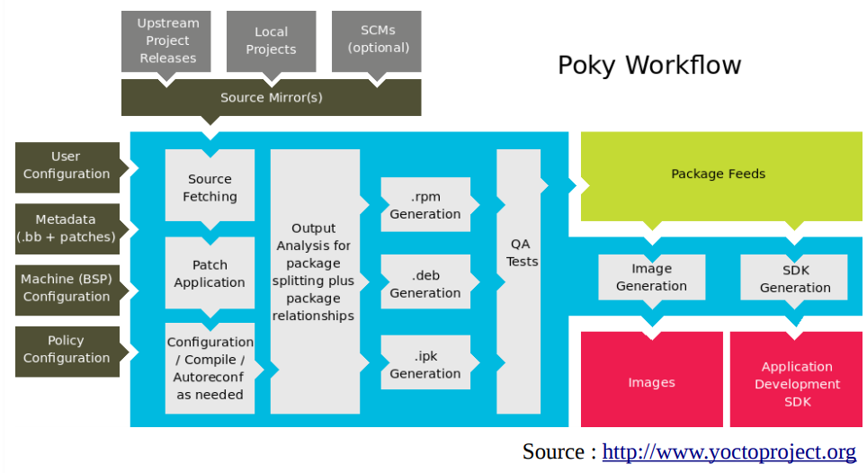

# Yocto

# Introduction

Yocto est une fondation Linux dont l'objectif est de fournir des outils permettant de construire des systèmes Linux pour l'embarqué, en s'abstrayant du matériel utilisé. Yocto souhaite donc offrir une solution unifiée, en regroupant les différents outils/projets existants. La première version de Yocto date de 2010. Contrairement à Buildroot, Yocto ne fournit pas d'interface "graphique" pour la configuration du système cible : tout se passe via des fichiers de configuration. De ce fait, Yocto est plus difficile à appréhender, mais il offre plus de possibilités avancées pour une approche industrielle.

(todo)

## Références :

https://www.blaess.fr/christophe/files/Solutions-pour-Linux-embarqu%C3%A9-Panorama-et-crit%C3%A8res-de-choix.pdf
