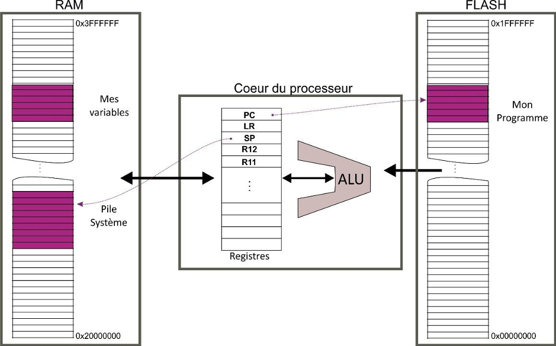
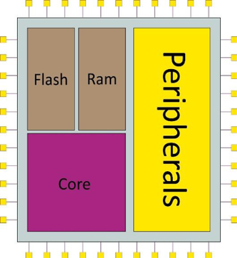
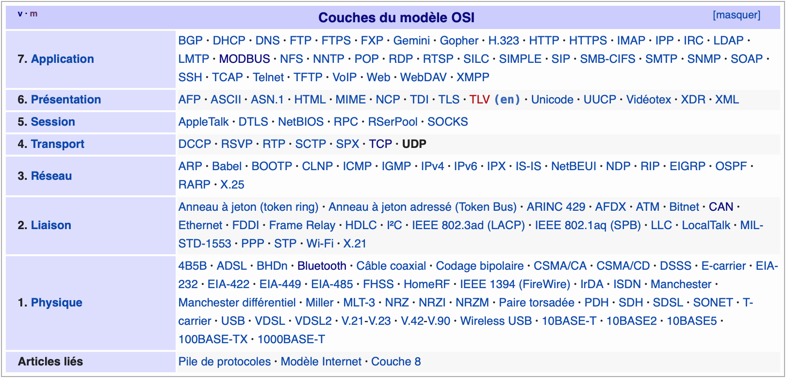
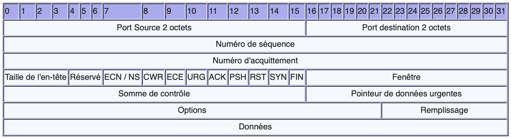
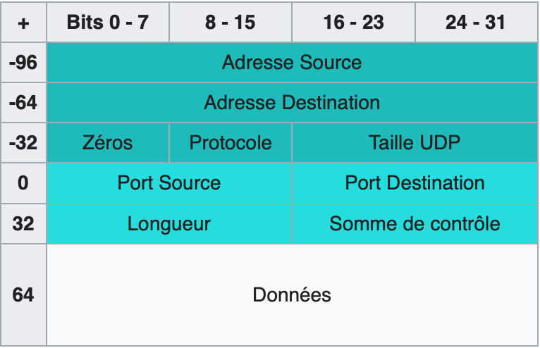

- [Opérateurs logiques](#opérateurs-logiques)
- [Architecture d’un processeur :](#architecture-dun-processeur-)
  - [Cœur (Core)](#cœur-core)
  - [Une banque de registres](#une-banque-de-registres)
  - [Mémoire et pile système](#mémoire-et-pile-système)
  - [Structure de la mémoire](#structure-de-la-mémoire)
    - [Stack](#stack)
    - [Heap](#heap)
    - [Unitialized data segment (également appelé bss)](#unitialized-data-segment-également-appelé-bss)
    - [Initialized data segment](#initialized-data-segment)
    - [Text segment ou code segment](#text-segment-ou-code-segment)
  - [Exécution](#exécution)
- [Architecture d’un microcontrôleur](#architecture-dun-microcontrôleur)
  - [Interruptions](#interruptions)
  - [DMA](#dma)
  - [Les bus de communication :](#les-bus-de-communication-)
    - [UART (Universal Asynchonous Receiver Transmitter) : protocole RS232 définit par :](#uart-universal-asynchonous-receiver-transmitter--protocole-rs232-définit-par-)
    - [SPI (Serial Peripheral Interface)](#spi-serial-peripheral-interface)
    - [I2C (Inter-Integrated Circuit)](#i2c-inter-integrated-circuit)
  - [Bus de terrain](#bus-de-terrain)
    - [SERCOS](#sercos)
    - [Profibus](#profibus)
    - [CAN](#can)
    - [Modbus](#modbus)
- [Memory](#memory)
  - [Notation](#notation)
  - [Memory supports (Non Volatile Memory)](#memory-supports-non-volatile-memory)
    - [eMMC](#emmc)
    - [NOR flash](#nor-flash)
    - [NAND flash](#nand-flash)
    - [EEPROM](#eeprom)
    - [SD Card](#sd-card)
    - [SSD](#ssd)
    - [Comparaison](#comparaison)
  - [Memory supports (Volatile Memory)](#memory-supports-volatile-memory)
    - [DDR](#ddr)
    - [SDRAM](#sdram)
- [Operating system (OS)](#operating-system-os)
  - [Temps-réel](#temps-réel)
- [Networking](#networking)
  - [IPv4/IPv6 network stack](#ipv4ipv6-network-stack)
  - [Time sensitive Network](#time-sensitive-network)
  - [Vocabulaire embedded systems :](#vocabulaire-embedded-systems-)

# Opérateurs logiques

- NON

| A   | S=/A |
| --- | ---- |
| 0   | 1    |
| 1   | 0    |

- ET

| A   | B   | S=A.B |
| --- | --- | ----- |
| 0   | 0   | 1     |
| 0   | 1   | 0     |
| 1   | 0   | 0     |
| 1   | 1   | 1     |

- OU

| A   | B   | S=A+B |
| --- | --- | ----- |
| 0   | 0   | 0     |
| 0   | 1   | 1     |
| 1   | 0   | 1     |
| 1   | 1   | 1     |

- XOR

| A   | B   | S=A(+)B |
| --- | --- | ------- |
| 0   | 0   | 0       |
| 0   | 1   | 1       |
| 1   | 0   | 1       |
| 1   | 1   | 0       |

- XNOR

| A   | B   | S= /(A(+)B) |
| --- | --- | ----------- |
| 0   | 0   | 1           |
| 0   | 1   | 0           |
| 1   | 0   | 0           |
| 1   | 1   | 1           |

# Architecture d’un processeur :
Un processeur est une machine synchrone : cela veut dire qu’il existe une horloge qui donne le rythme de tout ce qui se passe.

Deux types d'architectures principales :
-	Von Neumann : même canal d’échange pour lire les instructions et manipuler des données : le bus de données
-	Harvard : bus instruction (ou bus programme) et le bus de données

## Cœur (Core)

L’unité arithmétique et logique (ALU)
C’est la partie opérative du système. La seule vraiment capable de faire des calculs (au sens littéral du terme). Les opérations ordinaires d’une ALU sont : 
-	l’accès à la mémoire
-	les additions/soustractions
-	les multiplications/divisions
-	logiques portant sur des bits (opération ET, opération OU, décalages, rotations, compléments, extractions,…)
Note : Classiquement toutes ces opérations ne se font que sur des entiers (8 bits, 16 bits ou 32 bits) mais il y a des architectures qui intègrent des ALU qui calculent sur nombres réels FPU : Floatting Point Unit

## Une banque de registres

-	un registre qui contient l’adresse courante du programme en cours. Au cours de l’exécution du code, il se modifie tout seul pour aller chercher la prochaine instruction que devra réaliser l’ALU. Il est très souvent dénommé PC (pour Program Counter),
-	un registre “de statut” qui renseigne sur l’état du processeur à un instant donné et qui est mis à jour en fonction de ce qui s’y passe. Entre autres informations essentielles pour un programme, on y trouve les « flags » c’est-à-dire des bits qui informent l’ensemble de la machine si la dernière opération exécutée par l’ALU a retourné une valeur nulle, une valeur négative… Remarquez que les structures algorithmiques classiques comme if-then-else, while, for, etc., sont réalisées au niveau du processeur à l’aide de ces flags,
-	un registre contenant une adresse accessible en mémoire vive pour stocker des informations temporaires mais vitales pour le bon déroulement de l’ensemble. Cet espace mémoire est la PILE système et ce registre est le plus souvent dénommé Stack Pointer (SP).

## Mémoire et pile système
- De la mémoire en lecture seule (ou souvent dite « morte »)
ROM (Read Only Memory) ou FLASH (comme les clés USB).  Elles onservent leurs contenus lorsque l’alimentation est coupée.
Contient le code à exécuter
Une case mémoire (typiquement un octet) détient donc une valeur et se différencie des autres cases par une adresse unique (codée en général sur 32 bits). Le registre PC présenté ci-dessus va donc contenir la valeur sur 32 bits de l’adresse où le processeur pourra lire la prochaine instruction à traiter.

- De la mémoire « vive »
RAM (Random Access Memory) ce type de mémoire est accessible en lecture et en écriture par le processeur.

- Une pile système
C’est une zone de la mémoire RAM prédéfinie au départ par le programme.
Cette zone est repérée (pointée) par un registre spécial (SP).
Ce pointeur évolue au gré des écritures/lectures sur le principe d’une structure LIFO

## Structure de la mémoire


### Stack

La pile est la partie de la mémoire dans laquelle seront stockées toutes les variables pour lesquelles vous n'avez pas eu recours à l'allocation dynamique de la mémoire.

C'est également dans la pile que seront placées certaines informations lors de l'appel d'une fonction comme :

* l'adresse à laquelle retourner quand la fonction appelée est terminée;
* les paramètres transmis à la fonction;
* les interruptions;
* la valeur de retour;
* le contenu des différents registres, le cas échéant.

La stack (ou pile en français) a des accès très rapide ce qui l'a rend particulièrement efficace, cependant sa mémoire est fixée au démarrage du thread.
La stack a un ordonnacement de type `LIFO` (Last In First Out) et possède deux fonctions principales : `push`, pour ajouter un élément, et `pop` pour retirer et récupérer cet élément. Elle a une origine fixe, le pointeur référence toujours le haut de la pile.
Chaque thread possède son espace de stack et ne permet donc pas de le partager avec d'autres threads.

Dans les langages de bas niveau pour lesquels la gestion de la mémoire n’est pas automatique, l’usage de la stack a l’avantage de ne pas avoir à se préoccuper de libérer la mémoire. De fait, lorsqu’une fonction termine son exécution, toutes les variables qu’elle a déclarées sont instantanément supprimées.

### Heap

Le heap (ou tas en français) permet le contrôle complètement arbitraire de l’allocation et de la libération. Elle est gérée par `malloc`, `calloc`, ou `realloc` methods.

Il n’y a pas de gestion de l’attribution et de l’accès aussi stricte que celle de la stack, la heap est plus flexible. Cependant, elle demande le maintient de pointeurs pour chacune des valeurs stockées. Cette gestion étant plus complexe, les performances n’en sont pas aussi bonnes – toute proportion gardée.

En outre, la heap permet l’allocation de variables globales partagées entre plusieurs fonctions (sans recourir au passage de paramètres) et permet, le cas échéant, le partage de valeurs entre threads d’un même processus. Cette particularité fait que la heap doit la plupart du temps être `thread-safe`, ce qui impacte aussi légèrement les performances.

Exemples :
```c
int* prt = malloc(sizeof(int) * 2)
```

### Unitialized data segment (également appelé bss)
C'est l'endroit où toutes les variables qui n'ont été initialisées se trouvent.
* Variables globales (pointeurs compris)
* Variables constantes globales
* variables statiques locales

Exemples :
```c
int globalVar;
int globalVar = 0;
int *ptr = NULL;
static int localStatic;
```

### Initialized data segment
C'est l'endroit où toutes les variables qui ont été initialisées se trouvent. Cette mémoire peut être caractérisé en `read-only` or en `read-write`. Les variables globales constantes iront dans la parties read only tandis que les variables qui peuvent être modifiées pendant l'exécution iront dans la partie read-write.
La taille de ce segment est déterminé par la taille des valeurs dans le code source du programme, et ne peut pas changé en cours d'exécution.

Exemples :
```c
int globalVar = 1;
```

### Text segment ou code segment
Ce segment est la partie de la mémoire qui contient le code issu d'une partie d'un fichier objet (.o), c'est donc une partie très importante. D'ailleurs c'est pour ça qu'il est tout en bas de la mémoire (LSB=Less Significant Bit) et est souvent Read-only pour éviter d'être remplacé par des bugs par exemple l'overflow. Ici il n'y a pas de variables globales, locales etc.

En fonction de l'implémentation C, le code segment peut aussi contenir des string literals en read-only. Par exemple le "Hello World" d'un printf.

[Plus sur les mémoires_1]

[Plus sur les mémoires_2]

[Plus sur les mémoires_3]

[Plus sur les mémoires_4]

## Exécution
Pour comprendre le mécanisme du pipeline, il est nécessaire au préalable de comprendre les phases d'exécution d'une instruction. Les phases d'exécution d'une instruction pour un processeur contenant un pipeline « classique » à 5 étages sont les suivantes : 
•	LI : (Lecture de l'Instruction (en anglais FETCH instruction) depuis le cache ; 
•	DI : Décodage de l'Instruction (DECODe instruction) et recherche des opérandes (Registre ou valeurs immédiate); 
•	EX : Exécution de l'Instruction (EXECute instruction) (si ADD, on fait la somme, si SUB, on fait la soustraction, etc.); 
•	MEM : Accès mémoire (MEMory access), écriture dans la mémoire si nécéssaire ou chargement depuis la mémoire ; 
•	ER : Ecriture (Write instruction) de la valeur calculée dans les registres.



# Architecture d’un microcontrôleur


Processeur
Mémoire Flash : Contient le programme
Mémoire RAM (Random Access Memory) : Contient la pile système et les variables
Périphériques : Timers, Gestion d'Interruptions, SPI, Carte réseau

## Interruptions
- Démarrage

Les interruptions reposent sur une `Table des Vecteurs d'Interruptions (TVI)` placée au plus bas de la mémoire @0x00000000. En effet à la position 0 et 1 de cette table se trouve la séquence d'initialisation:

* Redonner l'ensemble des registres leur valeur d'initialisation
* Aller lire les bits contenus à l'@ 0x0000000 pour initialiser le SP
* Aller lire les bits contenus à l'@ 0x0000004 pour initialiser le PC
> Les adresses son pour le cortex M3 de ST, elles peuvent différer d'un uc à un autre

Cette `TVI` est sous le nom de `__VECTORS` reconnu par le linker.

- Déclenchement d'un IT

Lorsqu’une demande d’interruption arrive (avec un numéro d’identification) le processeur va réaliser les opérations suivantes :

* terminer l’instruction en cours,
sauvegarder sur la `pile (Heap)` et dans cet ordre **R0,R1,R2,R3, R12**, l’**@** de retour, **xPSR** et **LR**,
* mettre dans le registre **LR** un code spécifique (0xFFFFFFFx),
* récupérer le n° de la demande d’interruption et lire l’entrée correspondante dans la TVI,
* affecter **PC** avec l’**@** trouvée dans la table au n° correspondant.

- Le NVIC (pour STM32)

Le NVIC est le chef d'orchestre des interruptions, il gère si plusieurs IT interviennent simultanément. Son rôle :
* de recevoir les demandes d’interruption,
* de contenir les priorités relatives de chacun des vecteurs de la table,
* de contenir les autorisations de transmette à la CPU les demandes d’interruption,
* de transmettre ou de mettre en attente les demandes en cours selon les autorisations et les priorités respectives.

Les priorités sont définies de 0 à 255 avec 0 la plus haute priorité.

- Exemple d'utilisation
```c
void TIM2_IRQHandler(void)
{
	MaSeconde = MaSeconde +1;
}
```
> Il est impossible de passer des arguments (en entrée ou en sortie) dans une procédure d’interruption ; elle seront donc obligatoirement de type void Fonc(void).
> 
## DMA
L'accès direct à la mémoire (en anglais DMA pour Direct Memory Access) est un procédé informatique où des données circulant de, ou vers, un périphérique (port de communication, disque dur, etc.) sont transférées directement par un contrôleur adapté vers la mémoire principale de la machine, sans intervention du microprocesseur si ce n'est pour lancer et conclure le transfert. La conclusion du transfert ou la disponibilité du périphérique peuvent être signalés par interruption.

Cela permet de délester le CPU puisqu'une instruction envoyée au DMA est ensuite gérée par celle-ci. Cela évite de bloquer le programme. Très utile pour transférer beaucoup de données comme un print sur un UART.


## Les bus de communication :

### UART (Universal Asynchonous Receiver Transmitter) : protocole RS232 définit par :
•	un bit de démarrage (start bit) dont le niveau logique est zéro,
•	entre 7 et 8 bits de données,
•	éventuellement un bit de parité paire ou impaire (parity),
•	et un ou deux bits de stop avec un niveau logique de zéro (stop bits).
 


### SPI (Serial Peripheral Interface)
Un maitre et des esclaves, seul le maitre peut établir la communication. Full duplex synchrone. 4 fils :
•	SCLK (Serial Clock): l'horloge du bus qui est produit par le maître,
•	MOSI (Master Out Slave In) : la ligne de donnée du maître vers l'esclave,
•	MISO (Master In Slave Out) : la ligne de donnée de l'esclave vers le maître,
•	SSn (Slave Select n) : la ligne permettant de sélectionner l'esclave destinataire de la communication.
 

Le SPI repose sur des registres à décalage côté Maitre et esclave. Chaque période d’horloge un bit est transféré. (ex d’un registre de 16 bits, il faut 16 coups d’horloge).
Débit élevé mais sur faible distance, il n’y a pas d’acquitement. Exemple d’utilisation : carte SD.

### I2C (Inter-Integrated Circuit)
Bus synchrone half-duplex. Multi maîtres, multi esclaves.
•	SCL (Serial Clock) : l'horloge commune à tous les équipements,
•	SDA (Serial Data) : la ligne portant les données.
•	Une masse commune
Les lignes étant au niveau logique haut quand il n'y a pas de communication, les broches connectées aux lignes DCL et SDA doivent être en open-drain. Lorsqu'un maître émet sur la ligne SDA, la trame qu'il envoie est décomposée en un bit de démarrage, suivi de l'adresse de l'esclave (7 ou 10 bits) puis d'un bit indiquant si le maître souhaite envoyer une donnée ou en recevoir de l'esclave. À chaque envoi d'un octet de donnée (maître ou esclave) un bit d'acquittement est produit par le récepteur. La communication se termine par un bit de stop.
 
Dans le cas où il y a plusieurs maîtres, un mécanisme d'arbitrage est ajouté.
CAN (Controller Area Network) : bus half-duplex. Plutôt utilisé en automobile et avionique. La transmission suit le principe de transmission en paire différentielle et possèdent donc deux lignes CAN L (CAN LOW) et CAN H (CAN HIGH).
Un nœud (appareil) envoie son message à l’ensemble des nœuds qui filtrent le message et le traitent ou non. Lors de demandes simultanées sur le bus, un principe d’arbitrage basé sur la priorité. Chaque trame porte un champ d’arbitrage de 12 à 30 bits. Le message éyant la plus petite valeur est prioritaire.

La taille des données d'un message varie de 0 à 64 bits. À cela s'ajoute dans une trame, des bits CRC pour vérifier l'intégrité des données transmises ainsi que d'autres bits pour indiquer la taille de la donnée, pour valider la transmission et pour indiquer la fin.

## Bus de terrain 
### SERCOS

SERCOS (acronyme anglais de SErial Real-time COmmunications System) est un protocole de communication qui définit un standard d'interface numérique utilisé notamment en robotique.

Le bus SERCOS est conçu pour assurer des communications série rapides en temps réel sur fibre optique. Il est reconnu pour sa rapidité et son comportement déterministe.

### Profibus
Profibus (Process Field Bus) est le nom d'un type de bus de terrain propriétaire et de son protocole, inter-automates et de supervision. Il est devenu peu à peu une norme de communication dans le monde de l'industrie ces dix dernières années, mais son usage tend à disparaître au profit d'autres bus de terrain ou de réseaux.

### CAN
Le bus de données CAN (Controller Area Network) est un bus système série très répandu dans beaucoup d'industries, notamment l'automobile
Il met en application une approche connue sous le nom de multiplexage, et qui consiste à raccorder à un même câble (un bus) un grand nombre de calculateurs qui communiqueront donc à tour de rôle.

CAN est un bus de données série bidirectionnel half-duplex dans le domaine automobile, mais est utilisé en unidirectionnel — simplex — dans l'aéronautique, pour obtenir un comportement déterministe.

### Modbus
RS485

# Memory
## Notation
MiB, MB, GiB, and GB.

The SI prefixes are for strict use with powers of 10, not powers of 2 as used by computers. To solve this the International Electrotechnical Commission (IEC) came up with a new prefix standard for powers of 2, known as binary prefixes.
The prefix Kilo- stands for 10^3 while Kibi- stands for 2^10. This means that a Kilobyte is 1000 bytes while a Kibibyte is 1024 bytes. This might not seem like a big difference but when it gets to Gigabytes versus Gibibytes the difference becomes much more noticeable.


## Memory supports (Non Volatile Memory)
### eMMC
On la retrouve rarement dans les ordinateurs et pour cause, elle est généralement basée sur du stockage 32 Go ou 64 Go. Contrairement aux disques SSD, cet espace est assez restreint pour un ordinateur Windows, on croisera donc la eMMC dans les appareils de type Smartphone. 
La technologie utilisée permet d’ailleurs d’être étendue, comme nos smartphones sous Android qui disposent d’un stockage interne (eMMC) + un port d’accueil pour une carte microSD (extension). Concernant le prix, il est à savoir qu’à volume égal en Giga-octet, le stockage eMMC a un coût de revient bien moins cher que le stockage SSD.
### NOR flash
Basée sur des portes NON-OU

### NAND flash
Basée sur des portes NON-ET

### EEPROM
= NOR flash mais effaçable au bit près.

### SD Card

### SSD

### Comparaison
| Support                    | Vitesse | Taille     |
| -------------------------- | -------------------------- | -------------------------- |
eMMC | + | 64 GiB | 
SD card | + | 512 GiB |
SSD | +++ | <10 TiB

## Memory supports (Volatile Memory)
### DDR
### SDRAM


# Operating system (OS)
## Temps-réel
| Detail                     | VxWorks                                                                        | FreeRTOS                 | EmbOS                                        | RT-Linux                              | eCos |
| -------------------------- | ------------------------------------------------------------------------------ | ------------------------ | -------------------------------------------- | ------------------------------------- | ---- |
| **Licence**                | Payant                                                                         | MIT Open-source, gratuit | Gratuit pour les projets perso. sinon payant | --                                    | --   |
| **Boot time**              | --                                                                             | --                       | 85 cycles (213 nsec @400 MHz)                | --                                    | --   |
| **Interrupt latency**      | --                                                                             | --                       | 0                                            | --                                    | --   |
| **Size**                   | --                                                                             | 6k to 12k bytes          |
| **Context switching time** | --                                                                             | --                       | 241 Cycles (602 nsec @400 MHz).              | --                                    | --   |
| **Description**            | IEC 615088 and ISO 26262 for security and reliability in critical applications | --                       | --                                           | 2 Cores : 1 RT Linux / 1 Not-RT Linux | --   | -- |

# Networking
## IPv4/IPv6 network stack
* Layers: Layers are essentially the segmentation of functionality in the OSI model.
* HTTP: Hypertext Transfer Protocol- This is the framework of most internet based websites and is vital for transferring data between a web browser and a server. A secure version HTTPS typically has 128 bit encryption and is used for secure transactions.
* Ports: These are essentially the roads that different protocols travel. Envision the network to being a giant city and the ports being the highways leading out of that city.
* ISO: International Organization for Standardization

- How does the TCP/IP Stack work


La stack TCP/IP fonctionne comme le modèle OSI qui établit un ensemble de règles et standards pour communiquerentre les différentes couches (layers). Ces règle permettent de s'assurer que différents produits peuvent communiquer ensemble.

> La stack TCP/IP se consistue en 4 couches, la couche Liaison (Link Layer) ne se divide pas en 2. C'est uniquement dans la théorie avec le modèle OSI.

* Link Layer

Cette couche s'occupe du message physique pour le transfert de donné.
* Internet Layer

Cette couche inclus le paquet IP ainsi que le schéma d'adressage IP. C'est ici où les adresses de supervision des appareils sont établis.
* Transport Layer

Cette couche créer la connexion TCP (fiable) et et communique la donnée entre les sessions.(The transport layer creates the reliable connection you need when uploading or downloading BAS databases).
* Application Layer

Cette couche crée la connexion entre la donnée et l'application. Par exemple l'envoie d'alarme via SMTP (Simple Mail Transfer Protocol)

- Modèle OSI




- TCP 

TCP, est un protocole de transport fiable, en mode connecté. Dans le modèle Internet, aussi appelé modèle TCP/IP, TCP est situé au-dessus de IP. Dans le modèle OSI, il correspond à la couche transport, intermédiaire de la couche réseau et de la couche session. Les applications transmettent des flux de données sur une connexion réseau. TCP découpe le flux d’octets en segments dont la taille dépend de la MTU du réseau sous-jacent (couche liaison de données).

Une session TCP fonctionne en trois phases :

l'établissement de la connexion ;
les transferts de données ;
la fin de la connexion.



- UDP

Le rôle de ce protocole est de permettre la transmission de données (sous forme de datagrammes) de manière très simple entre deux entités, chacune étant définie par une adresse IP et un numéro de port. Aucune communication préalable n'est requise pour établir la connexion, au contraire de TCP (qui utilise le procédé de handshaking). UDP utilise un mode de transmission sans connexion.




## Time sensitive Network
Time-sensitive networking (TSN) est préemptif (priorités) et déterministe (temps respecté).

Sur un réseau TSN il n'y a que les équipements TSN qui sont autorisé à communiquer. Le maître envoie en bradcast sur le réseau et les switch diffusent.

Normes :
* PTP IEEE 1588-2008
* IEEE 802.1AS-rev
* IEEE 802.1Qbv
* IEEE 802.1Qbu

## Vocabulaire embedded systems :

HAL: Hardware Abstraction Layer = méthode de programmation qui consiste en l’abstraction du matériel de sorte de porter l’application sur différents matériel
SWD: Serial Wire Debug = remplace le JTAG par une interface avec 2 pins. Permet seulement le débug et la programmation sur ARM.
ISR: Interupt Service Routine
JTAG: Joint Test Action Group = originalement fait pour tester les continuités des circuits, permet de tester des logiques combinatoires, tester des memoires et autres grâce au ICE ou ICD. JTAG 5 pins, permet le debug, la programamtion et le boundary scanning pour les tests de production
OOP : Oriented Object Programming
ICE: In-Circuit Emulator , ICD : In-Circuit Debugger permet de mettre des points d’arrêts, R/W des registres internes, des mémoires internes, externes


[//]: Liens

[Plus sur les mémoires_1]: <https://quai-lab.com/arduino-ses-memoires/>
[Plus sur les mémoires_2]: <https://www.d-booker.net/HTML/coder_cpp/book/bases/pile_et_tas.html>
[Plus sur les mémoires_3]: <https://stackoverflow.com/questions/14588767/where-in-memory-are-my-variables-stored-in-c>
[Plus sur les mémoires_4]: <https://microcontrollerslab.com/difference-between-stack-and-heap/#Text_segment>