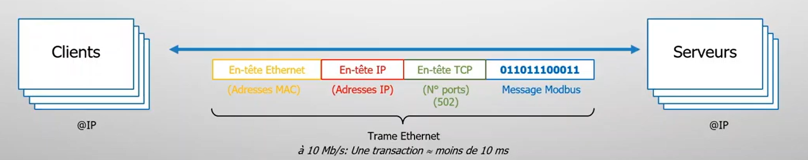
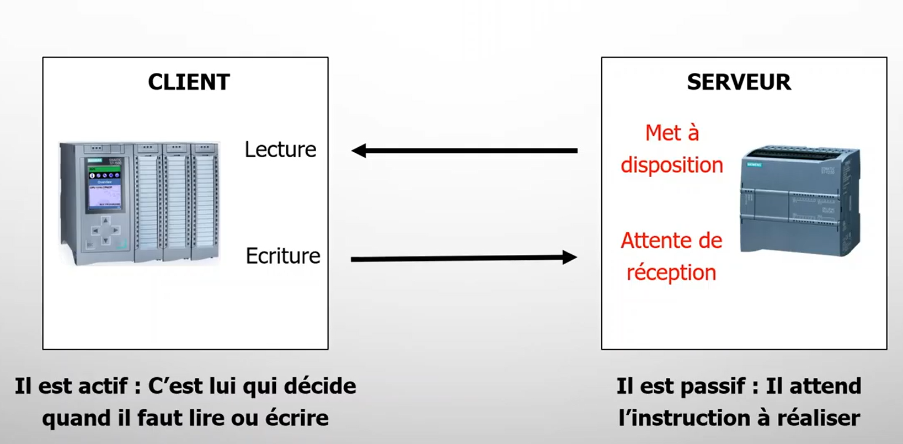
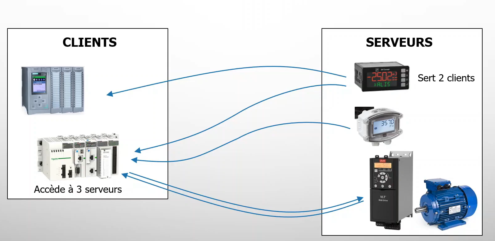
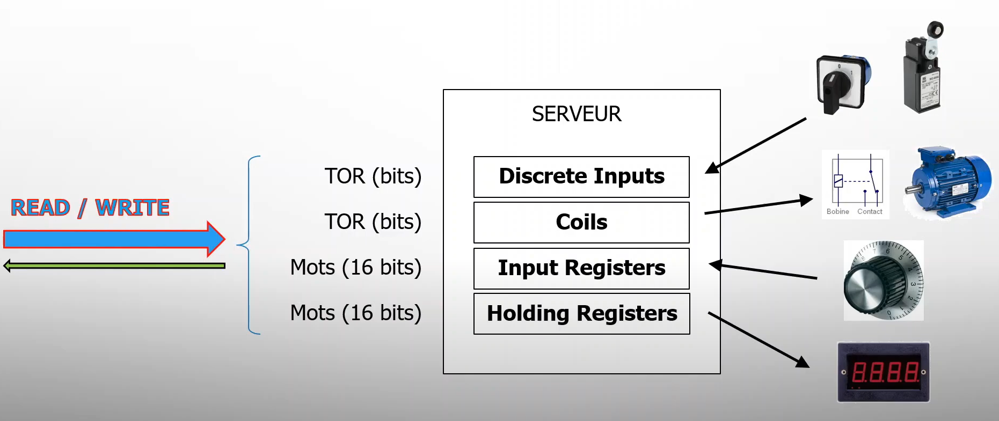
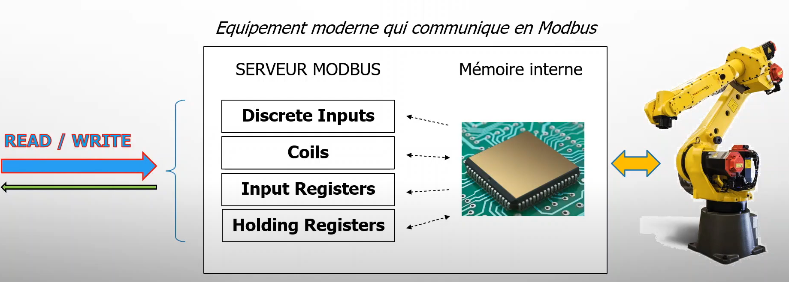
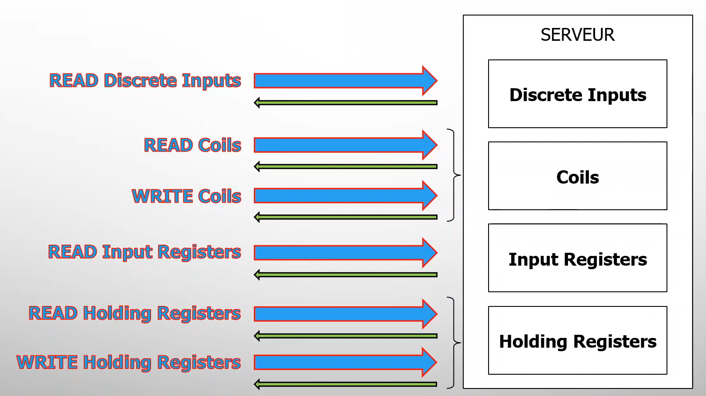

# Modbus

{ width=50% }

Crée en 1979 par Modicon (Schneider Electric) utilisé au départ pour les réseaux d'automates programmables industriels.
Le MODBUS permet de relier un Maître (par ex. un PC) et plusieurs Esclaves (par ex. des systèmes de mesure et de régulation). Il en existe deux versions : une pour l'interface série (RS-232 et RS-485) et une pour ETHERNET.

Pour la transmission de données, on distingue les différents modes de communication suivants :

- *Modbus TCP* : communication TCP/IP ETHERNET basée sur le modèle client/serveur.
- *Modbus RTU* (Remote Terminal Unit) : Les données sont sur 8 bits la transmission asynchrone série via RS-232 ou RS-485 en maitre-esclave.
- *Modbus ASCII* : similaire au protocole RTU, seulement un format de données différent, (utilisation plutôt rare).

## Modbus TCP/IP - communication rapide et simple

Il fonctionne sur le mode client-server. Seuls les clients sont actifs, le serveur est complétement passif.
Ce sont les client qui doivent lire et écrire dans le serveur Modbus.
Chaque client doit se connecter au serveur en protocol TCP (port 502).

Ce mode peut comporter plusieurs clients et plusieurs serveurs.

Les messages modbus sont encapsulées dans une trame Ethernet.

Dans tout les cas c'est au client de faire des requêtes de lecture ou d'écriture et au serveur de répondre.
Cependant les échanges se font les un après les autres.

Dans une application industrielle on peut voir ça comme des automates programmables (PLC) qui ferait des requêtes vers des capteurs / variateur de vitesse afin de commander les serveurs :

### Zone d'adressage mémoire et codes fonction
Par principe les données se trouve au niveau du serveur, et c'est au client d'écrire ou de lire dans les différents endroits du device.
Avec Modbus on trouve 4 zones mémoires différentes hérité du passé défini par rapport au besoin de control commande:
- Discrete Inputs (Fait le lien avec entrées tout ou rien : boutton, capteur ...) : bits (Lecture Uniquement)
- Coils ( Bobines : pour commander relais ou contacteur) : bits (Lecture ou Ecriture)
- Input Registers (Pour la saisie de valeur numérique : potentiomètre ...) : Mots (16 bits) (Lecture)
- Holding Registers ( Les registres de maintient : pour mémoriser ou ressortir des valeurs numériques) : Mots (16 bits) (Lecture ou Ecriture)

Note : Aujourd'hui les choses ont évolués mais les appelations sont restés identique.
Aujourd'hui chaques équipements structure ses données à sa manière.
Les 4 zones mémoires modbus servent d'interface avec la mémoire interne de l'équipement (mémoire lié au processeur).

En conséquence les opérations de lecture et d'écriture vont se décliner en fonction des zones mémoires donc 6 opérations à réaliser.
Pour les distinguer facilement chacunes de ces opérations va porter un numéro : on l'appelle le code fonction.

Chaques requêtes du client va donc contenir le fonction code correspondant à l'opération à réaliser.
Ces opérations peuvent transporter les données suivants leurs types.

## Modbus RTU
- Vitesse de transmission : 9600 ou 19200 bauds
- Parité: Avec ou Sans
- 1 Stop/1Start
- Mode de communication : half-duplex/Duplex (2 ou 4 fils)

Ce mode comporte un seul maître et plusieurs esclave identifié par un ID allant de 1 à 255.
