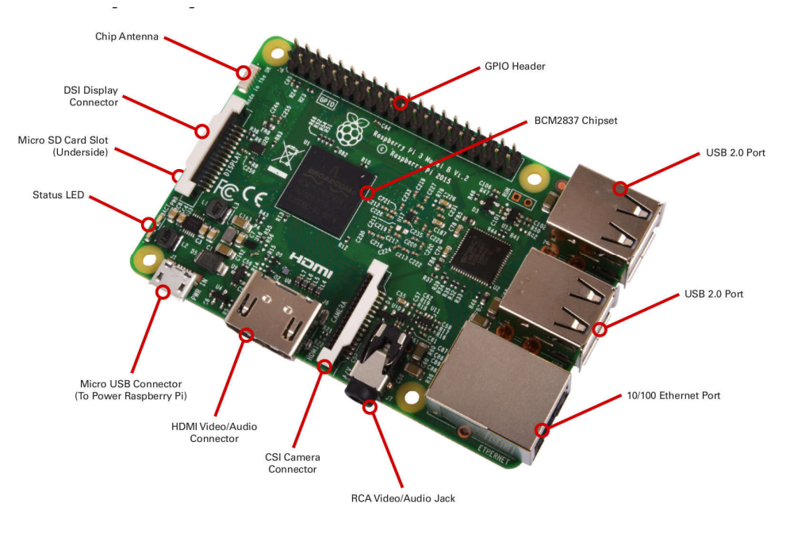

# RaspberryPi

La connexion entre les pins et le CPU est effectuée à travers un PORT.


La DataSheet du composant donne le diagramme du pinout du composant sur lequel on travaille et indique sur quel port est relié quelle pin : Prenoms par exemple le pinout du raspberry pi :


On prendra garde que plusieurs pin ont des fonctions multiples et parfois uniquement disponible sur ces broches. (Timer, I2C, UART, etc ...)
Les pins d'alimentations sont repérées par l'inscription : 5V,3.3V ou encore VDD et VSS(ou GND), VDDIO etc ...

On trouve les fonctions alternative des gpios dans la datasheet de notre composant :


On observe ainsi l'état de base de la sortie en Pull-up ou Pull-Down pour notre exemple ci dessous la GPIO0 est en pull up et possède 5 fonctions alternatives.

Ainsi chaques proches est connecté à un port. Un port peut être connecté au maximum à 16 broches. Le port est repéré par une lettre et un nombre qui correspond au numéro du pin. Ainsi par exemple PC2 signifie : Entrée/Sortie 2 du port C.

Chaques ports à au moins 10 registres de configurations :
```
MODER: Mode Register (input; output, alternate function, analog)
OTYPER: Output Type Register (Output Speed Register)
PUPDR: Pullup / Pull-down Register (if pin configured as open drain)
ODR: Output Data Register
IDR: Input Data Register
BSSR: Bit Set / Reset Register
AFRL/H: Alternate Function Register (connect pin to timers, bus, event)
BRR: Bit Reset Register (reset ODR registers)
LCKR: Lock Register
```


# Références :
https://openclassrooms.com/fr/courses/5281406-creez-un-linux-embarque-pour-la-domotique/5464296-faites-vos-premiers-pas-avec-buildroot-et-l-environnement-microlinux
