# Systèmes-embarqués

Ce dépôt regroupe des outils / documentation / tutoriel et codes qui peuvent être utiles pour un système embarqué.

## Introduction aux systèmes embarqués :

Un système embarqué est un ensemble électronique et/ou informatique intégré comme composant d'un environnement plus important.
Un système embarqué se définit surtout par les contraintes auxquelles il est soumis.
En général ce système est un microcontrôleur basé sur une technologie temps réel.
Le microcontrôleur de référence pour l'embarqué se base sur du STM32 de chez STM Electronic. Qui embarque un processeur ARM.
Celui-ci est représentatif des architectures modernes et est présent dans de nombreux systèmes industriels existants.
Cela inclut les téléphones, les routeurs et sans oublier les appareils IoT qui semblent exploser dans les ventes ces jours-ci. 
Cela dit, le processeur ARM est devenu l'un des cœurs de processeur les plus répandus au monde.


Un tel processeur est disponible pour un peu plus d’une dizaine d’euro sur une carte de développement.
Cette carte dispose d’une connectique compatible avec les composants Arduino, ce qui vous permettra de poursuivre sa prise en main en investissant dans quelques composants supplémentaires. Pour l’utiliser, il suffit d’un simple câble USB  et une chaîne de développement adaptée.


# Sommaire

 - [Généralités sur les systèmes embarqués](#embeddedsystem)
	- [Un Microprocesseur c'est quoi ?](#microprocesseur)
	- [Microcontroleur / Microprocesseur / et System on Chip (S.O.C)](#soc)
 - [Le language C en embarqué ?](#clang)
	- [Un programme en embarqué c'est quoi ?](#clangwhy)
 - [Le MiddleWare](#middleware)
 - [Les outils de l'embarqué](#tools)
 - [Glossaire](#glossary)
 
 
<div id='embeddedsystem'/>  

# Généralités sur les systèmes embarqués

Je vais tenter de vulgariser tout les systèmes embarqués en allant du nanomètre jusqu'à notre echelle du cm, et expliquer le lien qu'il existe entre le matériel (hardware) et le logiciel (software).

<div id='microprocesseur'/>

## Un Microprocesseur c'est quoi ?

Un microprocesseur est un composant électronique très complexe et compliqué à prendre en main lorsqu'on est pas concepteur de celui ci.
C'est un composant qui regroupe des millions de composants miniaturisés appelés transistors sur un processeur Intel Core i3/i5 ou i7 on peut compter plus de 1 500 000 000 transistors ! : en réalité ça ressemble à ceci :


Il existe des simulations sur internet qui nous permettre de comprendre le fonctionnement : http://www.visual6502.org/sim/varm/armgl.html
Et à notre echelle ça ressemble plus à ceci :


Sur les montages électroniques il possède plusieurs apparence appelée "Package" qui lui permet de s'adapter à tout type de PCB(Printed Circuit Board) et il est lui même relié à des composants exterieurs qui lui permet de communiquer avec le monde réel.


Ainsi le constructeur de carte nous donne soit un processeur seul et c'est à nous de l'introduire sur un PCB, ceci nous permet dans les fonctionalités du processeur de faire tout ce que l'on veux dans la mesure où le processeur est capable de le faire.
Il existe aussi des cartes appelées cartes de développement comme la NUCLEO-F401RE que j'ai introduit plus haut pour faire le lien entre le processeur et le reste du circuit il existe un schematic qui permet au constructeur de relier les composants entres eux.


Exemple simple de shematic pour NUCLEO-F401RE : https://dallasmakerspace.org/w/images/d/dc/NUCLEO-F401RE_Schematic.pdf

Ce shématic est fait par logiciel par le concepteur de puce pour une carte de développement ou par un tier et permet aussi de créer des PCB sur ordinateur afin de créer la(sa) carte électronique suivant les besoins.


<div id='soc'/>

## Microcontroleur / Microprocesseur / et System on Chip (S.O.C)

Il est important de comprendre la différence qu'il existe entre un microcontroleur et un microprocesseur.

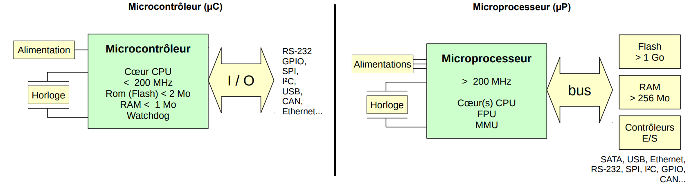

|  Microcontrôleur| Microprocesseur|
| ------------------------- | -------------------------------------------------- |
| Généralement pas de système d'exploitation (ou minimal). | Optimisé pour l'utilisation d'un système d'exploitation |
| Mise en œuvre électronique simple. | Mise en œuvre électronique beaucoup plus complexe |
| Déterminisme et fiabilité de fonctionnement. | Entrées-sorties réalisées par des contrôleurs externes au processeur |

Quelques exemples de microcontrôleurs :
• Atmel : AT91 (AT91SAM9xx, AT91SAM7xx), AVR (TinyAVR, MegaAVR…) 
• Freescale : 68HC05, 68HC08, 68HC11
• Hitachi / Renesas : H8 (H8/300, H8/500…), SuperH (SH-1, SH-2, SH-3...)
• Intel : 8051, 8052, 8085
• Microchip : PIC (PIC-10F, PIC-12F, PIC-16F, PIC-24F)
• STMicroelectronics : ST6, STM8, STM32
• Texas Instruments : MSP430, TMS320, TM4C

Quelques exemples de microprocesseurs :
• Famille Arm : ARM7 (Arm 720T), ARM9 (Arm 926) ARM11 (Arm 1176jzf), Cortex-A
(Cortex-A7, Cortex-A8, Cortex-A9, Cortex-A15),
• Famille x86 : Intel (Atom, Core 2, Core i5, Core i7), AMD (Opteron, Phenom), Via
(Nano)
• Famille M68k : Motorola 680x0, Coldfire (MCF5xxx), Dragonball.
• Famille PowerPC : Apple (G5), IBM (Power 6, Power 7, Power 8, Cell, Xenon)

Un *System on Chip* regroupe un microprocesseur et des périphériques sur le même boitier.

| SoC |
| -------- |
| Contrôleurs d'entrées-sorties déjà incorporés
Intégration électronique encore assez complexe
Souvent peu d'entrées-sorties industrielles (CAN) ou analogiques (ADC/DAC, PWM) |

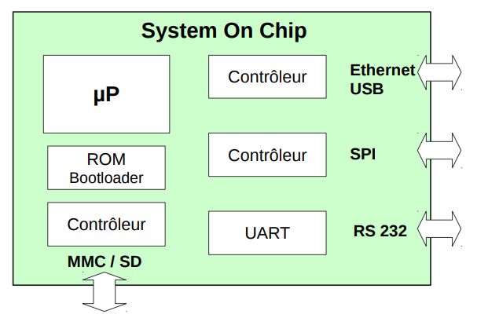

Quelques systems-on-chip Arm :
• Allwinner : A13, A20, A80
• Broadcom : BCM2835, BCM2836
• Freescale : i.MX21, i.MX23, i.MX6
• Marvell : 88SE6, 88SE9
• Rockchip : RK30, RK31
• Texas Instruments : OMAP, DaVinci

<div id='clang'/>

# Le language C en embarqué ?

On se demande pourquoi le language est particulièrement adapté à l'embarqué? La réponse est que le besoin de l'embarqué est de se retrouver très proche de la machine.
Le language le plus proche de la machine est le langage assembleur, cependant écrire un programme en assembleur est pénible et long à faire. Le langage C permet de rajouter une couche, afin de programmer plus rapidement mais en restant proche du hardware.
Ce dernier est réutilisable facilement et très bien strusturé pour nos applications.
Mais parfois le language C ne suffit pas il faut revenir au language assembleur.
Il peut être intéressant de mixer des fichiers écrits en langage C avec des fichiers écrits en langage d’assemblage.
Un tel exemple est disponible dans la section STM32, Assembleur et C.

<div id='clangwhy'/>

## Un programme en embarqué c'est quoi ?

Un programme est une suite d'instruction lancé au démarrage du processeur. Celui ci ne doit jamais se terminer.
Ainsi ce dernier doit se trouver dans une boucle infini pour ne jamais s'arrêter.
Cependant l'application de l'embarqué nous contraint d'optimiser la consommation de courant, la taille du programme et le temps d'exécution.
Ainsi un programme functionnant sous interruption est préféré à un programme qui marche sous scrutation (polling).

## La compilation

La compilation est le fait de transformer un programme écrit en language C/Assembleur vers du binaire (des 0 et 1).

La compilation se fait la plupart du temps en embarqué sous la forme de cross-compilation.
Mais qu'est-ce qu'une chaine de cross compilation?!
La machine de développement est en effet en général un ordinateur commum et non pas la cible embarqué directement.
Ainsi le programme est écris sur une machine Intel,AMD,etc ... et l'architecture cible est un processeur du type ARM, etc ...

Un des cross-compilateurs les plus utilisé pour arm est : `arm-none-eabi`
Qui présente les différents compilateurs habituel tel que `gcc g++ as` etc ...

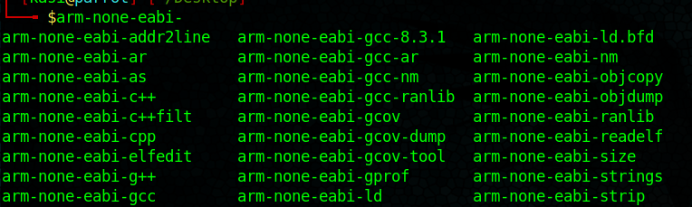

La compilation est le processus qui se déroule en plusieurs phases pour créer les fichiers nécéssaire à l'execution du programme par la machine.
Elle permet de traduire un programme C en langage machine (binaire) que pourras executer cette dernière.


Elle se déroule en plusieurs phases :

- La phase de préprocessing : Le code source est analysé par le program appelée preprocesseur qui se charge d'enlever les commentaires, de remplacer les defines dans le code etc ...
- La phase d'assemblage ou de compilation : Les fichiers générés par le preprocesseur sont traduit en assembleur, ensuite vers un language machine (celle de la machine cible).
- La phase de Link : Permet de rejoindre les fichiers entres eux (un programme C est parfois divisé en plusieurs sous fichiers).
- La phase de boot : placé avant le main qui permet d'initilialiser la pile et son pointeurs ainsi que diverses variables.

À cela s’ajoute des librairies pour le C++ ainsi que des librairies C avec des extensions POSIX et les librairies standards. Nous utiliserons enfin une implémentation de la microlib C spécifique pour ARM et qui offre une version optimisée (en particulier l’empreinte mémoire) des librairies standards pour les systèmes embarqués.

Lorsque que la compilation est effectuée cette dernière génères de nombreux fichiers qui peuvent nous être bien utile :

- Un fichier fichier de link (*.ldscript*) qui te permet d'indiquer les différentes sections du programme ainsi que le point d'entrée.
- Les fichier listing (*.lst*) :  contiennent des informations sur les erreurs de compilation et/ou d’assemblage.
- Le fichier mapping (*.map*) : contient l’ensemble des informations relatives à l’organisation mémoire de l’application. On peut y trouver entre autres les adresses physiques où seront implémentées les variables, les procédures, les sections, etc.
- Le fichier exécutable ( *.axf* ou *.elf* ou *.hex*) : contient l’image (en binaire ou en version éditable de l’application)

## Le démarrage (Startup) d'un programme embarqué :

Le point d'entrée d'un programme est classiquement basé à l'addresse 0x00000000. Ou sur l'addresse qui correspond à la mémoire ROM du processeur (varie suivant le processeur).


## Les types de mémoires

On distingue deux types de mémoires:
- Les mémoires volatiles (ce sont des mémoires qui s'éfface lorsque le dispositif est hors tension) :
	- SRAM : Static Random Access Memory (Granularité à l'octet en écriture et en lecture | Accès rapide en R/W | Basse consommation en courant | Toujours utilisé dans les microcontroleurs)
	- DRAM : Dynamic Random Access Memory (Granularité à l'octet, Ecriture rapide en écriture et en lecture | Haute consommation en courant | Non utilisé dans les microcontroleurs)
- Les mémoires non volatiles (Des mémoires qui restent intacte lorsque le dispositif est mise hors tension)
	- ROM : Read Only Memory (Granularité à l'octet R/W) | Accès rapide à la lecture | Impossible à écrire)
	- EEPROM : Electrically Erasable Programmable Read Only Memory (Granularité à l'octet R/W | Accès lent écriture R/W)
	- Flash (Nor) (Granularité d'un octet : doit être écris en pages (block d'octets) | Accès très lent en mode écriture | Toujours utilisé dans les microcontroleurs)

Dans un microcontoleur : 
La mémoire Flash est utilisé pour stocker le programme en mémoire, 
La mémoire EEPROM pour stocker les paramètres et les valeurs.
La mémoire SRAM pour la pile (stack).

## Comment est composé un programme ? (Segmentation)

La mémoire d’un programme informatique est divisée ainsi :

- Un segment de données (données + BSS + tas) ;
- Une pile d'exécution, souvent abrégée par "la pile" ;
- Un segment de code.


### Segment .rodata (Read Only Data)

Le segment .rodata contient des constantes statiques plutôt que des variables.

### Segment de données .data

Le segment .data contient toutes les variables globales ou statiques qui ont une valeur prédéfinie et peuvent être modifiées.
Il s'agit de toutes les variables qui ne sont pas définies dans une fonction (et qui peuvent donc être accédées de n'importe où) ou qui sont définies dans une fonction mais qui sont définies comme statiques afin qu'elles conservent leur adresse lors des appels suivants.

Les valeurs de ces variables sont initialement stockées dans la mémoire morte (généralement dans .text ) et sont copiées dans le segment .data pendant la routine de démarrage du programme.
Notez que dans l'exemple ci-dessus, si ces variables avaient été déclarées à partir d'une fonction, elles seraient stockées par défaut dans le cadre de la pile locale.

### Segment .text

Le segment .text est l'endroit qui correspond à l'espace d'addressage du programme en ce qui concerne les instructions éxecuté par le programme. Cette zone est généralement en lecture seule et de taille fixe.

### Segment .bss

Le segment BSS aussi connu comme zone de données non initialisées commence à la fin du segment de données et contient toutes les variables globales et toutes les variables statiques qui sont initialisées à zéro ou n’ont pas d’initialisation explicite dans le code source. 
Par exemple, une variable déclarée `static int i;` sera « contenue » dans le segment BSS.

### Segment Heap : "Le Tas"

La zone de tas commence généralement à la fin des segments .bss et .data et se développe vers des adresses plus grandes à partir de là.
La zone de tas est gérée par malloc , calloc, realloc et free.
La zone de tas est partagée par tous les threads, bibliothèques partagées et modules chargés dynamiquement dans un processus.

### Segment Stack : "La Pile"
La zone de pile contient la pile de programmes , une structure LIFO (Last In First Out). 
Généralement située dans les parties supérieures de la mémoire. Un registre "pointeur de pile" suit le haut de la pile; il est ajusté chaque fois qu'une valeur est "poussée" sur la pile.

Un exemple simple pour illustrer le cas d'une variable en pile et une autre en heap est la suivante :

La zone mémoire ou sont conservés les varibales dépend ou est déclaré la variable dans le programme prenons l'exemple de ce programme :
```
uint32_t myvarOutMain; //Saved int the data section of the RAM in the heap

int main(void)
{
	uint32_t myvarInMain = 0xDEADBEEF; //Saved in the stack
	return 0;
}
```
Dans le premier cas pour la variables `myvarOutMain` cette dernière est conservée dans le "heap", et pour la variables `myvarInMain` cette dernière est conservée dans la pile.

## La Table des vecteurs et table de vecteur d'interruption. (Exceptions)

### Reset
La réinitialisation est invoquée lors de la mise sous tension ou d’une réinitialisation à chaud.  
Lorsque la réinitialisation est confirmée, le fonctionnement du processeur s’arrête, potentiellement à n’importe quel point d’une instruction. 

### NMI
Une interruption NonMaskable (NMI) peut être signalée par un périphérique ou déclenchée par un logiciel. C’est l’exception de priorité la plus élevée autre que la réinitialisation.

### Hard fault
Une faute matérielle est une exception qui se produit en raison d’une erreur lors du traitement des exceptions, ou parce qu’une exception ne peut pas être gérée par un autre mécanisme d’exception.

### Memory Management Fault
Un défaut de gestion de la mémoire est une exception qui se produit en raison d’un défaut lié à la protection de la mémoire. Le MPU ou les contraintes de protection de la mémoire fixe déterminent ce défaut, tant pour les transactions d’instruction que de mémoire de données.

### IRQ
Une interruption, ou IRQ, est une exception signalée par un périphérique, ou générée par une demande de logiciel. Toutes les interruptions sont asynchrones à l’exécution des instructions. Dans le système, les périphériques utilisent des interruptions pour communiquer avec le processeur.

### SysTick
Une exception SysTick est une exception que la minuterie du système génère lorsqu’elle atteint zéro. Le logiciel peut également générer une exception SysTick. Dans un environnement OS, le processeur peut utiliser cette exception comme coche système.

### SVCall
Un appel de superviseur (SVC) est une exception qui est déclenchée par l’instruction de SVC. Dans un environnement OS, les applications peuvent utiliser des instructions SVC pour accéder aux fonctions du noyau OS et aux pilotes de périphériques.

## La MMU (Memory Managment Unit) au niveau du CPU :

Un processus voit un espace de mémoire virtuelle, au sein du quel il peut accéder à n'importe quelle adresse de 0x000000 à 0xFFFFFFFF (sur processeur 32 bits).
Cet espace est découpé en pages, et la MMU – Memory Managment Unit (un composant intégré dans le processeur) –  associe une page de mémoire virtuelle avec une page de mémoire physique en effectuant la modification d'adresse lors de l'accès à la mémoire. 

Certaines pages de mémoire virtuelle n'ont pas de correspondance en mémoire physique : une tentative d'accès déclenche une interruption « faute de page ».
Chaque processus dispose d'une configuration personnelle de la MMU. Cette dernière est programmée à chaque commutation entre deux processus.

Un processus ne voit que les pages de mémoire physique qui lui ont été attribué par le noyau ; 
les pages des autres processus ne sont projetées à aucun emplacement de sa mémoire virtuelle.

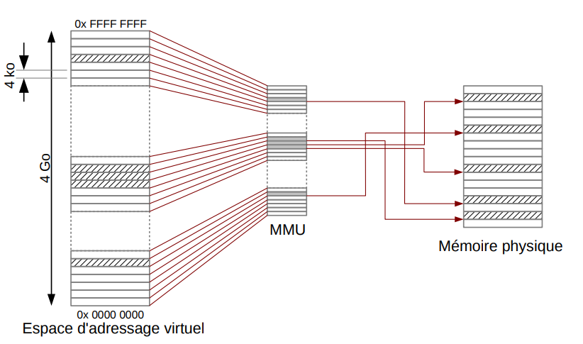

## Les Clocks.

Tout les périphériques doivent être sous horloge pour fonctionner.
Mais attentions tout les périphériques ne sont pas sous la même horloge ils sont cadencés par leur bus propre.

## Les GPIOs

GPIO signifie General Purpose Input/Output : ils font partis des périphériques. C'est le périphérique qui permet de contrôler les pins et qui permet de communiquer avec le monde extérieur.
La connexion entre les pins et le CPU est effectuée à travers un PORT.

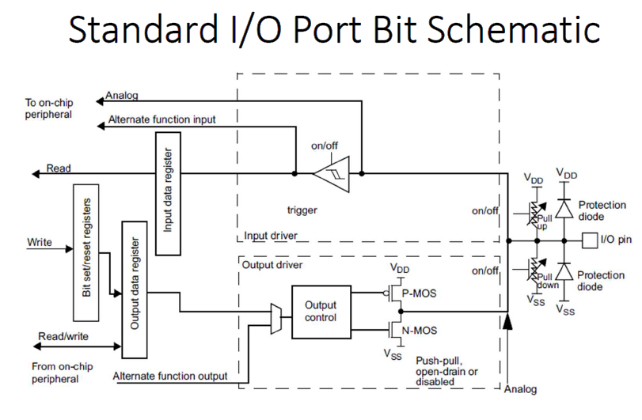

La DataSheet du composant donne le diagramme du pinout du composant sur lequel on travaille et indique sur quel port est relié quelle pin : Prenoms par exemple le pinout du raspberry pi :


On prendra garde que plusieurs pin ont des fonctions multiples et parfois uniquement disponible sur ces broches. (Timer, I2C, UART, etc ...)
Les pins d'alimentations sont repérées par l'inscription : 5V,3.3V ou encore VDD et VSS(ou GND), VDDIO etc ...

On trouve les fonctions alternative des gpios dans la datasheet de notre composant :
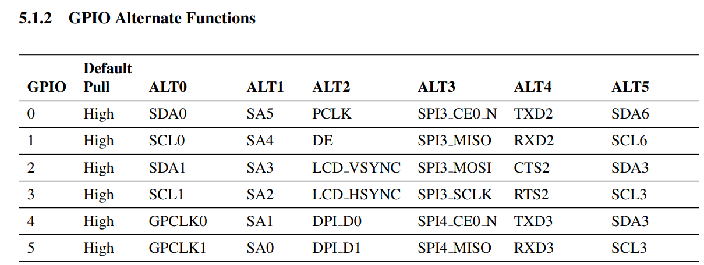

On observe ainsi l'état de base de la sortie en Pull-up ou Pull-Down pour notre exemple ci dessous la GPIO0 est en pull up et possède 5 fonctions alternatives.

Ainsi chaques proches est connecté à un port. Un port peut être connecté au maximum à 16 broches. Le port est repéré par une lettre et un nombre qui correspond au numéro du pin. Ainsi par exemple PC2 signifie : Entrée/Sortie 2 du port C.

Chaques ports à au moins 10 registres de configurations :
```
MODER: Mode Register (input; output, alternate function, analog)
OTYPER: Output Type Register (Output Speed Register)
PUPDR: Pullup / Pull-down Register (if pin configured as open drain)
ODR: Output Data Register
IDR: Input Data Register
BSSR: Bit Set / Reset Register
AFRL/H: Alternate Function Register (connect pin to timers, bus, event)
BRR: Bit Reset Register (reset ODR registers)
LCKR: Lock Register
```

Pour plus d'informations chercher les informations dans le Reference Manual du processeur.

## Les Timers

Tout les timers dans tout les micro-contrôleur ont :
- Une horloge.
- Un Prescaler pour diviser la fréquence de l'horloge.
- Un compteur pour stocker la valeur du nombre de ticks. (TIMx_CNT)
- Un registre d'auto-reload pour interrargir avec le compteur. (Comparaison, reload ...) (TIMx_PSC)
Par exemple si l'autoreload register est égale à 36, lorsque le compteur dépasse 36 il revient à 0.

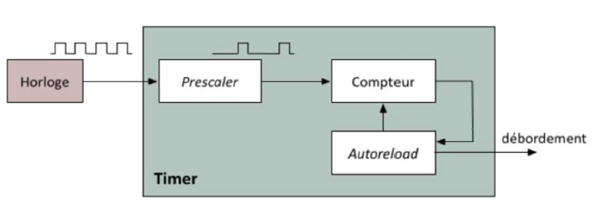

Ce dernier se sert du presclaer et de l'horloge pour s'incrémenter : l'autoreload permet de remettre la valeur à 0 comme le montre l'exemple ci dessous :

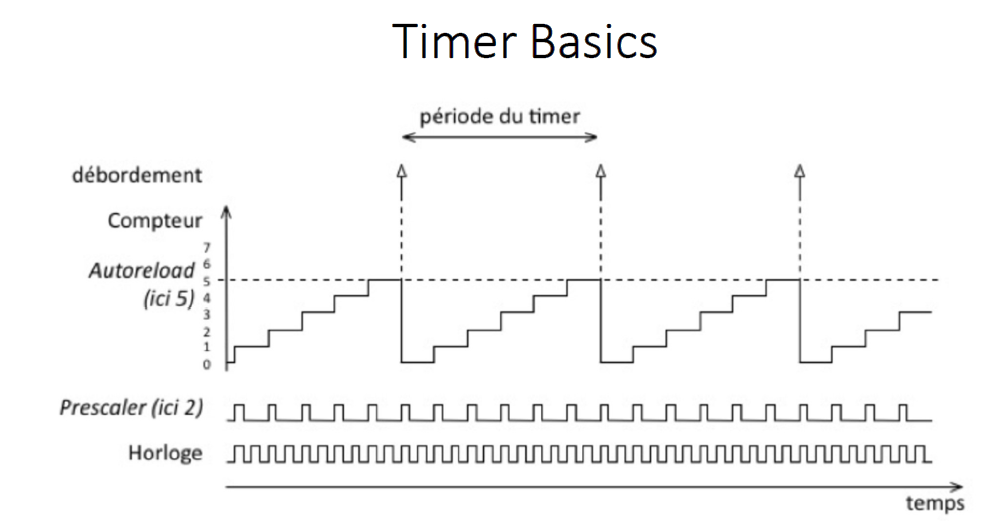


## Les interruptions

Pour un système embarqué les interruptions sont déclarés dans la table des vecteurs et présent dans le fichier de startup :
Le gestionnaire d'interruption doit avoir le nom écrit dans la table de vecteur.
Ce nom est normalisé par ARM pour la compatibilité entre plates-formes et fournisseurs.

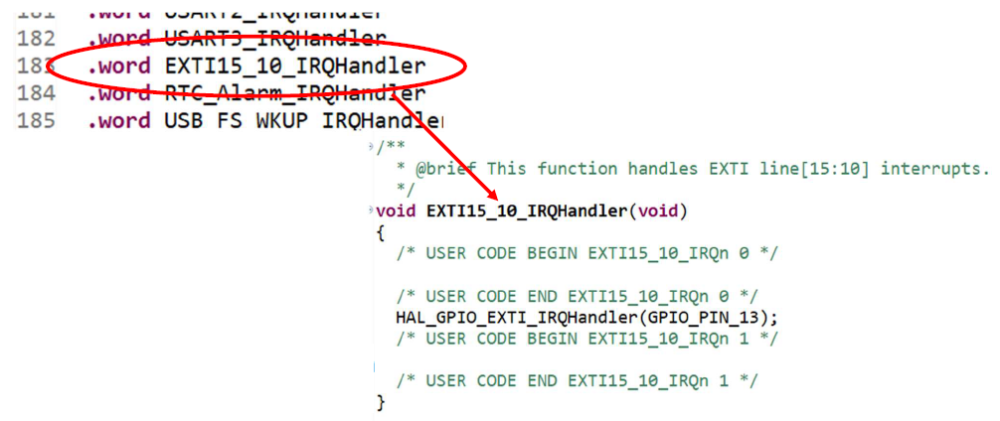

Cette dernière est déjà prédéfinie par le constructeur et elle est déclaré en tant que `.weak      EXTI15_10_IRQHandler` ce qui veut dire que par exemple pour l'interruption externe 15_10, la routine d'interruption (ou ISR) doit se nommer dans ce cas : "EXTI15_10_IRQHandler".

## Le DMA
L'accès direct à la mémoire (en anglais DMA pour Direct Memory Access) est un procédé informatique où des données circulant de, ou vers, un périphérique sont transférées directement par un contrôleur adapté vers la mémoire principale de la machine, sans intervention du microprocesseur si ce n'est pour lancer et conclure le transfert.
La conclusion du transfert ou la disponibilité du périphérique peuvent être signalés par interruption.
Son objectif est de décharger le processeur des transferts de données.
Le contrôleur de DMA est un module matériel capable de réaliser des transferts entre les périphériques et la mémoire.
L'avantage d'une telle technologie est que le processeur peut faire autre chose.
Le transfert des données peut être plus rapide.


La configuration minimale du DMA est la suivante :
```
Adresse de source du transfert
Adresse de destination du transfert
Nombre de données à transferer
Taille des données (octets, mots...)
```
Le déclenchement du DMA peut se faire par 2 voies :
- Déclenchement par logiciel (notamment dans le cas de transferts mémoire vers mémoire)
- Déclenchement sur événement d’un périphérique (exemple : données reçues par la carte réseau)
 
Contrôleur du DMA:
- Plusieurs canaux (channels) pour effectuer plusieurs transferts en même temps (en provenance de plusieurs périphériques par exemple)
- Registres de configuration par canaux
- Transferts
	• Périphérique vers mémoire
	• Mémoire vers périphérique
	• Périphérique vers périphérique
	• Mémoire vers mémoire
		- Possibilité de remplir une zone mémoire avec un motif

Il y a différents mode d'opérations possibles :
- Rafale (Burst) : Le bloc de données est transféré en une seule fois. Une fois que le contrôleur de DMA a accès au bus, il le conserve pendant tout le transfert. Le processeur ne peut pas faire d’accès mémoire pendant ce temps
- Vol de cycle (Cycle Stealing) : Le processeur et le contrôleur de DMA se partagent alternativement le bus (un cycle pour le processeur, un pour le contrôleur de DMA)
- Transparent : Le contrôleur de DMA n’a accès au bus que lorsque le processeur n’en a pas besoin.

## L'endianness

En mode Big Endian, le most significant bit(MSB) est à l'addresse la plus basse.
En mode Little Endian, le less significant bit(LSB) est à l'addresse la plus basse.

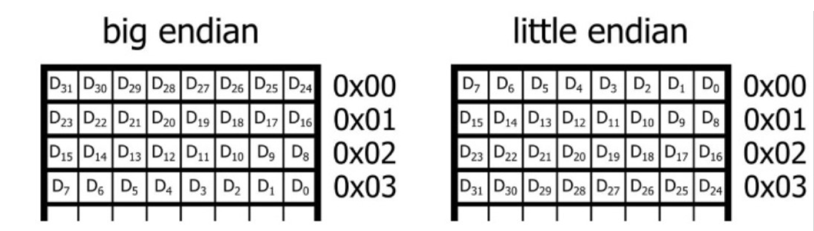
Durant les transmissions en little endian le LSB est transmis en premier.
En big endian, c'est le bit le plus haut est est transmis en premier.

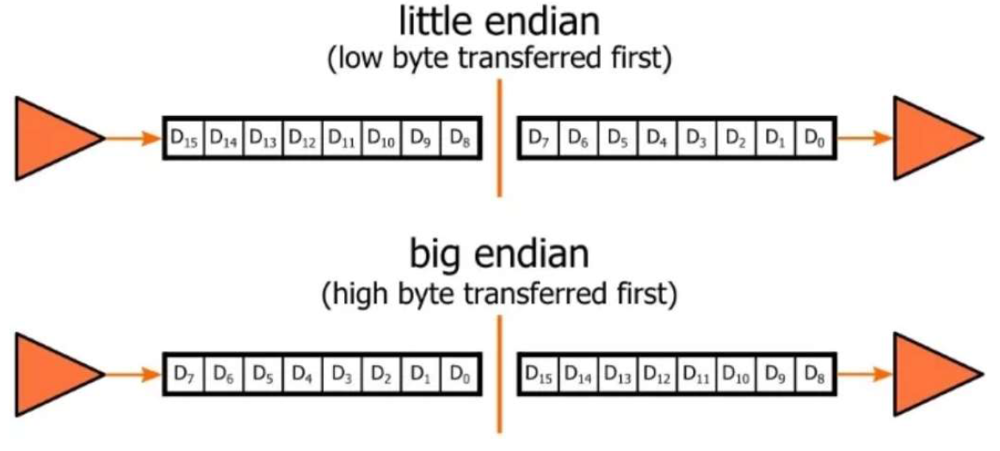

# Les systèmes exploitations embarqués :

## Processus de démarrage

Suivant le type de processeur et la complexité du matériel, le temps de boot du noyau dure de
deux à cinq secondes environ.
Le démarrage du processus init, les tâches administratives (montage systèmes de fichiers,
configuration paramètres de /proc (sous linux) , etc.) prennent une à deux secondes supplémentaires.
Le lancement de tous les services (réseau, authentification, environnement graphique, etc.)
peut demander une dizaine de secondes.

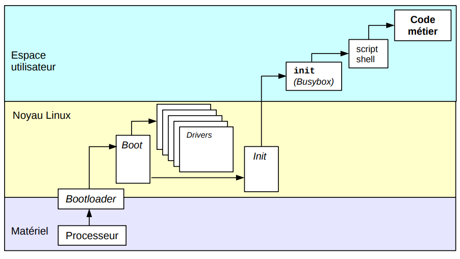

## Bootloader ou bootstrap
Un chargeur d'amorçage (ou bootloader) est un logiciel permettant de lancer un ou plusieurs systèmes d'exploitation (multiboot), 
c'est-à-dire qu'il permet d'utiliser plusieurs systèmes, à des moments différents, sur la même machine. En ce qui nous concerne: un petit programme qui charge un grand
programme et qui lui donne le contrôle.

Sous Windows ou Linux le plus répendu est "GNU GRUB"


### Sur une plateforme embarqué.

Sur une plateforme embarqué on utilise plutôt un de ces bootloaders :
- U-Boot (https://github.com/u-boot/u-boot)
- RedBoot
- Micro Monitor


Ce programme réside dans une zone spéciale de la mémoire flash et fournit un moyen pour :
- Effectuer les tests d’initialisation du matériel
- Charger une image du noyau et l’exécuter

Description
U-Boot (Universal Boot Loader) est le "BIOS" présent sur nos cartes.

Si aucun système d'exploitation n'est requis pour votre application, U-Boot peut être utilisé comme base de développement.

U-Boot est open source (GPL), sans royalties et bénéficie d'une communauté de développeurs importante et extrêmement active.

Les tâches principales d'U-Boot
Initialisation du matériel et plus particulièrement du contrôleur mémoire
Passage des paramètres de démarrage au noyau Linux
Lancement du noyau Linux
U-Boot permet aussi de :
Lire et écrire dans différentes zones mémoire
Charger des images binaires dans la RAM par cable série, Ethernet ou USB
Copier des images binaires de la RAM vers la FLASH
Programmer le FPGA


# OS et code BareMetal
## BareMetal

La programmation BareMetal consiste à écrire du code pour faire tourner directement le hardware (ou via des library) sans aucunes autre abstraction comme un système d'exploitation.
Au minimum la programmation BareMetal doit avoir un minibootloader pour initialiser le processeur, les horloges, la mémoire (etc ...) et saute au programme principal.


## Linux embarqué

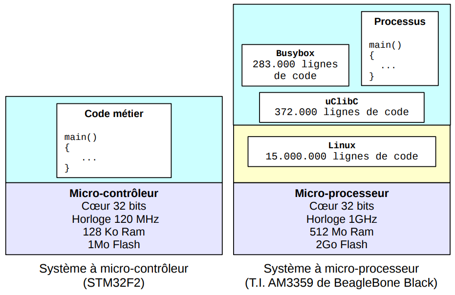

Sur un système à micro-contrôleur, le code métier(BareMetal Code) est le seul maître à bord, il accède à volonté aux périphériques, à la mémoire, etc. 
Au contraire, dans un système à micro-processeur, le code métier n'est qu'une petite partie de l'ensemble du logiciel. Il est soumis à l'ordonnancement et au sous-système de gestion mémoire du noyau. Il s'appuie sur des bibliothèques et des utilitaires externes.

<div id='middleware'/> 

# MiddleWare

On appelle MiddleWare, le code que l'on peut trouver entre la partie Driver et la partie Applicative (coté utilisateur).

## MiddleWare Cybersécurité
Les middleWare les plus populaire dans l'embarqué en terme de fonctions liés à la cybersécurité est la librarie MbedTLS.

Coté PC on trouve plutôt le middleware OpenSSL.
### MbedTLS 
Accès github : https://github.com/ARMmbed/mbedtls

## MiddleWare TCP/IP
Dans les MiddleWare TCP/IP on trouve plusieurs alternatives possibles : il existe dans le monde de l'opensource lwip-tcpip/lwip
Payant on trouve aussi la Stack Treck ( https://treck.com/ ) qui permet de communiquer en utilisant les protocoles ethernets.

### LwIP : (LightWeight IP Stack)
Accès github : https://github.com/lwip-tcpip/lwip

<div id='tools'/> 

# Outils de développement pour les systèmes embarqués :

```
Virtualisation
Eclipse
Code Composer Studio
IAR Embedded Workbench
Keil (Permet de mettre en place un environnement embarqué rapidement et facilement, possède un simulateur et une interface de debug très intuitive).
Quartus (FPGA Altera)
Vivado (FPGA Xilinx)
```
<div id='glossary'/> 

# Glossaire aux systèmes embarqués

```
Bootloader	Secteur d'amorçage (Permet de charger un noyau depuis un système de fichier ext2 ou
ext3/4)
ARM		Advanced RISC Machines (Société de conception de processeur basé à Cambridge)
CPU		Central Processing Unit
FPU		Floating Point Unit
MPU		Memory Protection Unit
GPIO 	General Purpose Input/Output
AHB		Advanced High-performance Bus
APB		Advanced Peripheral Bus
DMA		Direct Memory Access
GRUB	GRand Unified Bootloader
CAN 	Control Area Network (Bus de données)
CRC		Cyclic Redundancy Check
PWM		Pulse Width Modulation
SoC		System On Chip
ASICs	Application-specific integrated circuit
I2C		Inter-Integrated Circuit (Communication Série)
SPI		Serial Periphical Interface (Communication Série)
UART	Universal Asynchronous Transmitter Receiver (Communication Série)
USB		Universal Serial Bus (Communication Série)
BSP		Board Support Package (Logiciel bas niveau de support de cartes-mères, c'est-à-dire entre l'OS et la carte mère)
INTC	Interrupt Controler
DRIVER	Pilote (Permet de faire le lien entre le matériel et le logiciel)
GPP		General Purpose Memory Controller
FPGA	Field Programmable Gate Array
QNET	Quadnet Pile d'execution
RTOS	Real Time Operating System (Linux RT, FreeRTOS, VxWorks, Unix, OS/2 , Symbian, QNX , RTXC Quadros... )
RSTP	Rapid Spanning Tree Protocol
PLL 	Phase Locked Loop
RMII 	Reduced media-independent interface (Ethernet)
Modbus	TCP Modbus Protocol (Port 502)
SNMP	Simple Network Management Protocol
SNTP	Simple Network Time Protocol
LLDP	Link Layer Discovery Protocol
HPC	Host Proxy Component
EIP	EtherNet Industrial Protocol
TFTP	Trivial File Transfer Protocol
RTC	Real Time Clock
DSP	Digital Signal Processor
ΔΣ	ADC Analog to Digital Converter
TPM	Trusted Plateform Module	 
SPL	Secondary Prgram Loader 
NOR Flash	Mémoire non volatile
PMIC	Power management integrated circuit
SDRAM	Mémoire RAM volatile
IOC	 	Input Output Controler
NVIC	Nested Vectored Interrupt Controller
PBS	Product Breakdown Structure
```

# Références :
http://syst.univ-brest.fr/boukhobza/images/stories/Documents/Teachings/OSM/Cours/OSM_7_Boukhobza.pdf
