# Systèmes-embarqués

Ce dépôt regroupe des outils / documentation / tutoriel et codes qui peuvent être utiles pour un système embarqué.
Je propose dans ce dépot d'expliquer les systèmes embarqués simplement et plus en détail grâce à mes connaissances et à divers tutoriel disponible sur le web.
: vous pouvez suivre cette chaine Youtube qui vous permettra aussi d'évoluer rapidement : https://www.youtube.com/channel/UCY0sQ9hpSR6yZobt1qOv6DA/videos

## Introduction aux systèmes embarqués :

Un système embarqué est un ensemble électronique et/ou informatique intégré comme composant d'un environnement plus important.
Un système embarqué se définit surtout par les contraintes auxquelles il est soumis.
En général ce système est un microcontrôleur basé sur une technologie temps réel.
Le microcontrôleur de référence pour l'embarqué sur une architecture ARM, on retrouve ainsi comme référence le processeur basé sur STM32 de chez STM Electronic.
Celui-ci est représentatif des architectures modernes et est présent dans de nombreux systèmes industriels existants.
Cela inclut les téléphones, les routeurs et sans oublier les appareils IoT qui semblent exploser dans les ventes ces jours-ci. 
Cela dit, le processeur ARM est devenu l'un des cœurs de processeur les plus répandus au monde.


Un tel processeur est disponible pour un peu plus d’une dizaine d’euro sur une carte de développement.
Cette carte dispose d’une connectique compatible avec les composants Arduino, ce qui vous permettra de poursuivre sa prise en main en investissant dans quelques composants supplémentaires. 
Pour l’utiliser, il suffit d’un simple câble USB  et une chaîne de développement adaptée.


# Sommaire

 - [L'histoire de l'informatique UNIX](#history)
 - [Généralités sur les systèmes embarqués](#embeddedsystem)
	- [Un Microprocesseur c'est quoi ?](#microprocesseur)
	- [Microcontroleur / Microprocesseur / et System on Chip (S.O.C)](#soc)
 - [Le language C en embarqué ?](#clang)
	- [Un programme en embarqué c'est quoi ?](#clangwhy)
 - [Le MiddleWare](#middleware)
 - [Les outils de l'embarqué](#tools)
 - [Glossaire](#glossary)
 
 
<div id='history'/>  

# Un peu d'histoire ...

## Multics, UNICS, UNIX
Avant de rentrer dans les détails, commençons par comprendre comment on en est arrivé là ?

La naissance d’UNIX est particulièrement liée à l’histoire des Bell Labs, des laboratoires qui verront la naissance du transistor, du laser, d’UNIX, du langage C et C++ ou encore de la fibre optique.
En 1966, il ressort de la célèbre université de Berkeley, en Californie, avec une maîtrise en électronique et science informatique. 
Peu après, il va rejoindre l’équipe de développement au Bell Labs du système d’exploitation Multics où il va rencontrer Dennis Ritchie.

Le système Multics hérite d’un système plus ancien CTSS, dont la principale caractéristique était d’être à temps partagé et non en traitement par lot. 
Plusieurs utilisateurs pouvaient utiliser la machine en même temps pour des tâches différentes. Le système d’invite de commande et de traitement de texte vont être les précurseurs du shell et de Troff au sein d’UNIX.

Mais en plus de cet héritage, Multics va inclure le support du terminal distant permettant à chacun d’exécuter des tâches depuis son terminal dans son bureau sur l’ordinateur central. 
Pour mener cela à bien, un système d’anneaux de sécurité va se mettre en place permettant aux applications de se lancer avec des droits plus ou moins restreints. 
Technique que l’on va retrouver dans l’architecture des processeurs modernes comme le x86. Le système de fichier hiérarchisé va servir de référence à l’arborescence d’UNIX.

Cependant, en 1969 le travail de Dennis Ritchie et de Ken Thompson s’arrêtera sur Multics, les Bell Labs se retirent du projet. Cela va laisser le champ libre à la création d’UNIX. 
Ken profita du temps libéré pour créer son nouveau système, un prototype de ce qui deviendra UNIX sur un PDP-7 et le tout écrit dans un langage d’assemblage. 
Son collègue Brian Kernighan suggéra de nommer le système en Unics car contrairement à Multics, il n’y avait qu’une seule méthode pour faire les choses. 
Pour des raisons obscures, sans doute commerciales, Unics deviendra UNIX.

Le problème de ce système est sa difficulté à être portée. Ken travaillait en parallèle sur un langage de programmation nommé le B qui descend du BCPL. 
Ce langage est le prédécesseur du C. Cependant UNIX ne sera pas porté en B, en effet ce langage n’était pas adapté à un portage sur une autre machine aisément en plus de performances jugées médiocres. 
UNIX a failli être porté à ce moment-là en TMG ou Fortran.

En 1969 et 1970, Ritchie travailla sur le langage C pour succéder au B. 
Après sa disponibilité en 1971, Ken s’attela à porter UNIX en C sur un PDP-11, cet ordinateur ouvrait la porte du traitement de texte avec le langage roff et ses descendants futurs. 
À partir de 1972, UNIX est enfin portable et sa diffusion pourra bientôt commencer. Ken sera très impliqué dans son développement jusqu’à la diffusion de la version 6 en 1975. 
Les versions 4, 5 et 6 avaient apporté notamment le pipe permettant de lier les programmes entre eux grâce à l’apport de Doug McIlroy. Cette année-là UNIX commença à quitter le Bell Labs. 
Il prendra un congé sabbatique pour apporter UNIX dans l’université de Berkeley. Université qui sera à l’origine du schisme d’UNIX avec la naissance de BSD.

Pendant son travail sur UNIX, il sera à l’origine des utilitaires grep et ed, l’éditeur de texte qui servira de base à la création de vi et Vim. 
En effet, à cette époque les informaticiens étaient souvent proches des mathématiques et Ken Thompson va exploiter des travaux récents dans le milieu. 
Dans les années 1940 et 1950, Michael Rabin, Dana Scott et Kleene vont travailler sur la formalisation des expressions régulières. Ken Thompson va être le premier à exploiter cette découverte mathématique. 
Il ira plus loin en publiant un article en 1968 à ce sujet. 
Il en découlera un algorithme qui rend triviale la compilation d’une expression régulière en un automate fini non-déterministe (AFN) et la conception d’une machine virtuelle permettant d’exécuter un tel AFN de façon performante. Ce travail sera utilisé dans l’éditeur de texte qed sur CTSS avant de poursuivre ce travail sur UNIX avec ed et grep. Par la suite la plupart des logiciels de gestion du texte ou les langages de programmations vont reprendre ces concepts.

Ken Thompson n’a eu aucun regret sur la conception d’UNIX, quand on lui demandait ce qu’il aurait changé avec le recul dans UNIX, il répond avec humour «J’aurais orthographié creat avec un e». 
La fonction système creat() n’est pas correctement orthographiée sans raison apparente, l’orthographe réelle rentrant dans les 6–8 caractères qui était une limite à cette époque.


Source : https://zestedesavoir.com/articles/32/les-personnages-cles-de-linformatique-la-naissance-dunix/

## BSD (Fin années 1970) (https://github.com/freebsd)

Est une famille d'Unix libre, est une variante d'Unix développé par l'université de Berlekey en Californie.
Berkeley Software Distribution.
Le système BSD contient du code issue de Unix (d'AT&T) et au début des années 1990 AT&T intente un procès contre l'Université de Berkeley pour violation de propriété intellectuelle qui représente un frein majeur au développement.
Finalement BSD supprimera les parties incriminés de son code et continuera son développement.
Ainsi à partir d'ici trois Unix libres ont été développé à partir de 1993 :
- FreeBSD : Le plus répandus
- NetBSD : porté sur toutes les plateformes existances
- OpenBSD : orienté sécurité. Très populaire sur les serveurs.

Ils ont un tronc commun de commandes unix.
La différence entre un système BSD et Linux se trouve au niveau de la licence.
Licence beaucoup plus permissive qui inclut toutes les libertés.
En autre :
- Ne dites pas que c'est vous qui l'avez écrit.
- Tant pis si ça ne fonctionne pas chez vous.
- Prenez le code et faites-en ce que vous voulez.


## Le projet GNU (1983) (https://www.gnu.org/home.fr.html)

Créer en partie par Richard Stallman , le projet GNU (qui est aussi le nom d'un animal en afrique) signifie en réalité Gnu's Not Unix : c'est à dire que GNU n'est pas Unix.
Malgrès que UNIX reste le système d'exploitation de référence. Son défaut c'est de ne pas être libre.
L'ambition du porjet GNU consiste à proposer un système d'exploitation libre 100% compatible avec Unix mais qui n'est pas Unix (N'en contient aucune ligne de code).

Unix est composé d'une mutltitude de petits programmes qui font des choses qui s'acquitte d'une tâche bien définie.
Cette modularité va facilier la tâche au projet GNU qui se pose comme but concret de remplacer l'in après l'autres chacun des composants UNIX par un équivalent libre.
Au passage Richard, créer l'organisation à but non lucratif (FSF en 1985) pour la défense et la promotion du logiciel libre.
Pour éviter de se faire "cannibaliser par les éditeurs de logiciels propriéraires".
Richard contribue ainsi en partie à développer compilateur, débogueur, et une suite d'outils basique ainsi que l'éditeur Emacs.
En 1990, il ne manque plus que la partie importante : le kernel.
En 1990, la FSF lance le développement de GNU/Hurd, un projet de noyau livre pour les sytèmes Unix, le projet va battre de l'aile dès le début. Et ne sera jamais publiée que dans une version 0.9 en décembre 2016.

## GNU/Linux

En 1991 Linus Torvalds étudiant finlandais à l'université de Helsinko, achète un IBM PC 30386 (Processeur 32-bits) (bête de course à l'époque).
Au début de ces annnées les ordinateurs personnels à base Microsoft sont surtout équipé de MS-DOS (Un OS propriétaire et commercial livré sur disquettes floppy).
Les ordinateurs de la marque Apple tournent sous Mac OS également propriétaire.
En 1990, Unix reste hors de portée pour les particuliers, en vue des prox prohibitif des licenses, unix est relativement gourmand en ressource, l'installation nécessite une station de travail puissante.

Dans ces mêmes années le système Minix (https://www.minix3.org/) développé par Andrew Tanenbaum est un Unix à but pédagogique. Qui servira à expliquer aux étudiants comment fonctionne un système d'exploitation.
Documenté dans son livre Operating Systems Design & Implementation.
Qui présente des limitations : (Connexion à distance limitée,Architecture 16-bits).
Après avoir étudié Minix, linus décide d'écrire son propre émulateur de terminal, il écrit son code directement au niveau du matériel sans se servir du code Minix.
Petit à petit son code devient un système d'exploitation. Et déploie sur le site de son université le message : "Un système d'exploitation livre pour les clones 386-AT juste pour le fun"
Il publie sa première version 0.01 le 17 septembre 1991 qui portera le nom de "Freax" = free + freak + x final des Unix.
Ceci dans un pavé dans la marre dans la communauté de l'informatique, un "vrai" unix pour les ordinateur personnel. Avec un noyeau libre avec les outils GNU.
Il publie pour la première fois son code en entier en janvier 1992. Sous license GNU General Public License et encourage de nombreux utilisateurs à migrer vers Linux. C'est à dire une utilisation commercial de Linux.

## La norme POSIX

Portable Operatif System Interface (X pour Unix)
Implements a set of automated conformance tests.


<div id='embeddedsystem'/>  

# Généralités sur les systèmes embarqués

Je vais tenter de vulgariser tout les systèmes embarqués en allant du nanomètre jusqu'à notre echelle du cm, et expliquer le lien qu'il existe entre le matériel (hardware) et le logiciel (software).

<div id='microprocesseur'/>

## Un Microprocesseur c'est quoi ?

Un microprocesseur est un composant électronique très complexe et compliqué à prendre en main lorsqu'on est pas concepteur de celui ci.
C'est un composant qui regroupe des millions de composants miniaturisés appelés transistors sur un processeur Intel Core i3/i5 ou i7 on peut compter plus de 1 500 000 000 transistors ! : en réalité ça ressemble à ceci :


Il existe des simulations sur internet qui nous permettre de comprendre le fonctionnement : http://www.visual6502.org/sim/varm/armgl.html
Et à notre echelle ça ressemble plus à ceci :


Sur les montages électroniques il possède plusieurs apparence appelée "Package" qui lui permet de s'adapter à tout type de PCB(Printed Circuit Board) et il est lui même relié à des composants exterieurs qui lui permet de communiquer avec le monde réel.


Ainsi le constructeur de carte nous donne soit un processeur seul et c'est à nous de l'introduire sur un PCB, ceci nous permet dans les fonctionalités du processeur de faire tout ce que l'on veux dans la mesure où le processeur est capable de le faire.
Il existe aussi des cartes appelées cartes de développement comme la NUCLEO-F401RE que j'ai introduit plus haut pour faire le lien entre le processeur et le reste du circuit il existe un schematic qui permet au constructeur de relier les composants entres eux.


Exemple simple de shematic pour NUCLEO-F401RE : https://dallasmakerspace.org/w/images/d/dc/NUCLEO-F401RE_Schematic.pdf

Ce shématic est fait par logiciel par le concepteur de puce pour une carte de développement ou par un tier et permet aussi de créer des PCB sur ordinateur afin de créer la(sa) carte électronique suivant les besoins.


<div id='soc'/>


## Microcontroleur / Microprocesseur / et System on Chip (S.O.C)

Il est important de comprendre la différence qu'il existe entre un microcontroleur et un microprocesseur.


|  Microcontrôleur| Microprocesseur|
| ------------------------- | -------------------------------------------------- |
| Généralement pas de système d'exploitation (ou minimal). | Optimisé pour l'utilisation d'un système d'exploitation |
| Mise en œuvre électronique simple. | Mise en œuvre électronique beaucoup plus complexe |
| Déterminisme et fiabilité de fonctionnement. | Entrées-sorties réalisées par des contrôleurs externes au processeur |

Quelques exemples de microcontrôleurs :
• Atmel : AT91 (AT91SAM9xx, AT91SAM7xx), AVR (TinyAVR, MegaAVR…) 
• Freescale : 68HC05, 68HC08, 68HC11
• Hitachi / Renesas : H8 (H8/300, H8/500…), SuperH (SH-1, SH-2, SH-3...)
• Intel : 8051, 8052, 8085
• Microchip : PIC (PIC-10F, PIC-12F, PIC-16F, PIC-24F)
• STMicroelectronics : ST6, STM8, STM32
• Texas Instruments : MSP430, TMS320, TM4C

Quelques exemples de microprocesseurs :
• Famille Arm : ARM7 (Arm 720T), ARM9 (Arm 926) ARM11 (Arm 1176jzf), Cortex-A
(Cortex-A7, Cortex-A8, Cortex-A9, Cortex-A15),
• Famille x86 : Intel (Atom, Core 2, Core i5, Core i7), AMD (Opteron, Phenom), Via
(Nano)
• Famille M68k : Motorola 680x0, Coldfire (MCF5xxx), Dragonball.
• Famille PowerPC : Apple (G5), IBM (Power 6, Power 7, Power 8, Cell, Xenon)

Un *System on Chip* regroupe un microprocesseur et des périphériques sur le même boitier.

| SoC |
| -------- |
| Contrôleurs d'entrées-sorties déjà incorporés
Intégration électronique encore assez complexe
Souvent peu d'entrées-sorties industrielles (CAN) ou analogiques (ADC/DAC, PWM) |


Quelques systems-on-chip Arm :
• Allwinner : A13, A20, A80
• Broadcom : BCM2835, BCM2836
• Freescale : i.MX21, i.MX23, i.MX6
• Marvell : 88SE6, 88SE9
• Rockchip : RK30, RK31
• Texas Instruments : OMAP, DaVinci
	
# ARM Instruction Set Architectures

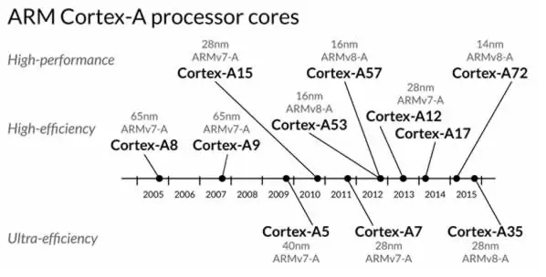

## ARM Assembly instruction sets

Les processeurs ARM suportent principalement 4 différents jeux d'instructions : Thumb, Thumb-2, ARM32, et ARM64.
- Le jeu d'instruction ARM64 est une suite d'instructions codé sur 64 bits.
Sont seulements utilisés dans des applications bureautique et les serveurs.
- Le jeu d'instruction ARM32 est une suite d'instructions codé sur 32 bits.
Il donne plus de flexibilité que le jeux d'instruction Thumb, car il possèdes plus d'opérandes et de plus de registres qui sont codés sur 32 bits. 
Les instructions ARM32 tournent plus rapidement que le jeux Thumb parce qu'une instruction ARM éffectue les instructions plus rapidement.
Le déavantage de ce code est la densité du code qui augmente.
- Le jeu d'instruction Thumb est une suite d'instructions codé sur 16 bits.
Il permet de priviliger une densité de code imoortante (parce que ses instructions sont sur 16 bits).
Ceci limite les possiblités et réduit le nombre des instructions. Cela est bénéfique en terme de taille, de coût mais aussi de longévité des batteries.
- Le jeu d'instruction Thumb-2 est une suite d'instruction qui peuvent être coté sur 16 ou sur 32 bits.
Ce jeux est un compromis entre ARM32 et Thumb, il permet de trouver le meilleur compromis entre densité et performance de code.

Le choix du jeu d'instruction se base sur un compromis entre la densité du code et la performance.
La densité du code messure le taille du binaire en finalité. Un code dense signifie une taille de binaire plus basse (moins de bytes).
Une densité de code importante est parfois préféré dans les systèmes embarqués car moins de mémoire est nécéssaire pour encoder le binaire. 
Cela a pour effet de réduire le cout et la consommation énergétique.

Ainsi le jeu d'instruction 16 bits Thumb décroit la taille du programme. 
Lorsque le jeu d'instruction ARM améliore la fléxibilité d'encodage. Il inclus alors plus d'opérande et améliorre les performances du système.
Le jeu d'instruction Thumb-2 lui qui est un mélange des deux jeux d'instructions permet de trouver un bon compris entre l'utilisation des instructions 16 bits et 32 bits.
Ce qui permet de trouver le bon compromis entre la taille du code et les performances.

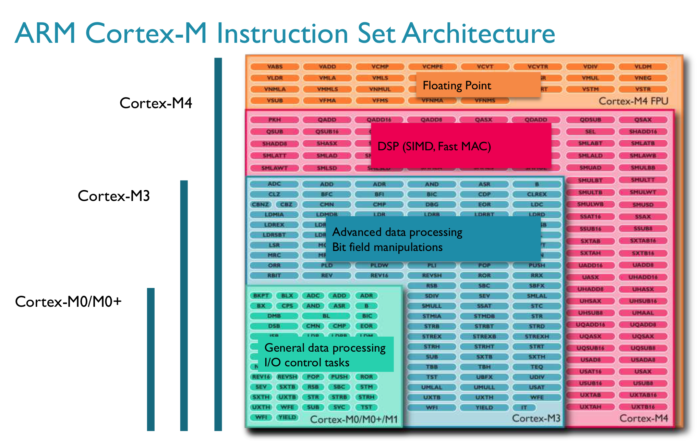

## Instruction Encoding and Decoding
ARM possède plusieurs jeux d'instructions possibles. 

### Le jeu d'instruction Arm

[ARM Instruction Set Encoding](https://developer.arm.com/documentation/ddi0406/c/Application-Level-Architecture/ARM-Instruction-Set-Encoding?lang=en)


### Le jeu d'instruction Thumb

[Thumb Instruction Set Encoding](https://developer.arm.com/documentation/ddi0406/c/Application-Level-Architecture/Thumb-Instruction-Set-Encoding?lang=en)


## Cortex ARM Families

On distingue 3 familles de processeurs Cortex :
- Les Cortex-M qui sont designé pour des microcontroleurs (M pour microcontroleur)
- Les Cortex-R pour du traitement temps réel sur des cibles embarqués (R pour Real Time)
- Les Cortex-A pour des applications hautes performance (A pour Application)

Les processeurs Cortex-A sont spécifiquement designés sur une architecture ARMv7-A ou ARMv8-A qui permettent d'avoir des performances rapides sur des devices sophistiqués, comme les smartphones et tablettes.
Ils peuvent supporter des systèmes d'exploitations comme Linux, iOS ou Android.

Les processeurs Cortex-R dont spécifiquement désignés pour des systèmes temps réels qui exigent une haute fiabilité, une tolérance aux pannes, et réagit de façon déterministe pour du temps réel.
Les exemples d'utilisation d'un tel processeur peut être de l'automatisation industrielle, le contrôle d'un moteur de voiture. Dans les systèmes temps réels, l'exactitude du calcul est déterminée non seulement par l'exactitude logique, mais aussi par le fait qu'il est systématiquement achevé dans certaines contraintes de temps.

Les processeurs Cortex-M offres un bon compromis entre la performance, le cout et la consommation énergétique.
Ils permettent d'effectuer des applications multiples comme pour de la domotique, de la robotique, des protocol industrielles, des montres connectés et de nombreux IoT.
Contrairements aux processeurs utilisés dans les PC ceux ci intègres un coeur processors, une mémoire, et de nombreux périphérique d'entrée sorties, timers, des ADC, des canaux de communication série, et des drivers LCD.

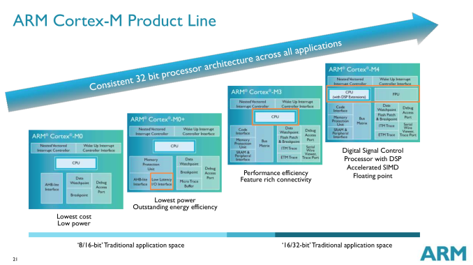

Dans la famille des cortex M on trouve par exemple le Cortex-M0 et le Cortex-M0+, le Cortex-M1, Cortex-M3, Cortex-M4 et le Cortex-M7.
Les 3 premiers sont sur une architecture VON Neumann, et les 3 derniers sur une architecture Harvard. De plus les Cortex M0/M0+/M1 sont sur du ARMv6-M, et les Cortex-M3/M4/M7 sur du ARMv7-M.
(ARMv6-M et  ARMv7-M correspondent aux instruction set architecture)

Les processeurs Cortex-M sont rétrocompatible. C'est à dire qu'il programme compilé pour Cortex-M4 peut fonctionner sur Cortex-M3 sans aucune modification.

Le Floating Point Unit (FPU) est un coprocesseur pour les opérations flotantes, c'est un processeur optionnel sur les Cortex M4-M7. Ces derniers possèdes aussi un single-intruction multiple data (SIMD) et un multiply and accumulate (MAC) pour faire du digital signal processing application (DSP).

Pour identifier rapidement de quel type de processeur il s'agit sur les produits STM32 il suffit de comprendre les [Conventions de Nomage des STM32](https://www.digikey.com/en/maker/blogs/2020/understanding-stm32-naming-conventions)
## Organisation interne d'un processeur

Intéréssons nous de plus prêt au diagramme bloc d'un processeur :
L'implémentation des périphériques se fait par le vendeur du processeur. Les bus de données et les ponts de communications pour les communications entre le coeur et les périphériques sont prédéfinis.

Des exemples de périphériques que l'on peut trouver dans un processeur Cortex-M sont les LCD controllers, encore les communications séries (I2C,SPI et USART), USB , DAC, ADC.
Prenons par exemple de cas du STM32F401RE : (Cortex-M4) 

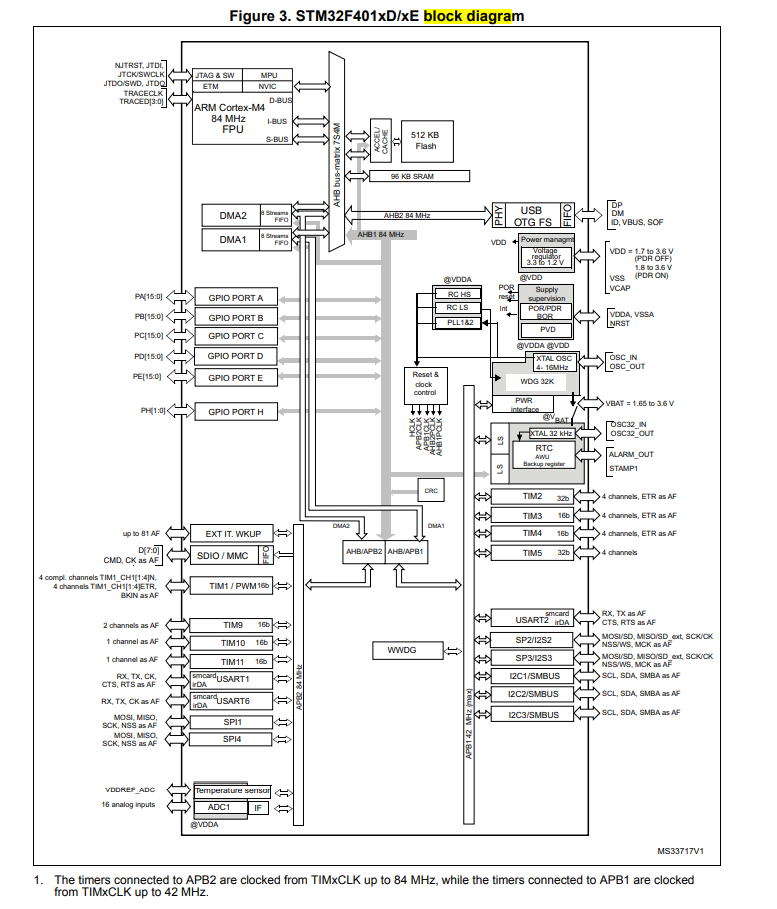

Le diagramme block ci dessus montre comment le coeur et les périphériques sont intégrés dans la puce.

- Le coeur du processeur communique avec la mémoire flash (typiquement pour cela utilise une instruction mémoire), avec la SRAM (avec une instruction data), le DMA ou encore avec les GPIOs et le PHY via l'AHB bus matrix (aussi appelé crossbar switch).
- La matrice de bus est un schéma d'interconnexion, qui permet des flux de données simultanés entre les composants connectés à la matrice de bus, fournissant ainsi une bande passante de communication élevée. La matrice de bus connecte des composants à haute vitesse, tels que le cœur du processeur, Flash, SRAM, contrôleurs DMA et PHY, ou encore les GPIOs.
- Les périphériques sont connectés à la matrice de bus via des ponts qui permettent de lier : l'advanced high-performance bus (AHB) et le advanced peripheral bus (APB). Généralement l'AHB est utilisé là ou se trouve de grosses bandes passantes, et l'APB pour des bandes passantes plus petites.
l'AHB et l'APB sont connecté via des ponts, qui met en mémoire tampon les données et les signaux de contrôle pour combler l'écart de bande passante entre les deux bus et s'assurer qu'il n'y a pas de perte de données.
- Chaques broches GPIO possèdes de multiples fonctions. Le software pevent les modifier. Nous pouvons utiliser les GPIOs comme une entrée numérique, ou une sortie. On peut aussi faire de l'ADC, des communications séries, des fonctionalités liés aux timers etc ... Les alternates fonctions dépend de la carte.
- La plupart des périphériques comme les timers, ADC et I2C sont connecté à l'APB.

Mais qu'est-ce qu'un bus ?
Un bus est un ensemble de fils physiques permettant de transférer des données ou des signaux de commande entre deux ou plusieurs composants matériels.
Un protocole ou une entente de communication doit être en place pour coordonner l'utilisation d'un autobus. La bande passante d'un bus dépend de la largeur du bus (généralement spécifiée en bits) et de la vitesse d'horloge prise en charge. Un processeur dispose de plusieurs bus pour communiquer les composants matériels internes et externes. Un pont de bus relie deux bus différents ensemble.

D'autres composant fondamentals des processeurs sont aussi l'unité : arithmetic logic unit (ALU), le processos control unit, l' interrupt controller (NVIC), the instruction fetching and decoding unit, ainsi que les interfaces pour la mémoire et le debug.
- l'ALU permet de faire des calculs sur un signal (comme l'instruction logic AND), sur des opérations arithmétique (comme l'instruction ADD). L'ALU prend 2 données en entrées (appelés opérandes) et donne une seule sortie.
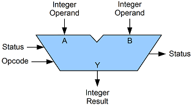

- Le processor control unit génère lui des signals de controle pour les circuits numériques interne (comme une suite de signaux des multiplexeurs, le signal de control de l'ALU) et coordonne chaques composants du coeur du processeur.
- L'interrupt controller (NVIC) permet au processeur de stopper une execution de la tache courante et de répondre à un autre événement généré par le hardware ou par le software.
- L'intruction fetching and decoding unit lits les instructions machines et les décodes pour que le processeur puisse les traiters. Le processor control unit génère un signal en fonction de l'opération à effectuer.
- L'interface mémoire elle permet l'accès aux périphériques mémoires (comme la SRAM ou la Flash)
- L'interface de debug permet au développeur d'utiliser son ordinateur pour arrêter ou démarrer un programme sur le processeur. Cela lui permet de faire du monitoring et de modifier les registres du processeur, des registres des périphériques et de voir la mémoire en temps réel.
- Les Cortex M4 supportent les DSP et peuvent aussi avoir un FPU. Les Cortex M plus ancien de supportent pas ces fonctionalités.

<div id='clang'/>

# Le language C en embarqué ?

On se demande pourquoi le language est particulièrement adapté à l'embarqué? La réponse est que le besoin de l'embarqué est de se retrouver très proche de la machine.
Le language le plus proche de la machine est le langage assembleur, cependant écrire un programme en assembleur est pénible et long à faire. Le langage C permet de rajouter une couche, afin de programmer plus rapidement mais en restant proche du hardware.
Ce dernier est réutilisable facilement et très bien strusturé pour nos applications.
Mais parfois le language C ne suffit pas il faut revenir au language assembleur.
Il peut être intéressant de mixer des fichiers écrits en langage C avec des fichiers écrits en langage d’assemblage.
Un tel exemple est disponible dans la section STM32, Assembleur et C.

<div id='clangwhy'/>

## Un programme en embarqué c'est quoi ?

Un programme est une suite d'instruction lancé au démarrage du processeur. Celui ci ne doit jamais se terminer.
Ainsi ce dernier doit se trouver dans une boucle infini pour ne jamais s'arrêter.
Cependant l'application de l'embarqué nous contraint d'optimiser la consommation de courant, la taille du programme et le temps d'exécution.
Ainsi un programme functionnant sous interruption est préféré à un programme qui marche sous scrutation (polling).

## La compilation

La compilation est le fait de transformer un programme écrit en language C/Assembleur vers du binaire (des 0 et 1).

La compilation se fait la plupart du temps en embarqué sous la forme de cross-compilation.
Mais qu'est-ce qu'une chaine de cross compilation?!
La machine de développement est en effet en général un ordinateur commum et non pas la cible embarqué directement.
Ainsi le programme est écris sur une machine Intel,AMD,etc ... et l'architecture cible est un processeur du type ARM, etc ...

Un des cross-compilateurs les plus utilisé pour arm est : `arm-none-eabi`
Qui présente les différents compilateurs habituel tel que `gcc g++ as` etc ...


La compilation est le processus qui se déroule en plusieurs phases pour créer les fichiers nécéssaire à l'execution du programme par la machine.
Elle permet de traduire un programme C en langage machine (binaire) que pourras executer cette dernière.


Elle se déroule en plusieurs phases :

- La phase de préprocessing : Le code source est analysé par le program appelée preprocesseur qui se charge d'enlever les commentaires, de remplacer les defines dans le code etc ...
- La phase d'assemblage ou de compilation : Les fichiers générés par le preprocesseur sont traduit en assembleur, ensuite vers un language machine (celle de la machine cible).
- La phase de Link : Permet de rejoindre les fichiers entres eux (un programme C est parfois divisé en plusieurs sous fichiers).
- La phase de boot : placé avant le main qui permet d'initilialiser la pile et son pointeurs ainsi que diverses variables.

À cela s’ajoute des librairies pour le C++ ainsi que des librairies C avec des extensions POSIX et les librairies standards. Nous utiliserons enfin une implémentation de la microlib C spécifique pour ARM et qui offre une version optimisée (en particulier l’empreinte mémoire) des librairies standards pour les systèmes embarqués.

Lorsque que la compilation est effectuée cette dernière génères de nombreux fichiers qui peuvent nous être bien utile :

- Un fichier fichier de link (*.ldscript*) qui te permet d'indiquer les différentes sections du programme ainsi que le point d'entrée.
- Les fichier listing (*.lst*) :  contiennent des informations sur les erreurs de compilation et/ou d’assemblage.
- Le fichier mapping (*.map*) : contient l’ensemble des informations relatives à l’organisation mémoire de l’application. On peut y trouver entre autres les adresses physiques où seront implémentées les variables, les procédures, les sections, etc.
- Le fichier exécutable ( *.axf* ou *.elf* ou *.hex*) : contient l’image (en binaire ou en version éditable de l’application)

## Le Linker

Le fichier de Linker est un fichier CAPITALE:

Il permet au compilateur d'assembler les fichiers objects .o vers le fichier output final : 
En d'autres termes : il permet au compilateur de faire entre les sections, les zones mémoires et le programme.
Il possède aussi les informations concernant ou se trouve les données du programme et quelle taille elles possède.
Il permet aussi d'indiquer au programme ou se trouve le point d'entrée. (Souvent pointé vers le vecteur de la table d'interruption).

Le language de programmation d'un fichier de Linker est "GNU Linker Command Language".

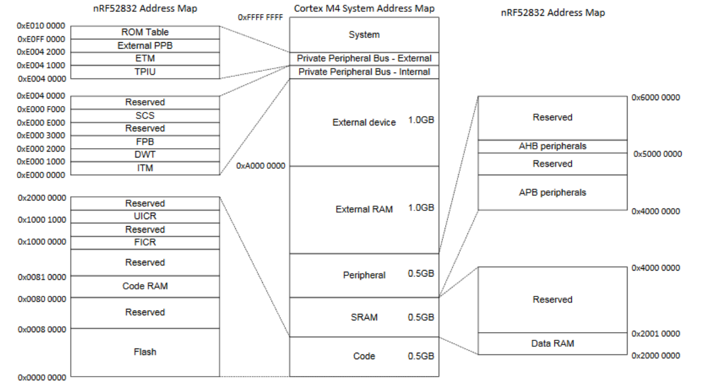

Par exemple avec le compilateur chez TI ce fichier porte souvent l'extension .cmd, sous GCC il porte l'extension .ld, sous IAR on le retrouve sous l'extension .icf

Les principales commandes du Linker sont les suivantes: Plus d'info (https://wiki.osdev.org/Linker_Scripts)
```
ENTRY
OUTPUT_FORMAT
STARTUP
INPUT
OUTPUT
MEMORY
SECTIONS
KEEP
ALIGN
AT>
```

### ENTRY command :
- Cette commande est utilisé comme l'addresse du point d'entrée du binaire, l'information est dans le header du fichier ELF généré.
- Dans notre cas, "Reset_Handler" is the entry point into the application. (La première instruction que le processeur utilise lors d'un reset).
La syntaxe est la suivante :
```
/* Entry Point */
ENTRY(Reset_Handler)
```

Ceci veut dire que le processeur pointe sur la fonction généralement présent dans stm32_startup.c pour les STM32 :
```
void Reset_Handler(void);
```

### MEMORY command :

Cette commande vous permet de décrire les différentes zones mémoires présentes dans la cible avec les informations concernant l'addresse de départ de la zone et sa taille.
Le Linker utilise ses informations pour calculer la mémoire consommé sur les données ou pour le code. Et permet de renvoyer une erreur au link si la zone mémoire est dépassée.
Typiquement un fichier de Link a une commande "MEMORY".

Les zones mémoires sont décrite dans ce fichier par exemple pour le processeur AM335X de chez TI: ces zones dépendent du memory map du microcontoleur choisi.
Par exemple pour le processeur AM335X on trouve dans la doc : https://www.ti.com/lit/ug/spruh73q/spruh73q.pdf
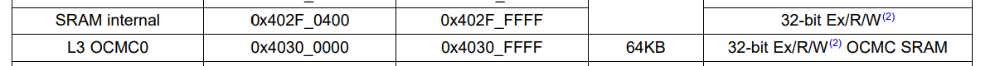
```
MEMORY
{
#ifndef M3_CORE     /* A8 memory map */

    SRAM:     o = 0x402F0400  l = 0x0000FC00  /* 64kB internal SRAM */
    L3OCMC0:  o = 0x40300000  l = 0x00010000  /* 64kB L3 OCMC SRAM */
    M3SHUMEM: o = 0x44D00000  l = 0x00004000  /* 16kB M3 Shared Unified Code Space */
    M3SHDMEM: o = 0x44D80000  l = 0x00002000  /* 8kB M3 Shared Data Memory */
    DDR0:     o = 0x80000000  l = 0x40000000  /* 1GB external DDR Bank 0 */

#else               /* M3 memory map */

    M3UMEM:   o = 0x00000000  l = 0x00004000  /* 16kB M3 Local Unified Code Space */
    M3DMEM:   o = 0x00080000  l = 0x00002000  /* 8kB M3 Local Data Memory */
    M3SHUMEM: o = 0x20000000  l = 0x00004000  /* 16kB M3 Shared Unified Code Space */
    M3SHDMEM: o = 0x20080000  l = 0x00002000  /* 8kB M3 Shared Data Memory */

#endif    
}
```

### SECTIONS command :
Les SECTIONS sont utilisés pour créer différentes sections dans le fichier d'output ELF généré pour regrouper les sections des différents fichiers .o .
A ce stade on parle de la composition interne dans la zone mémoire concerné.

Les sections sont défini dans le fichier output dans l'ordre dans lequel les sections sont déclarés.
Il permet de relier les sections aux zones mémoires ou l'on veut instruire le code.

La syntaxe est la suivante :
Les sections sont ensuite reparties dans la mémoire:
```
SECTIONS
{
    .text:
	{
	
	
	}> (vma) AT> (lma)
}
```
où LMA (Low Memory Address) VMA (Virtual Memory Address).
Rmq : vma est égal à lma, il est possible d’utiliser une syntaxe plus courte : ` }> FLASH`

Selon le schéma ci-dessous, nous voyons que la zone .data doit être copiée de la FLASH (load address) vers la SRAM (virtual address ou absolute address). C’est ce que nous retrouvons dans la syntaxe de la commande SECTIONS > SRAM AT> FLASH


Les sections sont ensuite reparties dans la mémoire:
```
SECTIONS
{
#ifndef M3_CORE     /* A8 memory map */

    .text          >  L3OCMC0
    .stack         >  L3OCMC0
    .bss           >  L3OCMC0
    .cio           >  L3OCMC0
    .const         >  L3OCMC0
    .data          >  L3OCMC0
    .switch        >  L3OCMC0
    .sysmem        >  L3OCMC0
    .far           >  L3OCMC0
    .args          >  L3OCMC0
    .ppinfo        >  L3OCMC0
    .ppdata        >  L3OCMC0
  
    /* TI-ABI or COFF sections */
    .pinit         >  L3OCMC0
    .cinit         >  L3OCMC0
  
    /* EABI sections */
    .binit         >  L3OCMC0
    .init_array    >  L3OCMC0
    .neardata      >  L3OCMC0
    .fardata       >  L3OCMC0
    .rodata        >  L3OCMC0
    .c6xabi.exidx  >  L3OCMC0
    .c6xabi.extab  >  L3OCMC0

#else               /* M3 memory map */

    .text          >  M3UMEM
    .stack         >  M3DMEM
    .bss           >  M3DMEM
    .cio           >  M3DMEM
    .const         >  M3UMEM
    .data          >  M3DMEM
    .switch        >  M3DMEM
    .sysmem        >  M3DMEM
    .far           >  M3DMEM
    .args          >  M3DMEM
    .ppinfo        >  M3DMEM
    .ppdata        >  M3DMEM
  
    /* TI-ABI or COFF sections */
    .pinit         >  M3UMEM
    .cinit         >  M3UMEM
  
    /* EABI sections */
    .binit         >  M3UMEM
    .init_array    >  M3UMEM
    .neardata      >  M3DMEM
    .fardata       >  M3DMEM
    .rodata        >  M3UMEM
    .c6xabi.exidx  >  M3UMEM
    .c6xabi.extab  >  M3UMEM

#endif    
}
```

Rmq : 
`#pragma` est spécifique au compilateur, la syntaxe peut donc varier pour votre compilateur.

Le pragma DATA_SECTION alloue de l'espace pour le symbole dans une section appelée nom de section. La syntaxe du pragma en C pourrait être :
```
#pragma DATA_SECTION (symbol, "section name");
```
Le pragma DATA_SECTION est utile si vous avez des objets de données que vous souhaitez lier dans une zone distincte de la section .bss.

Le pragma CODE_SECTION alloue de l'espace pour la fonction dans une section nommée section name. Le pragma CODE_SECTION est utile si vous avez des objets de code que vous souhaitez lier dans une zone distincte de la section .text. La syntaxe du pragma en C pourrait être :
```
#pragma CODE_SECTION (func, "section name");
```

### ALIGN command:
Cette commande est utilisée pour aligner les sections sur des adresses multiples de 4, par exemple. On peut trouver ce genre de syntaxe dans les sections. Exemple :

```
SECTIONS
{
    .text:
    {
        *(.isr_vector)
        *(.text)
        *(.rodata) 
        . = ALIGN(4);
        end_of_text = .;       /* Store the updated location counter value for */
                               /* ‘end_of_data’ symbol.                        */
    }> FLASH
}
```

Essayez toujours d’aligner les différentes sections avant leur fin. Dans notre cas, nous allons aligner les sections .text, .data et .bss.

Voici pour un programme simple ou vont être stockés les informations :

```
short m = 10; <- [ short m (Global vars(.bss)) ] [ = 10 (Init Vals(c.init)) ]
short x = 2;  <- [ short x (Global vars(.bss)) ] [ = 2 (Init Vals(c.init)) ]
short b = 5;  <- [ short b (Global vars(.bss)) ] [ = 5 (Init Vals(c.init)) ]
main()
{
	short y = 0; <- [ short y = 0 (Local Vars (.stack) ]
	
	y = m*x; <- [ y = m*x (Code (.text) ]
	y = y + b; <- [ y = y + b (Code (.text) ]
	
	printf("y=%d",y); <- [ printf("y=%d",y) (Std C I/O (.cio)]
}
```

Plus d'info : https://linuxembedded.fr/2021/02/bare-metal-from-zero-to-blink

## Comment est composé un programme ? (Segmentation)

|	Nom de la section	| Description          | Memory Type | Location | Why |
|:---------------:|:---------------:|:---------------:|:---------------:|:---------------:|
|	.text		|   Code										|	Initialialisé	|	FLASH	|	Must exist after reset	|
|	.switch		| Tables for switch instructions				|	Initialialisé	|			|		|
|	.const 		| Global and static string literals				|	Initialialisé	|			|		|
|	.cinit		| Initial values for global/static vars			|	Initialialisé	| FLASH | Must exist after reset |
|	.pinit		| Initial values for C++ constructors			|	Initialialisé	|			|		|
|	.bss		| Global and static variables					|	Non Initialialisé	| Internal | Must be in RAM Memory |
|	.far		| Aggregates (arrays & structures)				|	Non Initialialisé	|			|		|
|	.stack		| Stack (local variables)						|	Non Initialialisé	| Internal | Must be in RAM Memory |
|	.sysmem		| Memory for malloc fcns (heap)					|	Non Initialialisé	|			|		|
|	.cio		| Buffers for stdio functions					|	Non Initialialisé	|			|		|

La mémoire d’un programme informatique est divisée ainsi :

- Un segment de données (Données + BSS + tas) ;
- Une pile d'exécution, souvent abrégée par "la pile" ;
- Un segment de code.


### Segment .rodata (Read Only Data)

Le segment .rodata contient des constantes statiques plutôt que des variables.

### Segment de données .data

Le segment .data contient toutes les variables globales ou statiques qui ont une valeur prédéfinie et peuvent être modifiées.
Il s'agit de toutes les variables qui ne sont pas définies dans une fonction (et qui peuvent donc être accédées de n'importe où) ou qui sont définies dans une fonction mais qui sont définies comme statiques afin qu'elles conservent leur adresse lors des appels suivants.

Les valeurs de ces variables sont initialement stockées dans la mémoire morte (généralement dans .text ) et sont copiées dans le segment .data pendant la routine de démarrage du programme.
Notez que dans l'exemple ci-dessus, si ces variables avaient été déclarées à partir d'une fonction, elles seraient stockées par défaut dans le cadre de la pile locale.

### Segment .text

Le segment .text est l'endroit qui correspond à l'espace d'addressage du programme en ce qui concerne les instructions éxecuté par le programme. Cette zone est généralement en lecture seule et de taille fixe.

### Segment .bss

Le segment BSS aussi connu comme zone de données non initialisées commence à la fin du segment de données et contient toutes les variables globales et toutes les variables statiques qui sont initialisées à zéro ou n’ont pas d’initialisation explicite dans le code source. 
Par exemple, une variable déclarée `static int i;` sera « contenue » dans le segment BSS.

### Segment Heap : "Le Tas"

La zone de tas commence généralement à la fin des segments .bss et .data et se développe vers des adresses plus grandes à partir de là.
La zone de tas est gérée par malloc , calloc, realloc et free.
La zone de tas est partagée par tous les threads, bibliothèques partagées et modules chargés dynamiquement dans un processus.

### Segment Stack : "La Pile"
La zone de pile contient la pile de programmes , une structure LIFO (Last In First Out). 
Généralement située dans les parties supérieures de la mémoire. Un registre "pointeur de pile" suit le haut de la pile; il est ajusté chaque fois qu'une valeur est "poussée" sur la pile.

Un exemple simple pour illustrer le cas d'une variable en pile et une autre en heap est la suivante :

La zone mémoire ou sont conservés les varibales dépend ou est déclaré la variable dans le programme prenons l'exemple de ce programme :
```
uint32_t myvarOutMain; //Saved int the data section of the RAM in the heap

int main(void)
{
	uint32_t myvarInMain = 0xDEADBEEF; //Saved in the stack
	return 0;
}
```
Dans le premier cas pour la variables `myvarOutMain` cette dernière est conservée dans le "heap", et pour la variables `myvarInMain` cette dernière est conservée dans la pile.

# Les différents types de systèmes software

On distingue plusieurs méthodes de fonctionnement dans un microcontroleur :


- Bare-metal programming
	- Pas de sur couche OS
	- Ne nécéssite pas beaucoup de puissance électrique
	- Permet l'accès direct au hardware
	- Permet le développement d'une application simple
	- Timing Strict
	


- Real-ime Operating System (RTOS)
	- OS Rajouté : Ordonnancement
	- Plus de puissance électrique nécéssaire
	- Permet l'accès direct au hardware
	- MultiThreading
	- MultipleTask : Networking, Interface utilisateur etc ...
	


- Embedded General Purpose Operating System (GPOS) (Linux, Mac, Windows, Android ...)
	- Surcouche importante : OS, MMU
	- Un microprocesseur est requis et parfois plus de mémoire (mémoire externe flash et ram additionnelles).
	- Ne permet pas l'accès aux drivers hardware direct (Abstract layer)
	- MultiThrading, MultiProcessing
	- Multiple complex task : networking, filesystem, graphical interface etc ...
	
## Introduction à l'RTOS

### Introduction
Les systèmes temps réel ont pour but de répondre suivant les exigences de l'application:

Dans les RTOS les plus populaires on trouve en 2022 :
- Deos (DDC-I)
- embOS (SEGGER)
- FreeRTOS (Amazon)
- Integrity (Green Hills Software)
- Keil RTX (ARM)
- LynxOS (Lynx Software Technologies)
- MQX (Philips NXP / Freescale)
- Nucleus (Mentor Graphics)
- Neutrino (BlackBerry)
- PikeOS (Sysgo)
- SafeRTOS (Wittenstein)
- ThreadX (Microsoft Express Logic)
- µC/OS (Micrium)
- VxWorks (Wind River)
- Zephyr (Linux Foundation)

### Les sémaphores


## Le démarrage (Startup) d'un programme embarqué :

Le point d'entrée d'un programme est classiquement basé à l'addresse 0x00000000. Ou sur l'addresse qui correspond à la mémoire ROM du processeur (varie suivant le processeur).


## Les types de mémoires

On distingue deux types de mémoires:
- Les mémoires volatiles (ce sont des mémoires qui s'éfface lorsque le dispositif est hors tension) :
	- SRAM : Static Random Access Memory (Granularité à l'octet en écriture et en lecture | Accès rapide en R/W | Basse consommation en courant | Toujours utilisé dans les microcontroleurs)
	- DRAM : Dynamic Random Access Memory (Granularité à l'octet, Ecriture rapide en écriture et en lecture | Haute consommation en courant | Non utilisé dans les microcontroleurs)
- Les mémoires non volatiles (Des mémoires qui restent intacte lorsque le dispositif est mise hors tension)
	- ROM : Read Only Memory (Granularité à l'octet R/W) | Accès rapide à la lecture | Impossible à écrire)
	- EEPROM : Electrically Erasable Programmable Read Only Memory (Granularité à l'octet R/W | Accès lent écriture R/W)
	- Flash (Nor) (Granularité d'un octet : doit être écris en pages (block d'octets) | Accès très lent en mode écriture | Toujours utilisé dans les microcontroleurs)

Dans un microcontoleur : 
La mémoire Flash est utilisé pour stocker le programme en mémoire, 
La mémoire EEPROM pour stocker les paramètres et les valeurs.
La mémoire SRAM pour la pile (stack).

## La Table des vecteurs et table de vecteur d'interruption. (Exceptions)

### Reset
La réinitialisation est invoquée lors de la mise sous tension ou d’une réinitialisation à chaud.  
Lorsque la réinitialisation est confirmée, le fonctionnement du processeur s’arrête, potentiellement à n’importe quel point d’une instruction. 

### NMI
Une interruption NonMaskable (NMI) peut être signalée par un périphérique ou déclenchée par un logiciel. C’est l’exception de priorité la plus élevée autre que la réinitialisation.

### Hard fault
Une faute matérielle est une exception qui se produit en raison d’une erreur lors du traitement des exceptions, ou parce qu’une exception ne peut pas être gérée par un autre mécanisme d’exception.

### Memory Management Fault
Un défaut de gestion de la mémoire est une exception qui se produit en raison d’un défaut lié à la protection de la mémoire. Le MPU ou les contraintes de protection de la mémoire fixe déterminent ce défaut, tant pour les transactions d’instruction que de mémoire de données.

### IRQ
Une interruption, ou IRQ, est une exception signalée par un périphérique, ou générée par une demande de logiciel. Toutes les interruptions sont asynchrones à l’exécution des instructions. Dans le système, les périphériques utilisent des interruptions pour communiquer avec le processeur.

### SysTick
Une exception SysTick est une exception que la minuterie du système génère lorsqu’elle atteint zéro. Le logiciel peut également générer une exception SysTick. Dans un environnement OS, le processeur peut utiliser cette exception comme coche système.

### SVCall
Un appel de superviseur (SVC) est une exception qui est déclenchée par l’instruction de SVC. Dans un environnement OS, les applications peuvent utiliser des instructions SVC pour accéder aux fonctions du noyau OS et aux pilotes de périphériques.

## La MMU (Memory Managment Unit) au niveau du CPU :

Un processus voit un espace de mémoire virtuelle, au sein du quel il peut accéder à n'importe quelle adresse de 0x000000 à 0xFFFFFFFF (sur processeur 32 bits).
Cet espace est découpé en pages, et la MMU – Memory Managment Unit (un composant intégré dans le processeur) –  associe une page de mémoire virtuelle avec une page de mémoire physique en effectuant la modification d'adresse lors de l'accès à la mémoire. 

Certaines pages de mémoire virtuelle n'ont pas de correspondance en mémoire physique : une tentative d'accès déclenche une interruption « faute de page ».
Chaque processus dispose d'une configuration personnelle de la MMU. Cette dernière est programmée à chaque commutation entre deux processus.

Un processus ne voit que les pages de mémoire physique qui lui ont été attribué par le noyau ; 
les pages des autres processus ne sont projetées à aucun emplacement de sa mémoire virtuelle.


## Les Registres ARM

### General Purpose Register (R0-R12)

### Stack Pointer (SP)

### Link Register (LR)


### Current Program Status Register (CPSR)

### (Special-purpose) Program Status Registers, xPSR

The Program Status Register (PSR) is a 32-bit register that comprises three subregisters:

Application Program Status Register, APSR
Holds flags that can be written by application-level software, that is, by unprivileged software. APSR handling of application-level writeable flags by the MSR and MRS instructions is consistent across ARMv6T2, ARMv6-M, and all ARMv7 profiles.

Interrupt Program Status Register, IPSR
When the processor is executing an exception handler, holds the exception number of the exception being processed. Otherwise, the IPSR value is zero.

Execution Program Status Register, EPSR
Holds execution state bits.

### Program Counter (PC)


## Les Clocks.

Tout les périphériques doivent être sous horloge pour fonctionner.
Mais attentions tout les périphériques ne sont pas sous la même horloge ils sont cadencés par leur bus propre.

## Les GPIOs

GPIO signifie General Purpose Input/Output : ils font partis des périphériques. 
C'est le périphérique qui permet de contrôler les broches et qui permet de communiquer avec le monde extérieur.
Ces broches sont des sorties numériques (qui sortent uniquement 0 ou 5V) et qui permettent d'allumer des LEDs, de rajouter des bouttons poussoirs ou encore d'y insérer par exemple un clavier.

### Introduction

Le nombre de broche sur un processeur est assez limité, les broches du processeurs sont configurables par le software au démarrage pour accomplir différentes fonctions.
Ces broches GPIO permettent de fournir une grande flexibilité et une manoeuvre importante sur le design de la carte.

- L'entrée numérique qui permet de détecter si l'entrée du signal est haute ou basse en définissant un certain seuil.
- En sortie numérique pour controler la sortie de la broche. (0 ou 5V)
- Des fonctions analogues pour faire du DAC ou de l'ADC.
- D'autres fonctionalités plus complexes comme du PWM, un driver LCD, un timer input capture, une interruption externe, une interface USART, SPI, I2C et des communications USB.

Nous appelons cette dernière catégorie les AF pour alternates functions.
Le software permet de changer la fonction des GPIO au démarrage du logiciel.

Un port GPIO est un regroupement de broche GPIO, (typiquement 8 ou 16), qui partagent les mêmes données et registres de contrôles.

- Quand une broche GPIO est mise comme entrée numérique, la valeur binaire lue sur cette broche est stocké dans le ième bit du registre input data register (IDR).
Chaques bits dans l'IDR correspond à une entrée d'une broche différente appartenant au même port.
- Quand une broche GPIO est mise en sortie numérique, le bit i du registre output data register (ODR) permet de controler la sortie de la broche.
Par conséquent, 1 broche correspond à 1 bit.
- Tout les broches GPIO d'un GPIO port peuvent être configuré indépendaments en entrée ou en sortie.

### GPIO Intput mode : Pull Up and Pull Down


### GPIO Input : Schmitt Trigger

Habituellement chaques entrée d'un GPIO contiennent un trigger de Schmitt. Ce dernier utilise un comparateur pour convertir un signal soit bruité pour obtenir une sortie plus clean.

Le trigger de Schmitt utilise deux valeurs de seuil et évite ainsi les effets indésirables d'un simple comparateur.
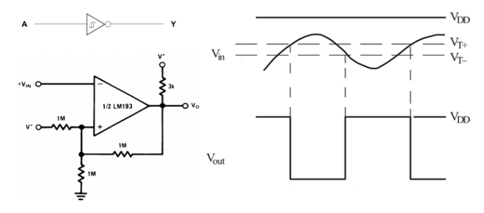

### GPIO Open-Drain Output


## Les Timers
Les timers sont des composants hardwares spéciaux qui fournissent des timestamps très précis, permettent de mesurer des intervals de temps, et d'effectuer des événements périodiquements pour de l'hardware ou du software.
Dans la suite nous utiliserons les timers pour mesurer la longueur du pulse sur des signaux d'entrées (input capture) ou encore la génération de waveform de sortie (output compare et PWM)

### Timer Organization and Counting Mode
Un timer est un composant hardware indépendant qui permet d'incrémenter ou de décrémenter un compteur à chaques cycle d'horloge. Le compteur tourne continuellement jusqu'à sa déactivation. 
Le compteur recommence son cycle dès qu'il atteint la valeur 0 lorsqu'il est en mode décrémentation.
Il peut aussi recommencer son cycle s'il atteint une valeur défini lorsque le compteur s'incrémente.

Le softwware permet de selectionner la fréquence du timer, donc le timer est configurable pour tourner à une période désirée.

Si un timer fonctionne comme "output compare", le comparateur compare systématiquement la valeur du compteur avec une constante donnée par le software.
Il génère en fonction une sortie ou une interruption si les deux valeurs sont égales.
Le software permet de configurer la valeur de la constante pour controler le timing des sorties ou des interruptions.

Si un timer fonctionne comme "input compare", l'hardware log la valeur du compteur dans un registre spécial appelé (CCR) et génère une interruption quand l'événement voulu se passe.
Typiquement, l'interrupt handler a besoin de copier le registre CCR vers un buffer utilisateur pour enregistrer les événements passé. Ensuite le software calcule la différence entre 2 valeurs loggé et trouve le temps passé entre deux événements.

Un compteur d'un timer hardware a 3 modes de comptages : le mode "up-counting", le mode "down-counting", et le mode "center-aligned counting" .
- Le mode "up-counting" commence à compter à partir de 0 jusqu'à une valeur d'une constante puis recommence à partir de 0. Le software permet de setter la valeur de la constante et le stock dans un registre spécial appelé (ARR) pour auto-reload register.
Par exemple si le registre ARR est à 4, le compteur va prendre les valeurs 0,1,2,3,4,0,1,2,3,4,(...) jusqu'à la déactivation du timer.
- Le mode "down-counting", le compteur commence à la valeur de l'ARR et compte jusqu'à 0. Et recommence à la valeur de l'ARR. Par exemple si l'ARR vaut 4 on aura : 4,3,2,1,0,4,3,2,1,0,(...) jusqu'à la déactivation du timer.
- Le mode "center-aligned counting", qui lui fait un "up-counting" puis un "down-counting" alternativement. Par exemple si l'ARR vaut 4 on aura : 0,1,2,3,4,3,2,1,0 (...) jusqu'à déactivation du timer.

Le compteur du timer forme en faites un signal triangulaire ou un signal à dent de scie. La période était controllé par la fréquence de l'horloge du compteur et de la valeur stocké dans le registre ARR.
Pour un compteur "up-counting" et "down-counting", la période du signal à dent de scie est donnée par la formule :

` Counting period = (1+ARR) * 1/fclk_cnt`

Pour un compteur "center-aligned counting" , la période du signal triangulaire est donnée par la formule :

` Counting period = 2 * ARR * 1/fclk_cnt`

Le compteur d'un timer possède deux événements : overflow et underflow.
Dans le mode "up-counting", l'overflow est atteint lorsque le compteur est remis à 0.
Dans le mode "down-counting", l'overflow est atteint lorsque le compteur atteint la valeur de ARR.
Dans le mode "center-aligned counting", l'overflow et l'underflow est atteint alternativement 0 et ARR.

Quand on utilise un timer pour mesurer une grande différence de temps entre deux événements, le soft doit considérer que le underflow et l'overflow pour éviter de sous estimer la différence de temps.
Le timer handler peut vérifier en vérifiant les flag du timer status register pour compter le nombre d'overflow et de underflow.

### Compare Output
Le compteur du timer (CNT) est une valeur encodée sur 16 bits. Le registre de capture/compare (CCR) garde la valeur qui est comparé avec la valeur du compteur.
Dans le STM32L, 4 canaux de sorties partagent le même compteur de timer. Malgrès que le timer compares la valeur du compteur avec 4 registres CCR simultanément et génères 4 sorties indépendantes basés sur cette comparaison.
L'horloge permet de comparer le compteur du timer. (CLOCK_CNT), ce dernier peut être ralenti par la valeur d'une constante appelé prescaler pour générer une sortie qui s'étend sur une longue période.

`fclock_cnt = fclock_psc / (Prescaler + 1)`

Une valeur importante de Prescaler  permet de réduire la résolution du timer, mais réduit les occurences d'overflow et l'underflow ce qui améliorre les performances énergétiques.
Plusieurs horloges peuvent controler les timers : ces horloges inclus des mécanismes internes que sont le processeur, l'external crytal oscillators et certain signaux internes comme la sortie d'un autre timer.
Les horloges externes sont préférés aux horloges internes car les horloges externes sont plus précises.

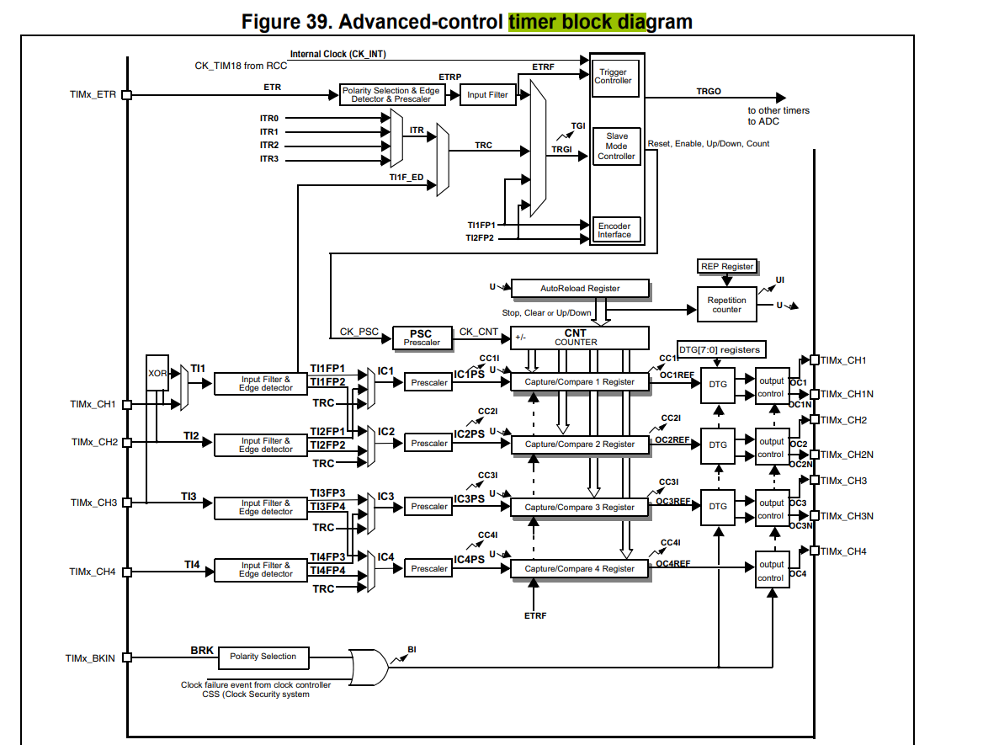

#### Setting Output Mode
Quand la valeur du timer counter (CNT) est égale au compare value register (CCR), le canal de sortie (OCREF) est programmable. La sortie peut avoir différences valeurs, cela dépend de la sortie du compare mode (OCM)

| Output Compare Mode (OCM)  | Timer Reference Output (OCREF)         |
| :--------------- |:---------------:|
| Timing mode (0000)  |   Gelé        |
| Active mode (0001)  | Logique haute si CNT = CCR             |
| Inactive Mode (0010)  | Logique basse si CNT = CCR          |
| Toggle Mode (0011)  | Toggle si CNT = CCR          |
| Force Inactive Mode (0100)  | Forcer la logique à bas (toujours à bas)          |
| Force Active mode (0101)  | Forcer la logique à haut (toujours à haut)          |
| PWM output mode 1 (0110)  | Si le mode est upcounting : Logique à haute si CNT < CCR sinon logique à bas , Si le mode est downcounting, Logique haute si CNT <= CCR , sinon logique à bas         |
| PWM output mode 2 (0111)  | Si le mode est upcounting : Logique à haut si CNT >= CCR sinon logique à bas , Si le mode est downcounting, Logique haute si CNT > CCR, sinon logique à bas         |

La sortie du mode active ou le mode inactive produisent respectivement une logique haute ou une logique basse quand le compteur atteint la valeur du CNT.
Le mode Toggle inverse la sortie quand CNT vaut CCR. Ce qui produit une sortie haute puis basse, basse puis haute alternativement.
Le mode Force inactive mode et active mode permet de garder respectivements les niveaux à bas et à haut.

Dans les circuits numériques, il y a deux logiques possible : haut et bas. Le software permet de changer la représentation de la logique pour la sortie de chaques timer indépendaments par programmation de la polarité sur le output polarity bit in the control register CCER.
Quand la polarité est mise à 0, le mode actif correspond à une sortie qui est en "high voltage".

|   | Active High signal         | Active Low Signal         |
| :--------------- |:---------------:| :---------------:|
| Logique haute(1)  |   High Voltage        | Low Voltage |
| Logique Basse(0)  | Low Voltage             | High Voltage |

Le canal du timer peut avoir deux sortie, la sortie principale OC et son complémentaire OCN qui est un ou-exclusif du canal de référence. Qui correspond au bit de polarité du registre CCER.
Le bit CCP et CCNP dans le registre CCER sont respectivements les bits de polarité de OC et OCN.

Si seulement OC et OCN sont activés :

```
OC = OCREF + polarity bit for OC
OCN = OCREF + polarity bit for OCN
```

Si les deux OC et OCN sont activés :

```
OC = OCREF + Polarity bit for OC
OCN (not OCREF) + Polarity bit for OCN
```

La logique "high active" est toujours utilisé pour OCREF. Cependant, OC et OCN ne peuvent pas être active en même temps sur active high ou active low. Cela dépend du bit de polarité.
Si le but de polarité est à 0, la sortie du canal correspondant est en active high. Sinon elle est en active low.

Si les interruptions des timers sont activés, l'interrption est appelée quand le CNT = CCR, ou quand le CNT a un overflow ou un underflow. L'ISR doit vérifier quel est le status du timer status register pour savoir quel est l'événement qui vient d'arriver.
L'update interrupt flag (UIF) est setté en cas d'overflow ou d'underflow, et le flag compare interrupt flag (CCIF) est setté quand CNT = CCR.

Une interruption DMA peux aussi être généré pour charger la valeur stocké dans la mémoire dans les registres ARR et CRR automatiquement. (Se référer au chapitre DMA).


#### Example of Toggling LED with Output Compare
Dans cette section nous allons utiliser le mode output compare mode pour faire le clignotement d'une LED. Attaché au PIN PB13.

Chaques broches GPIO peux faires plusieurs fonctionalités hardware. Les fonctions différes entre les cartes et les manufactureurs, mais aussi entre les broches elle même. Dû à la complexité de la carte et au cout de fabrication,
c'est impossible qu'une broche supporte toutes les fonctions. Dans le cas de notre broche nous pouvons trouver les alternatives fonctions. Dont  le TIM2_CH1 qui va nous permettre de faire un toggle de la led.


Supposons que la clock du système soit à 80 MHz, et que cette dernière soit notre clock système qui pilote le TIMER 2.
Le calcul suivant nous permet donc de calculer le prescaler qui va nous permettre de déscendre le timer à 2 KHz :

` fclk_cnt = fclk_psc / (Prescaler + 1)`
donc

` Prescaler = (fclk_psc / fclock_cnt) - 1 = 80 MHz / 2KHz - 1 = 40000 - 1 = 39999`

Ainsi pour allumer et éteindre la LED toutes les secondes nous devons placer notre ARR à 1999 car la fréquence d'horloge est à 2KHz.
Le timer compte ainsi de 0 à 1999, donc 2000 cycles pour chaques périodes. Le registre CCR peut être alors placé entre 0 et 1999.

L'implémentation C suivante permet par software de configurer le TIM1_CH1N (La sortie complémentaire du canal 1 du timer 1) comme compare-output et de faire un toggle de la LED connecté sur PE8 toutes les secondes.
```
int main()
{

	System_Clock_Init(); // System clock = 80MHz
	
	RCC-> AHB2ENR |= RCC_AHB2ENR_GPIOEEN; // Enable GPIOE clock
	
	// Set mode of pin 8 as alternate function
	// 00 = Input 01 = Output, 10 = Alternate function, 11 = Analog
	GPIOE->MODER &= ~(3UL << 16); // Clear bit 17 et 16
	GPIOE->MODER |= 2UL << 16 // Set mode as 10
	
	// Select alternative function (TIM1_CH1N)
	GPIOE->AFR[1] &= ~(0xF); // ARF[0] for pin 0-7 , ARF[1] for pin 8-15
	GPIOE->AFR[1] | 1UL; //TIM1_CH1N defined as 01
	
	// Set I/O output speed value at low
	// 00 : Low, 01 Medium, 10 Fast, 11 High
	GPIOE->OSPEEDR &= ~(3UL<<16);
	
	// Set pin PE8 as no pull-up/pull-down
	// 00 for no pull up pull down
	GPIOE->PUPDR &= ~(3UL<<16);
	
	// Enable Timer1 Clock
	RCC->APN2ENT |= RCC_APB2ENR_TIM1EN;
	
	// Counting direction : 0 upcounting, 1 downcounting
	TIM1-> CR1 &= ~TIM_CR1_DIR;
	
	// Clock prescaler
	TIM1->PSC = 39999;
	
	// Auto reload register
	TIM1->ARR = 2000 -1;

	// CCR can be any value between 0 and 1999
	TIM1->CCR1 = 500;
	
	// Main output enable (MOE) 0 Disable 1 Enable
	TIM1->BDTR |= TIM_BDTR_MOE;
	
	// Clear output compare mode bits for channel 1
	TIM1->CCMR1 &= ~TIM_CCRM1_OC1M;
	
	/// Select Toggle Mode (0011)
	TIM1->CCMR1 |= TIM1_CCMR1_OC1M_0 | TIM_CCMR1_OC1M_1;
	
	// Select output for channel 1 complementary output
	TIM1-> CCER &= ~TIM_CCER_CC1NP; // Select active high
	// Enable output for channel 1 complementary output
	TIM1->CCER |= TIM_CCER_CC1NE;
	
	// Enable Timer 1
	TIM1->CR1 | TIM_CR1_CEN;
	
	while(1); //Dead loop
}
```
	
Un autre exemple de output compare est disponible dans le dossier STM32.

#### Timer Update Events

Un Update Event (UEV) est généré à chàque fois qu'on atteint l'overflow dans le mode upcounting, et à chaques underflow dans le downcounting. Sur l'overflow et le underflow pour le center-counting.

Ainsi la période de l'UEV est :

` UEVPeriod = (1+ARR) * (1+Prescaler) * 1/ fclk_cnt`

Les événements UEV ont 3 objectifs :
- Généré une trigger output (TRGO) ou sortie de déclenchement pour d'autres modules internes que sont les timers DMA, ADC et DAC.
- Permettre l'update des registres ARR, PSR, et CCR en prenant effet immédiatement, si le buffering (aussi appelé preload) mécanisme est activé.
Si le channel preload enable bit (OCPE) dans le registre CCMR1 et que l'auto-reload enable bit (ARPE) dans le registre CR1 est setté, le mécanisme de preload est activé.
- Générer une interruptions timer si l'update interrupt flag bit (UIF) du control register CR1 est setté. L'interruption est envoyé au NVIC. En réponse, le processeur execute la routine d'interruption (ISR).

Le Software peut déactiver l'UEV en mettant à jour l'udpate disable bit à 0(UDIS) dans le registre CR1. Dans ce cas les updates events ne sont pas générés.

Dans l'exemple ci dessous le software utilise le timer update event pour atteindre une précision hardware sur le délais.
A 30°C, le MSI et le HSI peut atteindre une précision de +-0.6%.
Supposons que le MSI est setté à 4MHz et qu'il pilote le timer. Le prescaler est setté à 3999 et le compteur est en mode upcounting. Donc le timer counter est incrémenté chaques ms.
On selectionne le timer7 car ce dernier est un timer basic sans les fonctions avancés.
Dans ce cas on réserve les timers avancés pour des usages plus compliqués.

```
void delay(uint16_t ms)
{
	if (ms == 0) // Sanity check
	{
	}
	
	//Enable timer7 clock
	RCC->APB1ENR1 |= RCC_APB1ENR1_TIM7EN;
	
	TIM7-> CR1 &= ~TIM_CR1_EN; // Disable Timer7
	TIM7-> SR = 0; // Clear status register
	TIM7-> CNT = 0; // Clear counter
	TIM7-> PSC = 3999;	//4MHz/(1+3999) = 1Khz
	TIM7 -> ARR = ms - 1; // ARR + 1 cycle
	TIM7-> CR1 |= TIM_CR1_EN; // Enable Timer7
	
	while( (TIM7->SR & TIM_SR_UIF) == 0); // Loop until UIF is set
}
```

L'exemple ci dessous compte le nombre d'overflow atteint dans le mode upcounting. Si le flag UIF dans le timer status register (SR) est setté, l'interruption timer incrément le compteur d'overflow and nettoie le flag UIF pour prevenir une nouvelle execution de l'ISR.

```
volatile uint32_t overflow = 0;

int main(void) {
	//Init
	...
	
	// Select counting direction : 0 upcounting
	TIM1->CR1 &= ~TIM1_CR1_DIR
	
	// Enable update interrupt
	TIM1->DIER |= TIM_DIER_UIE;
	
	// Enable Timer4 interrupt on NVIC
	NVIC_EnableIRQ(TIM1_IRQn);
	
	//Enable the counter
	TIM1->CR1 | TIM_CR1_CEN;
	
	while(1);
}

void TIM1_IRQHandler(void)
{

	// Check whether an overflow event has taken place
	if ((TIM1->SR & TIM_SR_UIF) != 0) {
		overflow++;
		TIM1-> SR &= ~TIM_SR_UIF;
	}
}
```

Dans cette exemple la variable `overflow` est déclarée en volatile. Pour informer le compilateur qu'aucune optimisation ne doit être faites sur cette variable.
Sans l'optimisation il est possible que le compilateur réutilise incorrectement la variables. Car l'IRQ n'est pas appelé par le software et donc pense que la variable ne change jamais.

### Les sorties PWM
Pulse width modulation(PWM) est une technique numérique pour controler la valeur du variable analogique.
Les PWM utilisent des signaux rectangulaire pour rapidement évoluer au niveau du voltage. 
En l'activant et déactivant rapidement on peut ainsi modifier la valeur moyenne lue et obtenir une autre valeur de voltage en sortie.
Bien que la sortie soit à 5V ou à 0V de base, la moyenne sur un temps donné peut se trouver entre les deux.

Spécifiquement, le pourcentage de temps passé dans un état est proportionnel à la valeur moyenne de la sortie en volt.
Par conséquent, quand le software change les durées des états, l'output voltage peut être utilisé pour emuler un signal analogique.

Les PWM sont très utilisé dans les applications, particulièrement pour contrôler la vitesse d'un moteur et pour la mesure du couple, pour l'encodement digital et les télécommunications, les convertisseurs DC vers DC, les amplificateurs audios.
Dans cette section nous allons utiliser le PWM pour controler l'intensité d'une LED.

Nous devons sélectionner la variation de fréquence PWM minutieusement afin d'éviter les impacts sur les applications. Par exemple le changement de fréquence sur l'intensité d'une LED doit être inférieur à 120 Hz pour éviter l'effet vacillant pour que un humain puisse le voir.

La valeur moyenne d'un PWM est basé sur un signal à dent de scie et une valeur constante de référence, tout ceci est linéairement proportionnel au duty cycle.

Le temps de cycle (duty cycle) est défini ainsi :


`duty cycle = (pulse on time (Ton) / pulse switching period (Ts)) * 100`

Ou 

` pulse switching period (Ts) = 1/PWM switching frequency`


En modifiant le duty cycle, le software peut controler la valeur moyenne. Dans l'exemple de la LED la luminosité est déterminé par le PWM duty cycle. 


Le signal PWM de sortie dépend de 3 facteurs :
- La comparaison entre le registre CNT et la valeur de référence donné dans le compare and capture register (CCR).
- Le mode PWM output mode
- Le bit de polarité

Il y a 2 modes PWM qui sont opposé l'un l'autre :
- PWM Mode 1: Si le compteur est plus petit que la référence, le timer reference output (OCREF) est dans un état haut. Sinon dans un état bas.
- PWM Mode 2: Si le compteur est plus grand que la référence, le timer reference output (OCREF) est dans un état haut. Sinon dans un état bas.

OCREF est une sortie interne. Qui doit toujours utiliser une logique d'état haut. Cependant la sortie actuelle (OC ou OCN) peut être active high ou active low.
- Dans le mode active high, un haut voltage corrrespond à une logique haute, et un bas voltage à une logique basse.
- Dans le mode active low, un haut voltage correspond à une logique basse, et un bas voltage à une logique haute.
- La selection de ce mode se fait via le bit de polarité.

Pour résumé, la sortie PWM(OC ou OCN) est obtenue par le mode et le bit de polarité.
Les formules suivantes permettent de calculer la période du PWM :

Pour un mode upcounting ou downcounting :

` PWMPeriod = (1+ARR) * (Clock Period of Timer)/(1+ Prescaler)`

Pour un mode center-counting-mode :

` PWMPeriod = 2 * ARR * (Clock Period of Timer)/(1+ Prescaler)`

Pour le PWM duty cycle, suivant le mode du PWM et le bit de polarité, le duty cycle de la sortie principale OC en mode upcounting ou downcounting est :

` Duty cycle = CRR / (ARR + 1) `

ou de son complémentaire 

` Duty cycle = 1- CRR / (ARR + 1)`

Pour le mode center-counting on a :

` Duty cycle = (CRR / ARR) `

ou de son complémentaire

` Duty cycle = 1 - (CRR / ARR) `

Dans le mode center aligned , quand le registre CCR est à 0 ou le registre ARR, OCREF est 1 ou 0. Cela dépend du mode PWM.

#### PWM Alignement
"Toutes les sorties PWM d'un même timer ont les mêmes périodes"

Un timer possède plusieurs canaux comme vue plus haut.
Tout les canaux partagent le même timer counter et le registre ARR.
Ainsi, tout les signaux PWM produit par le même timer ont les mêmes périodes.
Cependant leurs duty cycles peuvent être différent car chaques canaux a un CCR différent.

## UART

RX : UART  Receive Data
TX : UART	Transmit Data
CTS : Clear to Send
DT: Data Terminal Ready
DSR : Data Set Ready
DCD : Data Carrier Detect
RI : Ring Indicator


## Les interruptions

### Introduction
"Une interruption est simplement une fonction qui est appelée par l'hardware".

Une interruption s'appuie sur une combinaison logicielle et matériel pour forcer le processeur à stopper ses activités courante pour éxécuter une partie de code particulière appelée ISR (Interrupt Service Routine).
Une ISR réponds à un événement qui peut venir du hardware ou du software.
Quand la routine d'interruption se termine le processeur revient automatiquement à ses activités initiales.
Le flux d'execution continue comme si rien ne s'était passé.
Les interruptions sont largements utilisés pour répondre à des requêtes hardware. Par exemple, elles peuvent être utilisés pour des évenements extérieurs (comme l'appui sur un boutton poussoir ou la reception d'un message sur un port de communication).
Les interruptions sont aussi utilisés lorsqu'une erreur critique intervient et permet au processeur de s'arrêter "proprement".
(Il peut s'agir ici d'un "memory access violation", ou la détection d'instructions non définies).
Les interruptions permettent aussi d'effectuer plusieurs tâche simultanément. A un temps donné, le microcontroleur peut faire tourner qu'il seul programme.
Cependant, les interruptions permettent aux processeurs de traiter plusieurs tâches de calcul alternativement de manière multiplexée.
Les différentes tâches peuvent être traité de façon pré-emptive ou non-premptive.
- Dans le cas préemptif. Si la tâche est plus urgente que la tâche en cours d'éxécution. Cette dernière peut stopper la première sans demander aucune cooperation : la tâche va prendre le controle sur le processeur. Ensuite le processeur va retourner dans son état initial quand la tâche plus prioritaire aura terminé son traitement.
- Dans le cas non préemptif, la nouvelle tâche ne peux pas interrompre le processeur dans son execution actuelle. Un système non préventif s'appuie souvent sur le temporisateur système pour exécuter plusieurs tâches périodiquement de manière circulaire. (Round Robin)

Une alternative aux interruptions est de stopper un flux d'éxecution en attendant un événement ou utiliser un système d'interrogation périodique (polling).
Dans le mode polling, le proccesseur interroge continuellement les I/O pour vérifier si l'événement attendu est arrivée.
La latence à détecter l'événement est déterminé par la période de polling.
Dans le mode interruption, le processeur donne le mécanisme qui permet de générer un signal pour informer immédiatement le processeur que l'événement est arrivé.

Exemple : Prenons l'exemple d'un téléphone pour comparer l'efficasité du mode interruption / mode polling.
Supposons que nous attendons un appel.  
Dans le mode polling, vous décrochez tout les 10 secondes pour savoir si quelqu'un est au bout du fil.
Dans le mode interruption, vous continuez ce que vous faites et vous vous arrétez quand le téléphone sonne vous arrétez ce que vous faites le temps de répondre.

### Interruption Number
Le Cortex-M supporte jusqu'à 256 interruptions. Chaques interruptions excepté l'interruption de `reset` est identifié par un numéro unique allant de -15 à 240.
Les numéros d'interruptions sont défini par ARM et les manufactureurs collectivement. Ces nombres sont fixés et le software ne peux pas les redéfinir.
Les interruptions sont divisés en deux groupes :
- Les 16 premières interruptions sont les interruptions systèmes.
Ces interruptions viennent du coeur du processeur. Ces numéros d'interruptions sont définis par ARM. Spécifiquement par l'ARM CMSIS Library. (CMSIS : Cortex Microcrontrol Software Interface Standard).
- Les interruptions restantes sont les interruptions liés aux périphériques. (Aussi appelée interruption non système).
Ces interruptions commence à patir de 0 et sont définis aussi par le manufactureur. Le nombre total d'interruption varie suivant le processeur.

Ce changement de numérotation permet de différencier interruption système d'interruption non système.
On retrouve les numéros des interruptions dans le Reference Manual.

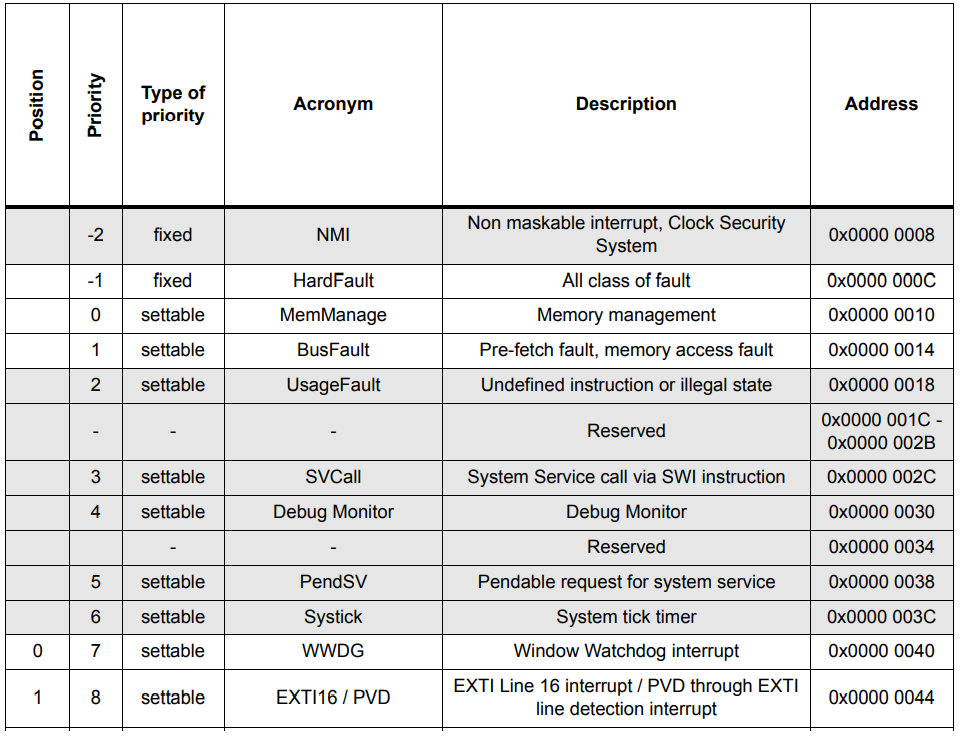

Quand une interruption est appelée le numéro d'interruption est stocké dans le program status register(PSR), le numéro d'interuption n'est pas stocké en utilisant le complément à 2 pour les nombres négatifs, on utilise à la place un offset de 15 pour revenir sur des nombres positifs.

Interruption number in PSR = CMSIS interrupt number + 15

Quand on parle du numéro d'interruption on parle toujours au sens du CMSIS.
Chaques numéros d'interruption a dans sa table d'interruption une addresse associée qui correspond au pointeur vers l'ISR.

### Les ISR

Une interrupt service routine (ISR) est aussi appelée interrupt handler, c'est une fonction particulière que l'hardware peut appeler automatiquement en réponse à une interruption. Chaques interruptions a une implementation par défaut dans le code de démarrage). (`startup_stm32xxxx.s`).
Dans la majeure partie de ces interruptions il s'agit d'une boucle "morte" comme le montre le code ci dessous : (HardFault_Handler)
```
void HardFault_Handler(void)
{
  /* USER CODE BEGIN HardFault_IRQn 0 */

  /* USER CODE END HardFault_IRQn 0 */
  while (1)
  {
    /* USER CODE BEGIN W1_HardFault_IRQn 0 */
    /* USER CODE END W1_HardFault_IRQn 0 */
  }
}
```

Dans un cadre courant ces fonctions sont définis par le mot clée `weak`, ce mot clé signifie que si une fonction a le même nom (symbole) elle sera écrasé par la fonction non-`weak`.
Les ISRs ne retournent habituellement aucune valeur parce qu'elles sont appelées par l'hardware.
De plus les IRS ne prennent pas d'argument excepté le SVC_Handler

Prenons l'exemple du Reset_Handler, qui est executé quand le processeur est resetté ou quand il démarre.
On peut voir ici que le reset handler, copie les data segments vers les data memory puis appel ensuite la fonction main.

```
Reset_Handler:  
  ldr   sp, =_estack    		 /* set stack pointer */

/* Copy the data segment initializers from flash to SRAM */  
  ldr r0, =_sdata
  ldr r1, =_edata
  ldr r2, =_sidata
  movs r3, #0
  b LoopCopyDataInit

CopyDataInit:
  ldr r4, [r2, r3]
  str r4, [r0, r3]
  adds r3, r3, #4

LoopCopyDataInit:
  adds r4, r0, r3
  cmp r4, r1
  bcc CopyDataInit
  
/* Zero fill the bss segment. */
  ldr r2, =_sbss
  ldr r4, =_ebss
  movs r3, #0
  b LoopFillZerobss

FillZerobss:
  str  r3, [r2]
  adds r2, r2, #4

LoopFillZerobss:
  cmp r2, r4
  bcc FillZerobss

/* Call the clock system initialization function.*/
  bl  SystemInit   
/* Call static constructors */
    bl __libc_init_array
/* Call the application's entry point.*/
  bl  main
  bx  lr    
.size  Reset_Handler, .-Reset_Handler
```

### Interrupt Vector Table

Pour un système embarqué pour chaques interruptions il y a une ISR associée les interruptions sont déclarés dans la table des vecteurs.
Pour une interruption i (defini dans le CMSIS), l'addresse mémoire associée correspond à (i + 16)th entrée de la table d'interruption.
La table d'interruption stock les addresse mémoire de chaques routines d'interruption (sur 4 bytes : car une mémoire STM est sur 32 bits).

Par exemple le numéro d'interruption associé à SysTick est -1. Donc l'addresse de SysTick Handler peut être trouvée en lisant le word stocké à l'addresse suivante :

`SysTick_Handler = 0x00000004 + 4*(-1+15) = 0x00000003C`

Quand le processeur ARM Cortex est démarré (ou reset), le processeur lit les deux words localisés aux addresse 0x00000000 et 0x00000004 en mémoire. Le processeur utilise alors le mot 0x00000000 pour initialiser le main stack pointer (MSP) et le mot 0x00000004 pour le program counter(PC).
Le mot stocké à l'addresse 0x00000004 est l'addresse mémoire du Reset_Handler() qui est déterminé par le compilateur et par le fichier du linker.
Quand le PC est initialisé le programme démarre son execution.

Quand les premiers mots sont utilisés pour initialiser le MSP, et le PC. La table des interruptions stock elle tout les addresses mémoires pour les interruptions.

Le Cortex-M utilise un "nested vectored interrupt controller" (NVIC) pour gérer les interruptions.
Le NVIC permet d'activer les interruptions en utilisant un système de priorités.
Le processeur appel les interruptions suivants leurs priorités. Ainsi le processeur peut stopper une interruption handler si une autre interruption arrive avec une priorité plus élevé.
Comme les tâches, le processeur rend ensuite la main à la première priorité pour terminer son traitement.
Il faut savoir que le Reset_Handler est l'ISR avec la priorité la plus haute (en général -3).

Des examples d'interruptions système sont : Supervisor call interrupts, System timer interrupt, fault-handling interrupt, hard-fault.
Des exemples d'interruptions non système sont : ADC interrupt, USB interrupt, Serial Communication interrupt (SPI,I2C,USART).

Il faut savoir qu'il est possible de relocaliser la table des interruptions vers une région différente (SRAM,FLASH), ainsi le processeur peut booter depuis différents devices.
Par exemple sur le STM32L4 l'adresse mémoire 0x0000004 est un alias à la mémoire 0x08000004 par défault, qui est une addresse mémoire assigné à la mémoire flash interne processeur.

## Interrupt Stacking and Unstacking
Quand le processeur traite une interruption, ce dernier gère automatique la stack et le unstack.
- Interrupt Stacking : Avant d'executer une interruption, on rajoute automatiquement sur la stack la valeurs de 8 registres pour préserver l'état précédent du processeur. Dans ces 8 registres on trouve : (R0,R1,R2 et R3) et 4 autres registres qui sont R12,LR,PSR et le PC.
(Au passage le PC est modifiée avec l'addresse de l'ISR à effectuer)
- Interrupt UnStacking : Quand l'interruption est terminée, la phase de unstack se fait automatiquement, cette dernier remet les valeurs des 8 registres dans l'état initial.
Cela permet de retrouver l'environnement tel qu'il était avant l'ISR. En même temps le processeur nettoie les bits qu'ils avait activé dans le NVIC status register.

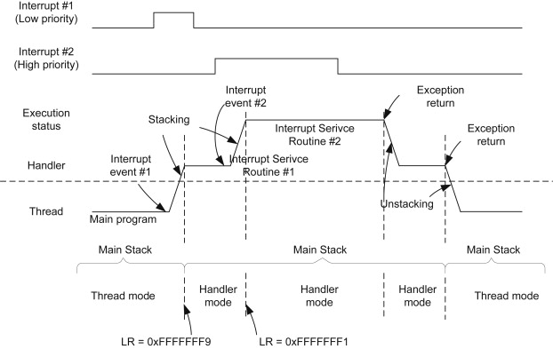

Comme le PC a été sauvegardé dans la stack, le processeur est capable de revenir dans son état initial.
L'ISR termine par l'instruction `BX LR`. Notez que LR dans une routine d'interruption a une signification différente de LR dans une sous-routine normale.
- LR dans une routine normale représente l'addresse de retour de la fonction appelée. Quand une function est appelée le registre LR stocke l'addresse mémoire de l'instruction suivante à appeler en sortie de function.
La valeur de LR est copié dans le PC quand une function se termine.

- LR dans une routine de service d'interruption indique si le processeur utilise la pile principale ou la pile de processus dans l'opération push et pop. 
Etant donné que le sous-programme de service d'interruption pré-entretient et récupère le PC via l'empilement et le désempilement, 
le registre LR n'est pas copié pour définir le PC lorsqu'un sous-programme de service d'interruption se termine. 
Au lieu de cela, le registre LR doit être fixé à une valeur spéciale. Pour indiquer si le processeur doit désempiler les données de la pile principale (MSP) ou de la pile de processus (PSP).

## Nested Vectored Interrupt Controller (NVIC)

Le NVIC est construit dans les ARM-Cortex-M pour traiter toutes les interruptions. Il offre 3 fonctions clées :

- Activer et Déactiver les interruptions.
- Configurer les priorités et les sous priorités d'une interruption spécifique.
- Set et Clear les handling bit d'une interruption particulière.

Le nombre d'interruption supporté par le processeur diffère suivant le processeur. Ce nombre est stocké dans le registre `ICTR` (Interrupt Controller Type Register).

Chaques interruptions possède 6 bits de contrôles :
| Interupt Control Bit  | Corresponding register (32 bits)          |
| :--------------- |:---------------:|
| Enable bit  |   Interrupt set enable register (ISER)        |
| Disable bit  | Interrupt clear enable register (ICER)             |
| Pending bit  | Interrupt Set pending register (ISPR)          |
| Un-pending bit  | Interrupt Clear Pending Register (ICPR)          |
| Active bit  | Interrupt Active bit Register (IABR)          |
| Software trigger bit  | Software trigger interrupt register (STIR)          |

Le Cortex-M défini huits registres pour controler chaques bits. Par exemple ISER0, ISER1, ..., ISER7 qui sont capable d'activer les 256 interruptions.

- Activation et Déactivation des interrupts : 
Ecrire un 1 dans le registre permet d'activer l'interruption correspondante. Ecrire un 0, par contre ne permet pas de déactiver l'interruption demandé.
Ecrire un 1 sur le registre disable permet de déactiver l'interruption. Ecrire un 0, n'a aucun impacts sur l'intérruption demandé.
Séparer les registres Enable et Disable permet d'activer ou de déactiver les interuptions sans affecter les autres interruptions.
Exemple : imaginons que je veux activer l'interuption avec l'ID = 32 je dois donc écrire dans le registre NVIC_ISER1[0] à 1.

- Pending et nettoyage d'interruption.
Si une interruption est demandé, son pending bit est setté si le processeur ne peux y accéder immédiatement. Ecrire 1 sur le Un-pending bit permet de retirer l'interruption de la pending list.
Quand une interruption est déactivé mais que le pending bit a déjà été setté, l'interruption reste active, et elle est exécuté une dernière fois avant déactivation.

- Trigger an interrupt:
Mettre le software trigger bit à 1 permet d'activer l'interruption demandée. Le processeur va appeler l'ISR correspondant.

## Enable and Disable Peripheral Interrupts
Nous avons vu que le registre capable d'activer ou de déactiver une interruption est le registre NVIC_ISERx.
Chaques bits dans le registre ISER peux activer une interruption périphérique.
Par exemple sur STM32L nous avons seulement 84 interruptions (non-système).
En reprenant la table des vecteurs ci dessus. 
Imaginons que nous souhaitons activer le WWDG (Watchdog) : Il faudra alors mettre le registre NVIC_ISER0[0] = 1.
Pour l'interruption TIM2 qui porte le numéro 28 il faudra setter le bit NVIC_ISER0[28] = 1.
Pour l'interruption SPI2 qui porte le numéro 36 il faudra setter le bit NVIC_ISER1[4] (32+4) à 1.

On notera que tout les registres font 32 bits peuvent être en little ou big endian et que l'addresse de l'ISER1= addr of ISER0 + 4

On pourrait dans ce cas écrire une fonction pour activer les interruptions qui ressemblerait à :
```
void Enable_Interrupt(int IRQn)
{
	int WordOffset = IRQn >> 5;	// Word offset IRQn / 32
	BitOffset = IRQn & 0x1F;	// IRQn mod 32
	NVIC->ISER[WordOffset] = 1 << BitOffset; //Enable interrupt
}
```

Si le TIMER5 portait le numéro 50 on pourrait aussi l'activer en faisant :
```
NVIC->ISER[1] = 1 << 18
```

De la même façon on pourrait écrire une fonction pour déactiver les interruptions :
```
void Disable_Interrupt(int IRQn)
{
	int WordOffset = IRQn >> 5;	// Word offset IRQn / 32
	BitOffset = IRQn & 0x1F;	// IRQn mod 32
	NVIC->ICER[WordOffset] = 1 << BitOffset; //Enable interrupt
}
```

## Interrupt Priority
"Lower Priority valie means higher Urgency."
La priorité détermine l'ordre des interruptions par ordre de priorité.
Chaques interruption possède son register "priorité d'interruption" (NVIC_IPRx) qui a une taille de 8 bits.
Dans ce registre il y a deux valeurs à mettre : la valeur "preemption priority number" et "sub-priority number". Une valeur basse veut dire une priorité plus grande.
La priorité avec la valeur 0 représente l'interruption la plus prioritaire.

De manière générale, une interruption périphérique possède une valeur de priorité positive là ou les interruptions systèmes peuvent être négatifs. 
La preemtion est une technique largement utilisé pour traiter le caractère urgent d'une interruption. 
Il y a un système de premptions au niveau des interruptions.

Quand les processeurs Cortex-M utilise 8 bits pour stocker la valeur de priorité, les processeurs STM32L utilisent seulement 4 bits. (Ranging from 0 to 15)
Pour un cortex-M différent on peut avoir d'autres valeurs.
Si je prend l'exemple du processeur STM32F401RE on a 16 niveau de priorité (8 bits):

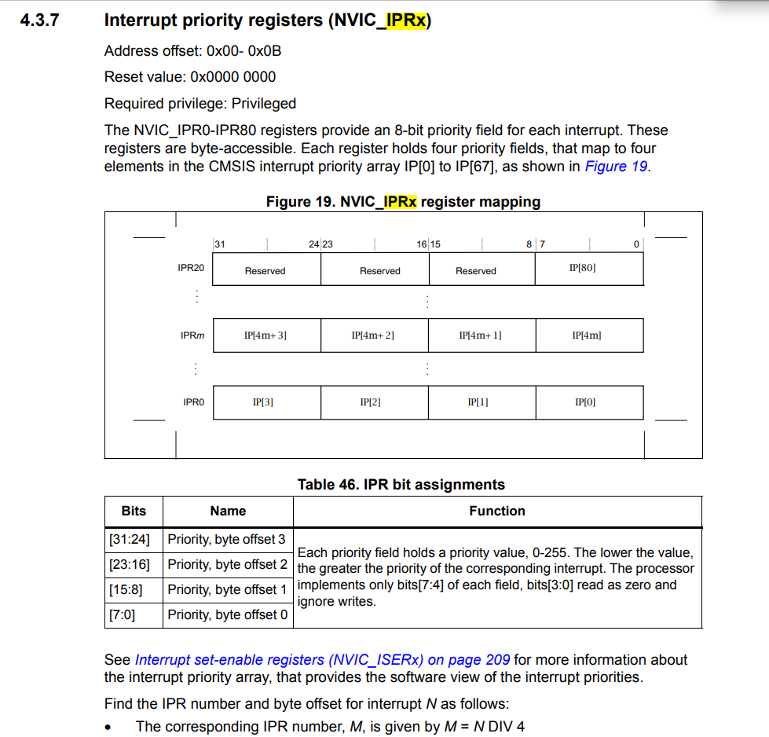

## Global Interrupt Enable and Disable
En plus de la configuration du NVIC pour configurer individuellement les interruptions, le processeur cortex-M nous permet d'activer ou de déactiver des groupes d'interruption en changeant les registres d'état des interruptions du processeur (CPS)
Ainsi nous utilisons pour cela le priority mask register (PRIMASK) pour activer ou déactiver les interruptions (excepté hardfault et le non-maskable-interrupt (NMI)).
De plus nous utilisons le fault mask register (FAULTMASK) pour activer ou déactiver les interruptions excepté le NMI.
| Instruction  | Action          | Equivalent          |
| :--------------- |:---------------:|:---------------:|
| CPSID i  |   Déactiver les interruptions & configurable fault handler        | MOVS r0,#0 MSR PRIMASK, r0 |
| CPSID f  | Déactiver les interruptions et tout les fault handler             | MOVS r0,#1 MSR FAULTMASK, r0 |
| CPSIE i  | Activer les interruptions & configurable fault handler           | MOVS r0,#0 MSR PRIMASK, r0 |
| CPSIE f  | Activer les interruptions et tout les fault handler          | MOVS r0,#1 MSR FAULTMASK, r0 |
| N/A  | Déactiver les interruptions avec les priorités 0x05-0xFF          | MOVS r0,#5 MSR BASEPRI, r0 |

Quand le base prioriy mask register (BASEPRI) n'est pas null, tout les interruptions plus haute que la priorité supérieur ou égale à BASEPRI sont déactivé.
Dans ce cas, nous disons aussi que tout les interruptions inférieur à BASEPRI sont non-maské. (cad Active).
Plus la valeur de la priorité est grande moins est l'urgence de l'interruption.

Dans la table des équivalences données ci dessus. Les MRS transfèrent la valeur des purposes register dans les special purpose regiter. Notons que les instructions MOV ou MOVS ne peuvent pas accéder à ces registres.

## System Timer
Le tick système timer (SysTick) est un simple compteur décroissant 24 bits qui produit un petit quantum de temps fixe. Le Soft utilise le SysTick pour créer des delays ou ou produire des interruptions périodique et executer un traitement de façon répété dans le temps.
- Le compteur SysTick compte de facon décroissante d'une valeur N-1 jusqu'à 0. Le processeur génère une interruption lorsque le SysTick atteint la valeur 0.
- Après avoir atteint la valeur 0, Le SysTick charge la valeur stocké dans un registre spécial appelée le SysTick Reload Register et continue de compter en décroissant à nouveau.
- Le SysTick ne s'arrête jamais de compter même quand le processeur est en mode pause (debug session). Les interruptions continuent même en mode debug.

Un autre usage du SysTick timer est de créer un Timer qui pourrait être utile aux CPU équipé d'un RTOS. Quand plusieurs tâches tournent de façon concurrente. Le processeur alloue  chacunes des tâches du temps CPU suivant la politique d'ordonnancement choisi (Preempif ou Round Robin).
Pour faire cela, le processeur utilise le timer hardware pour générer des interruptions à interval régulier. Ces interruptions informent le processeur d'arrêter la tâche en cours d'execution, en sauvegardant le contexte de la tâche en cours d'execution dans la stack, et selectionne la nouvelle tâche qui se trouve dans la queue.
Quand le timer SysTick est utilisé au niveau du système, le processeur peut parfois protéger le SysTick d'être modifié par software dans le mode "unprivileged mode".

Il y a 4 registres 32 bits pour configurer le system timer. Leurs addresse mémoires données ci dessous sont toujours les mêmes pour les processeurs ARM Cortex-M mais le nom de ces registres varient suivant le manufactureur.
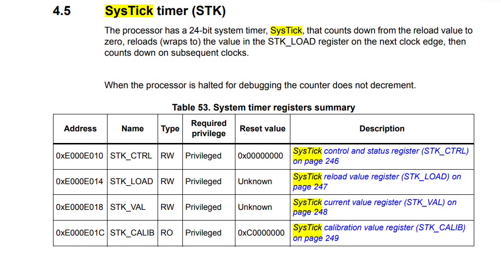

Détaillons ces registres dans les chapitres suivants :

### SysTick CTRL Register

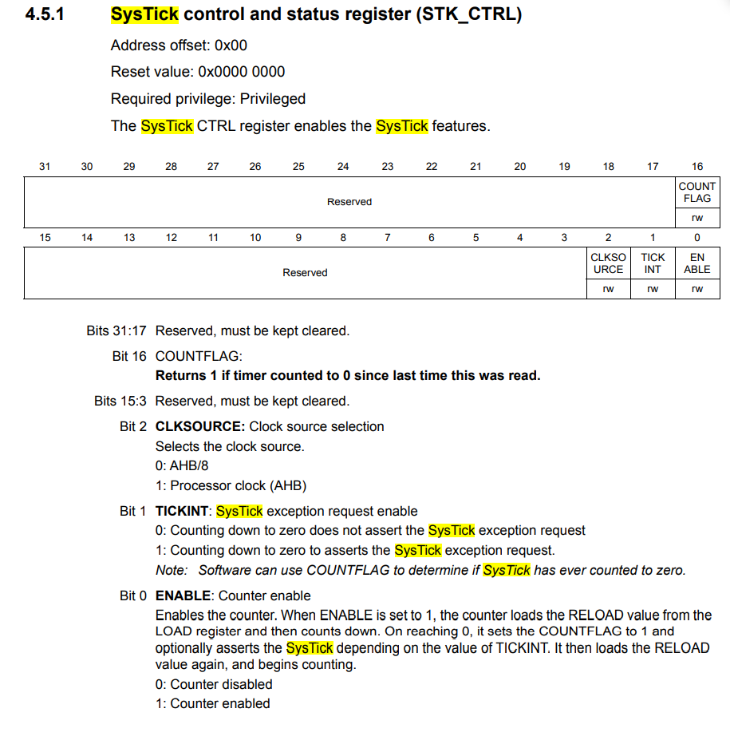

- La CLKSource permet de prendre la fréquence de AHB divisé par 8 ou bien la valeur du processor clock.
La sélection de la clock (MSI,HSI,PLLCLK,HSE) est faites par le registre RCC_CFGR via un multiplexeur.
Dans l'exemple ci dessous on utilise directement le processor Clock.
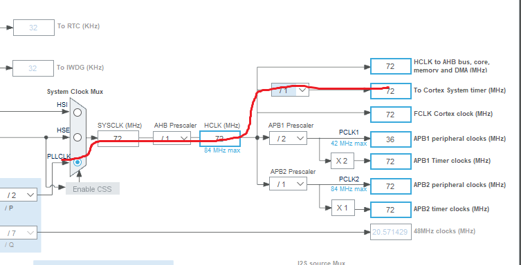
- TICKINT : Permet d'activer les interruptions sur le SysTick.
0 : Permet de déactiver l'interruption lorsqu'on atteint la valeur 0.
1 : Permet d'activer l'interruption quand on atteint la valeur 0.
- ENABLE :
Permet d'activer (1) le compteur ou de le déactiver (0).

Ainsi pour avoir une interruption sur le SysTick il faut :
1. Mettre le bit  TICKINT à 1 pour activer l'interruption
2. Activer le SysTick interrupt dans le NVIC vector. (activé par défault dans le NVIC)
3. Mettre le flag ENABLE à 1 pour activer le compteur.

- COUNTFLAG permet d'indiquer quand un évenement spécial est arrivé.
1 = Le compteur est passé de 1 à 0 depuis la dernière lecture de SysTick_CTRL
0 = Le COUNTFLAG est néttoyé en lisant le SysTick_CTRL ou par écriture de SysTick_VAL.

### SysTick LOAD Register
Le registre LOAD permet de stocker la valeur à laquelle le SysTick va se remettre lorsqu'il atteint la valeur 0.

Si l'interruption SysTick a besoin d'être appelée tout les N clock pulses, le software doit configurer ce registre à la valeur N-1.
Ce register supporte une valeur sur 24 bits.
Par exemple si l'application a besoin de générer une SysTick interrupt tout les 100 clocks pulse, le SysTick Clock LOAD doit être setté à 99.
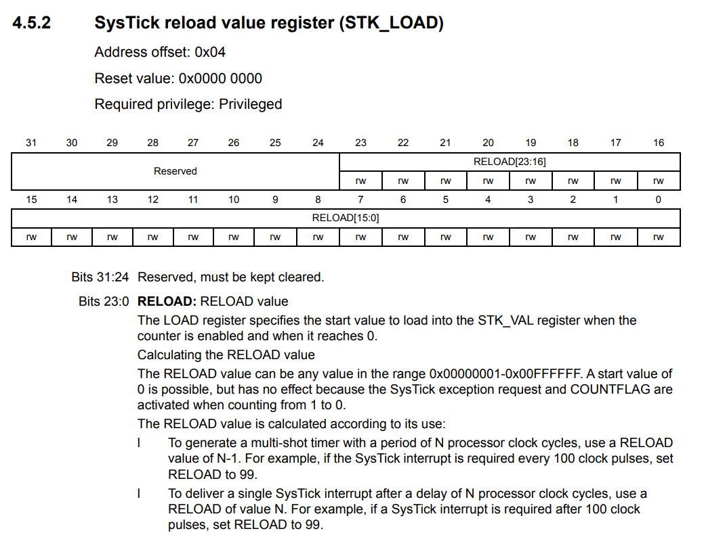

### SysTick VAL Register
Quand le SyTick est activé, le compteur 24 bits est copié dans le registre SysTick_VAL.
Cependant la valeur de ce registre est arbitraire lorsqu'on effectue un reset.

Le processeur décrémente automatiquement le registre à chaques pulse envoyé par le timer.
Ecrire une valeur sur ce registre remet ce registre à 0. (Redémarre le TIMER à la valeur SysTick_LOAD) au prochain pulse.
Lire une valeur sur ce registre permet d'afficher la valeur courante du SysTick.
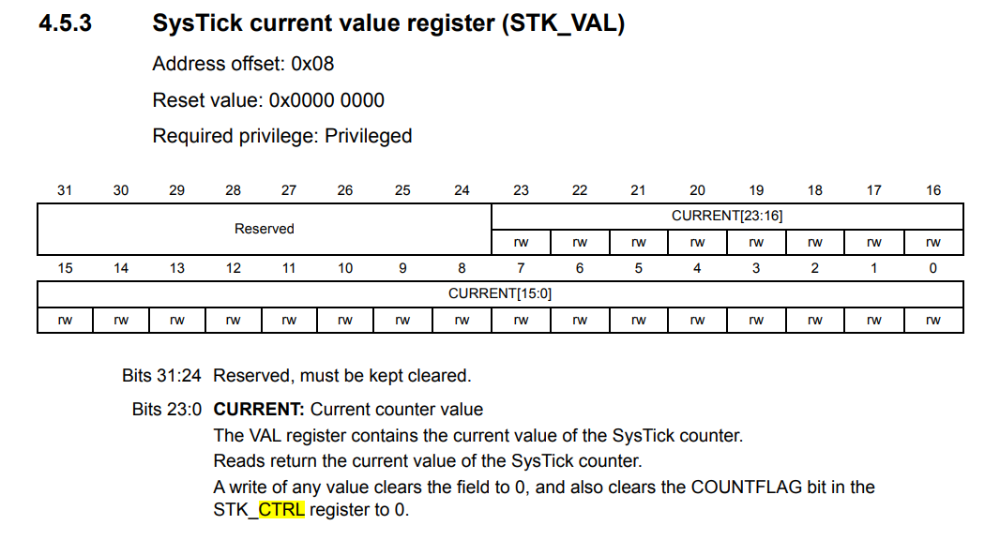

### SysTick CALIB Register
Permet de calibrer le SysTick : c'est un registre en lecteur seul qui nous permet de voir la calibration de notre systick.
- La valeur TENMS stocké dans ce registre est un prérequis pour générer un interval de temps de 10ms (cad un timer à 100Hz).
Le Software peut l'utiliser comme une horloge de référence externe de grande précision pour calibrer le système timer. Si la valeur TEMS vaut 0, nous pouvons calculer sa valeur à partir de la fréquence de la clock qui pilote le compteur du timer.
La valeur TEMNS donne une valeur façon convenable pour générer un interval de temps particulier.
Par exemple pour générer un SysTick interrupt tout les 1ms, nous pouvons setter le Systick_LOAD à TENMS/10.
- Le FLAG SKREW indique si la valeur TENMS est exacte ou non. Si la valeur vaut 0, le champ TENMS ne peux pas générer exactement 10ms à cause d'une petite variation sur la fréquence de la clock.
- Le FLAG NOREF indique si le processeur a implémenté une clock de référence.
Si TENMS vaut 1. La clock de référence n'a pas été appliqué par le manufactureur.

Exemple de calcul d'un interval system timer :
Imaginons qu'on ai un SysTick_LOAD à 6. Si la clock du processeur est à 1MHz et que le Systick counter prend cette fréquence en horloge. Nous pouvons calculer la période d'interruption comme cela :
`SysTick Interrupt period = ( 1 + SysTick_LOAD) * (1/ SysTick Counter Clock Frequency) = ( 1 + 6 ) * (1/1MHz) = 7us`

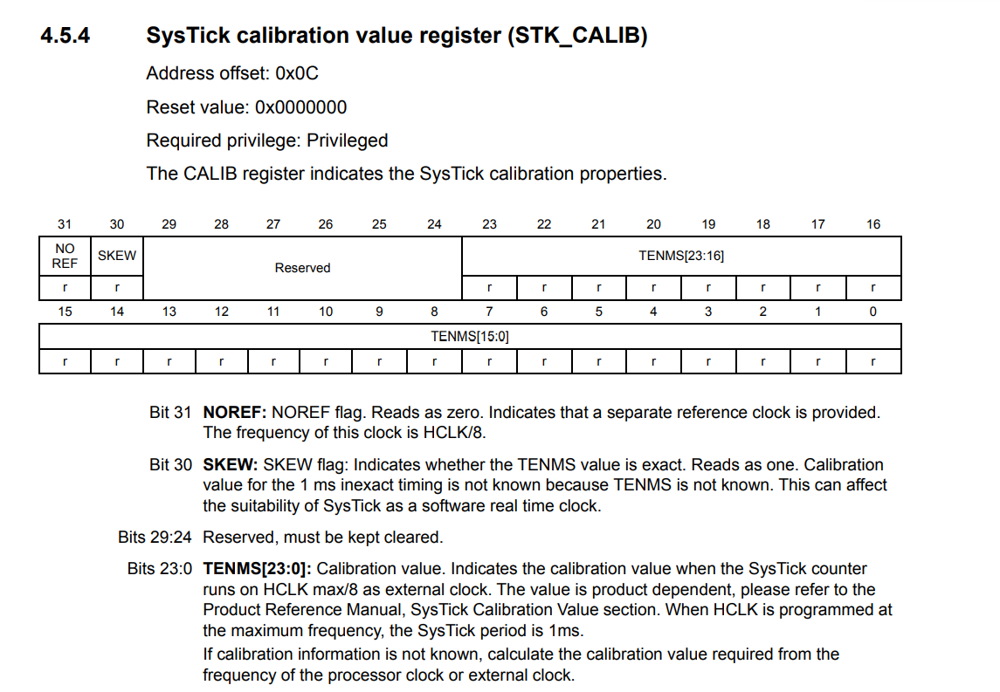

Maintenant que nous connaissons tout les registres voyons comment programmer cela :
On pourrait par exemple activer les interruptions SysTick en faisant :
` *((volatile uint32_t *) 0xE000E010 |= 1UL << 2;`
Mais ce n'est pas une façon convenable de le faire car difficile à comprendre et à lire.

A la place nous pourrions utiliser une structure sur un block contigue et le mapper sur la mémoire physique.
Comme nous l'avons vu le systick s'appui sur 4 regitres de 32 bits.
Les addresses mémoires de ces registres sont convertis vers un pointeur variables qu'on peut déclarer dans une structure.
```
#define __I volatile const // define as read only
#define __O volatile // defines as write only
#define __IO volatile // allow both read and write

// Memory mapping structure for SysTick
typedef struct {
__IO uint32_t CTRL;
__IO uint32_t LOAD;
__IO uint32_t VAL;
__I uint32_t CALIB;
} SysTick_Type;

#define SysTick_BASE 0xE000E010

#define SysTick ((SysTick_Type *) SysTick_BASE)
```

En partant de ce code on peut ainsi une écrire une fonction pour initialiser notre SysTick : Nous pouvons aussi écrire une fonction delay personalisé.
La fonction ci dessous `SysTick_Config()` initialise le systick et génère des interruptions à interval régulié. Le paramètre d'entrée ticks est égale à l'interval de temps du time divisé par la période de la clock.`
Ci dessous l'utilisation du systick d'un STM32F401RE que nous utilisons qu'on incrémente plutôt que de décrémenter mais le cas d'usage est le même.

```
__STATIC_INLINE uint32_t SysTick_Config(uint32_t ticks)
{
  if ((ticks - 1UL) > SysTick_LOAD_RELOAD_Msk)
  {
    return (1UL);                                                   /* Reload value impossible */
  }

  SysTick->LOAD  = (uint32_t)(ticks - 1UL);                         /* set reload register */
  NVIC_SetPriority (SysTick_IRQn, (1UL << __NVIC_PRIO_BITS) - 1UL); /* set Priority for Systick Interrupt */
  SysTick->VAL   = 0UL;                                             /* Load the SysTick Counter Value */
  SysTick->CTRL  = SysTick_CTRL_CLKSOURCE_Msk |
                   SysTick_CTRL_TICKINT_Msk   |
                   SysTick_CTRL_ENABLE_Msk;                         /* Enable SysTick IRQ and SysTick Timer */
  return (0UL);                                                     /* Function successful */
}
```

Le SysTick interrupt Handler lui incrémente la valeur uwTick
```
/**
  * @brief This function handles System tick timer.
  */
void SysTick_Handler(void)
{
  /* USER CODE BEGIN SysTick_IRQn 0 */

  /* USER CODE END SysTick_IRQn 0 */
   uwTick += uwTickFreq;
  /* USER CODE BEGIN SysTick_IRQn 1 */

  /* USER CODE END SysTick_IRQn 1 */
}
```

La fonction Delay pourrait s'écrire par exemple :
```
__weak void HAL_Delay(uint32_t Delay)
{
  uint32_t tickstart = uwTick;
  uint32_t wait = Delay;

  /* Add a freq to guarantee minimum wait */
  if (wait < HAL_MAX_DELAY)
  {
    wait += (uint32_t)(uwTickFreq);
  }

  while((uwTick - tickstart) < wait)
  {
  }
}
```

Notons que la variable `uwTick` est du type `__IO uint32_t uwTick;` (volatile).
Nous pourrions pousser l'analyse plus loin et analyser le code assembleur.

## External Interrupt
Les interruptions externes sont des interruptions qui sont instantiés par des périphériques externes ou des device externe au coeur du processeur.
Comme des bouttons poussoirs ou des claviers. Ils sont très utiles car ils permettent au microcontroleur de moniter des signaux extérieurs efficassement et de répondre rapidement à des événements extérieurs.

L'external interrupt controlleur possède 16 external interrupts, nommés EXTI0, EXTI1, ... , EXTI15.
Chacuns de ces registres sont associés à un GPIO spécifique.
Les broches GPIO avec le même numéro de broche dans tous les ports GPIO sont affectées à la même interruption externe.
Dans d'autres mots, seules les broches avec le numéro de broche k peuvent être la source de l'interruption externe EXTI k.
Par exemple : Le processeur map le GPIO PA0 vers EXTI0, PA1 vers EXTI1, PA2 vers EXTI2 etc ...

De plus, il n'y a qu'une seule interruption externe sur toutes les broches avec le même numéro sur tous les ports GPIO.
Par exemple, si la broche PA3 déclenche une interruption. Nous pouvons pas utiliser les broches PB3, PC3, PD3 ou PE3 comme source externe d'interruption.

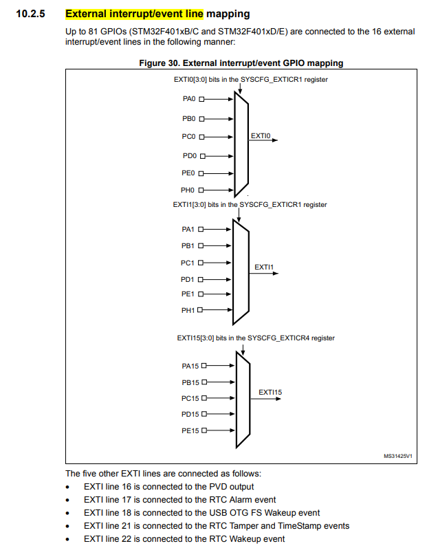

Dans la figure ci dessus on voit que si on appui par exemple sur un boutton relié à la pin PA3, le voltage de PA3 passe à l'état haut. Le Software devrait donc configurer la broche PA3 en pull down en interne et donc avoir un PA3 en basse tension quand le boutton n'est pas appuyé.

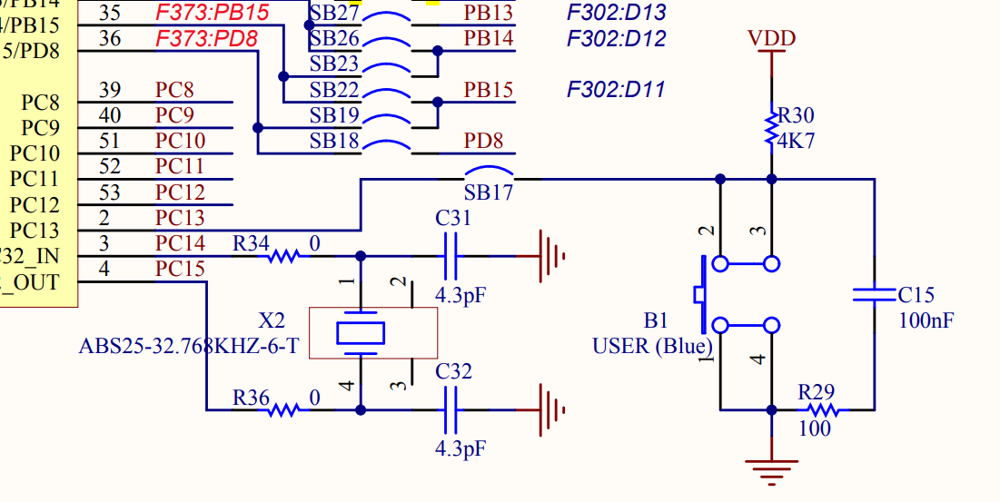

Par exemple sur le schéma ci dessus (NUCLEO-F401RE) on retrouve le bouton avec un système de debounce qui permet d'éviter l'effet "rebond", avec en interne dans le processeur une résistance de pull-down configuré en software.

L'external interrupt controller possède un moniteur pour monitorer les volts et donc de détecter un seuil. Ce moniteur hardware peut monitorer une broche GPIO.
Le software peut selectionner le front montant, le front descendant ou les deux et déclencher une interruption sur les deux fronts. Pour une interruption sur PA3 l'interruption se trouve sur EXTI3.
La requête d'interruption est envoyée au NVIC. Finalement le processeur répond avec l'appel de la routine d'interruption `EXTI3_IRQHandler()`.

Expliquons alors comment configurer le software pour configurer un GPIO pin k et déclencher une interruption externe EXTI k.

1. Activons l'horloge de SYSCFG et le port GPIO correspondant.
2. Configurer le GPIO broche k en entrée.
3. Mettre le registre SYSCFG external interrupt configuration register (SYSCFG_EXTICR) pour mapper le GPIO broche k vers l'interruption externe line k.
4. Selection le front qui active l'interruption EXTI k. Peut être le front descendant, montant ou les deux. Ceci est programmé à travers les registres EXTI_RTSR1 ou EXTI_RTSR2 pour le front montant et EXTI_FTSR1 ou EXTI_FTSR2 pour le front descendant.
5. Activer l'EXTI k en mettant le kième bit dans le registre EXTI interrupt mask register (EXTI_IMR1 ou EXTI_IMR2). Une interruption peut être seulement généré si le bit correspondant dans le registre interupt mask register est à 1.
6. Activer l'interruption EXTI k sur le NVIC Controller avec NVIC_EnableIRQ.
7. Ecrire l'ISR pour l'EXTI k. Le EXTI pending register (EXTI_PR1 ou EXTI_PR2) enregistre la source de l'interruption. Le nom de l'interruption est donnée dans la table des vecteurs d'interruption.
8. Dans l'ISR, le soft a besoin de faire un clear sur le pending bit correspondant pour indiquer que l'interruption a bien été prise en comte. Il faut écrire un 1 sur le pending bit de l'interruption concerné.

Voici un exemple pour activer une interruption sur PA3, cette dernière allumera la LED en PB8 par exemple :
```
void EXTI_Init(void) {
	// Enable the SYSCFG Clock
	RCC->APB2ENR |= RCC_APB2ENR_SYSCFGEN;
	
	// Select PA.3 as the trigger source of EXTI 3
	SYSCFG->EXTICR[0] &= ~SYSCFG_EXTICR1_EXTI3;
	SYSCFG->EXTICR[0] |= SYSCFG_EXTICR1_EXTI3_PA;
	SYSCFG->EXTICR[0] &= ~(Ox000F);
	
	// Enable rising edge trigger for EXTI3_IRQHandler
	// Rising trigger selection register (RSTR)
	// 0 : Disable , 1 : Enable
	EXTI->RTSR |= EXTI_RTSR_RT3;
	
	// Disable falling edge trigger for EXTI3_IRQHandler
	// Falling trigger selection register (FSTR)
	// 0 : disable, 1 : enable
	EXTI->FTSR &= ~EXTI_FTSR_RT3;
	
	// Enable EXTI3 Interrupt
	//Interrupt mask register : 0 : masked 1: unmasked
	// "Masked" means that processor ignores the corresponding interrupt.
	EXTI->IMR1 |= EXTI_IMR1_IM3; // Enable EXTI line 3
	
	// Set EXTI priority to 1
	NVIC_SetPriority(EXTI3_IRQn,1)
	
	// Enable EXTI3 interruot
	NVIC_Enable IRQ(EXTI3_IRQn);
}
```

Attention dans le codage de l'ISR une erreur courante est de ne pas nettoyer le pending flag après avoir traité l'interruption. Et peut par erreur pensait qu'une autre interruption est arrivée et répéter l'appel à l'interruption deux fois.
Ici on fait le toggle d'une LED sur PB8 :

```
void EXTI3_IRQHandler(void) {
	if ((EXTI->PR1 & EXTI_PR1_PIF3) == EXTI_PR1_PIF3) {
	
		// Toggle LED
		GPIOB->ODR ^= 1<< 8;
		
		EXTI->PR1 |= EXTI_PR1_PIF3; // Write 1 to clear
	}
```	

Les interruptions externe peuvent aussi monitorer les evénements interne lié au processeur, comme les alarmes RTC, COMP outputs, ou les événements de wakeup interne. Aussi, le software peut faire un trigger d'un événement en écrivant sur le EXTI software interrupt event register (EXTI_SWIER).

## Software Interrupt
Les signaux d'interruptions peuvent être généré par l'hardware, comme les timers et les autres périphériques hardware.
Le software peut aussi générer des signaux d'interruption en mettant les interrupt pending registers à 1. Ou en utilisant des instructions spéciales.
Il y a deux utilisations majeurs des interruptions software : les exceptions handling et les priviliged hardware access.

- Exception Handling :
Quand une condition d'exception arrive lors de l'execution du processeur, comme une division par 0, un illegal opcode, ou une addresse mémoire invalide, le processeur doit voir ces situations anormales et déclencher une action.
Le processeur peut identifier deux types de fautes, y compris une division par 0 ou un accès mémoire non aligné.
Si le software déclénche une division par 0, il génère ce qu'on appel une "trap", c'est à dire que le processeur appel le hard fault handler qui peut demander un redémarrage du système ou terminer dans une boucle infinie.

- Privilege Hardware Access : Quand une application utilisateur tourne en mode unprivileged et nécéssite un accès au hardware, ceci est disponible seulement en mode priviliged. 
Une instruction spéciale (Supervisor call) permet de passer du mode privilège au mode non privilège.

## Le DMA
L'accès direct à la mémoire (en anglais DMA pour Direct Memory Access) est un procédé informatique où des données circulant de, ou vers, un périphérique sont transférées directement par un contrôleur adapté vers la mémoire principale de la machine, sans intervention du microprocesseur si ce n'est pour lancer et conclure le transfert.
La conclusion du transfert ou la disponibilité du périphérique peuvent être signalés par interruption.
Son objectif est de décharger le processeur des transferts de données.
Le contrôleur de DMA est un module matériel capable de réaliser des transferts entre les périphériques et la mémoire.
L'avantage d'une telle technologie est que le processeur peut faire autre chose.
Le transfert des données peut être plus rapide.


La configuration minimale du DMA est la suivante :
```
Adresse de source du transfert
Adresse de destination du transfert
Nombre de données à transferer
Taille des données (octets, mots...)
```
Le déclenchement du DMA peut se faire par 2 voies :
- Déclenchement par logiciel (notamment dans le cas de transferts mémoire vers mémoire)
- Déclenchement sur événement d’un périphérique (exemple : données reçues par la carte réseau)
 
Contrôleur du DMA:
- Plusieurs canaux (channels) pour effectuer plusieurs transferts en même temps (en provenance de plusieurs périphériques par exemple)
- Registres de configuration par canaux
- Transferts
	• Périphérique vers mémoire
	• Mémoire vers périphérique
	• Périphérique vers périphérique
	• Mémoire vers mémoire
		- Possibilité de remplir une zone mémoire avec un motif

Il y a différents mode d'opérations possibles :
- Rafale (Burst) : Le bloc de données est transféré en une seule fois. Une fois que le contrôleur de DMA a accès au bus, il le conserve pendant tout le transfert. Le processeur ne peut pas faire d’accès mémoire pendant ce temps
- Vol de cycle (Cycle Stealing) : Le processeur et le contrôleur de DMA se partagent alternativement le bus (un cycle pour le processeur, un pour le contrôleur de DMA)
- Transparent : Le contrôleur de DMA n’a accès au bus que lorsque le processeur n’en a pas besoin.

## Moteur pas à pas

Les moteurs à courant continu sont utilisés dans divers domaines, comme la robotique, les imprimantes, la domotique, les équipements médicals etc ...
On distingue deux types de moteur à courant continu (DC).
- Les servo-moteur qui opèrent sur une boucle fermée, il nécéssite un retour sur leurs positions pour accomplir la consigne donnée en position et vitesse.
Ils sont plus onéreux que les moteurs pas à pas. On utilise très souvent un PWM pour controler un servo-moteur.
- Les moteurs pas à pas, qui tournent sur des pas discrets. Il peuvent être controlé en boucle ouverte et ne nécéssite pas de retour de position.

En comparaison avec les moteurs pas à pas, les servo-moteurs sont plus adapté à des applications qui nécéssite une haute vitesse et un haut couple, ou des contraintes plus importantes.
Les moteurs pas à pas ont entendance à avoir moins de couple sur des hautes vitesses, et peut même esquiver des pas à haute vitesse, ils ont une vibration aussi plus élevé à cause des vibrations du au mécanisme de pas à pas en lui même.
Les moteurs pas à pas sont moins onéreux car il y a moins d'électronique, en partie pas de retour de capteur et ils sont plus facile à faire fonctionner sur un microprocesseur.
Ils sont donc plutôt adapté aux application qui n'ont pas besoin de beaucoup d'acceleration, et à charge constante.

### Moteur pas à pas bipolaire et unipolaire

Les moteurs pas à pas peuvent être de deux types : bipolaire et unipolaire

- Un moteur pas à pas bipolaire a besoin d'une source externe d'énergie qui possède les bonnes polarités, comme un pont en H. La source d'énergie peut inverser le sens du courant et la polarité électromagnetic pour l'enroulement de chaques bobines.

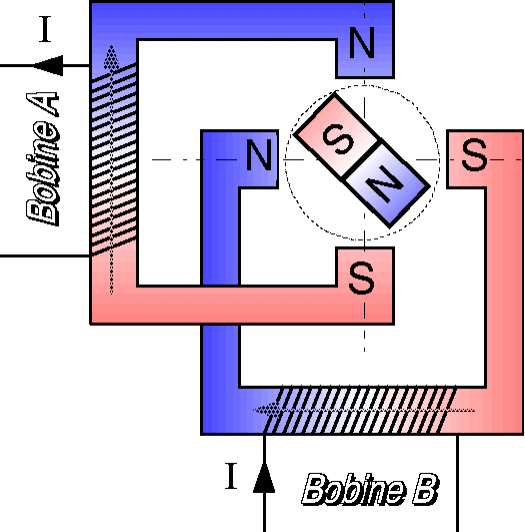

- Un moteur pas à pas unipolaire a besoin qu'une source externe d'énergie, et le sens electrique du courant ne s'inverse pas dans l'enroulement des bobines. Le moteur unipolaire utilise la moitié de sa bobine d'enroulement pour générer le champ électromagnétique tandis que le moteur bipolaire utilise une bobine d'enroulement complète.
Par conséquent, un moteur pas à pas bipolaire a généralement une capacité de couple plus élevée qu'un moteur unipolaire de même poids. Cependant, un moteur pas à pas unipolaire a un circuit de commande plus simple.

Dans la suite, nous étudirons le moteur pas à pas unipolaire pour montrer comment le controler à l'aide d'un processeur.
Nous utiliserons le moteur 38BYJ-48 qui est un moteur pas à pas de 5V et qui possèdes les propriétés suivantes :
[https://download.mikroe.com/documents/datasheets/step-motor-5v-28byj48-datasheet.pdf](https://download.mikroe.com/documents/datasheets/step-motor-5v-28byj48-datasheet.pdf)

A savoir 4 phases et une résolution de 1/64. (C'est à dire 360/64 = 5,625‬° degrès par pas).

### L'angle de pas

Pour chaques pulsation, le moteur tourne d'un pas fixe. 
Suivant la vitesse du champs dans les bobines le moteur tourne plus ou moins rapidement et on peut aussi controler le nombre de pas à effectuer.
L'arbre peut tourner d'un pas complet, d'un demi-pas ou d'une fraction spécifique de pas complet. Ce qu'on appelle le pas complet, le demi-pas et le micro-pas.
Lorsque l'arbre tourne d'un pas complet, l'angle qu'il effectue est appelé angle de pas. Nous pouvons calculer l'angle de pas comme suit.

` Step Angle = 360° / step per revolution `

Avec `step per revolution = P * T`

Ici P correspond au nombre de phases sur le stator et T le nombre de poles magnétique permanent sur le rotor.


Par exemple sur la figure ci dessous, il y a 8 paires de poles sur le rotor ;
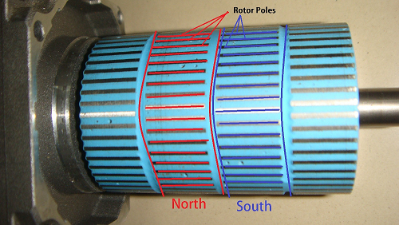
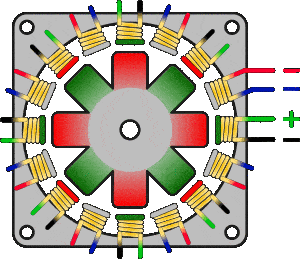

En règle général, un moteur pas à pas possède 2 ou 3 phases le nombre de pas est de l'ordre de 48,72,144,180 ou 200 qui correspond donc à des résolutions différentes.

Le moteur que nous allons utiliser a 4 phases sur son stator, et possède 16 paires de poles.
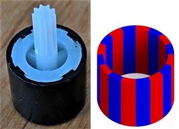

Donc l'angle de pas peut être calculé ainsi :

` Step angle = 360° / (4*16) = 5,625‬° `

Pour un pas complet, le moteur tourne d'un `step angle` pour chaques pulsations. Pour un demi-pas il tourne d'un demi `step angle`. Pour le micro-pas il tourne d'un angle qui correspond à une fraction spécifique du `step angle`.
Le nombre de taux d'impulsions contrôle la position et la vitesse de l'arbre du moteur, respectivement.

Vue éclaté du moteur que nous allons utiliser 

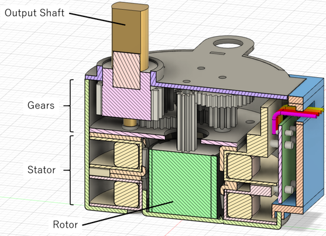

Pour plus d'information sur le moteur 28BY-J48 et son démontage se référer à ce lien : https://cookierobotics.com/042/

### Stepping Mode

Dans la suite nous distinguerons 4 modes de step différents :
- Le Wave Stepping
- Le Full Stepping
- Le Half Step Drive
- Le Microstepping

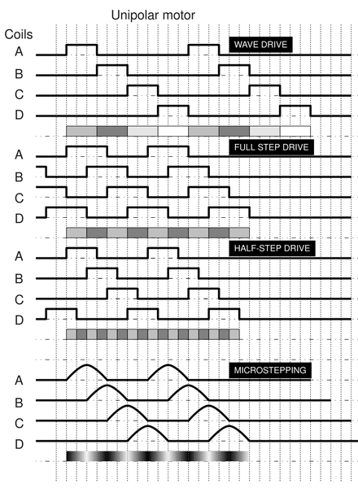


#### Wave Stepping

En tant que méthode de pas à pas la plus simple, le wave stepping allume un interrupteur et alimente une seule phase à la fois. 
La figure suivante montre la séquence de contrôle de quatre commutateurs de bobine d'enroulement (A, B, C, D). 
Pour chaque interrupteur, si son signal de commande est élevé, l'interrupteur est activé et le courant électrique circule dans la bobine d'enroulement correspondante. 
Par exemple lorsque le signal de SW1(A) est haut, la bobine A correspondante est excitée. Le logiciel active ces commutateurs alternativement dans cette séquence de contrôle.

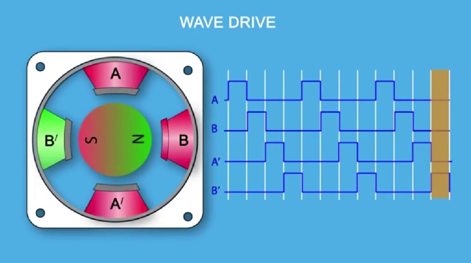

Pour simplifier la compréhension, imaginons que notre rotor ai seulement deux paires de poles (en réalité ce n'est pas le cas).
Comme dans l'illustration ci dessus le rotor tourne de 90° à chaques impulsions dans les bobines.
Ce mode est appelée wave stepping. Une seul bobine est alimenté à la fois. Ceci offre un couple très bas.
Cette méthode n'est pas largement utilisé dans les systèmes réels.

#### Full Stepping

Pendant que la méthode wave stepping alimente une seul bobine à chaques fois, le full stepping alimente deux bobines alternativement. Comme illustré dans l'image ci dessous :
- Pour faire tourner l'arbre dans le sens horaire les bobines doivent être alimenté dans la séquence AB(-), AB, A(-)B et A(-)B(-).
- Pour tourner dans le sens antihoraire c'est l'inverse


Le Wave Stepping et le Full Stepping font tourner l'arbre d'un angle de pas à chaque fois et ont le même nombre de pas en un tour. 
Cependant, le Full Stepping produit un couple plus élevé que le Wave Stepping car deux enroulements de bobine poussent ou tirent l'arbre simultanément.

Un exemple de programme embarqué qui permettrait de faire du full stepping de 360° dans le sens des aiguilles d'une montre serait : (Les GPIO sont à définir)
```
// Full Step : 0b1001, 0b1010, 0b0110, 0b0101
// Each four bits sequence representent the onOFF control of A,¯A, B, ¯B.

unsigned char FullStep[4] = {0x9, 0xA, Ox6,0x5};

for (int j = 0; j<64; j++) { // 64 step * 5,625 = 360
	for (int i = 0; i< 4; i++){ // Sens de rotation clockwize for (int i = 3; i >= 0; i--){ 
		delay(1); // Delay
		GPIOA->ODR[0] = (FullStep[i] & 0x8) >> 3; // A
		GPIOB->ODR[0] = (FullStep[i] & 0x4) >> 2; // B
		GPIOA->ODR[1] = (FullStep[i] & 0x2) >> 1; // ¯A
		GPIOB->ODR[1] = (FullStep[i] & 0x1); // ¯B
	}
}
```

#### Half Stepping

Dans ce mode, la séquence d'activation est la suivante : AB¯ , A , AB, B , ¯AB, ¯A, ¯A¯B et ¯B.
Nous activons à la fois une bobine et deux bobines alternativement.
Ce mode donne moins de couple au moteur que le précédent mode, mais rajoute de la résolution du niveau du step.
Il permet de faire tourner l'arbre avec plus de souplesse également.

Dans ce mode on aurait ce programme :
```
// Full Step : 0b1001, 0b1000, 0b1010, 0b0010, 0b0110, 0b0100, 0b0101, 0b0001
// Each four bits sequence representent the onOFF control of A,¯A, B, ¯B.

unsigned char HalfStep[8] = {0x9, 0x8, OxA,0x2, 0x6, 0x4, 0x5, 0x1};

for (int j = 0; j<64; j++) { // 64 step * 5,625 = 360
	for (int i = 0; i< 8; i++){ // Sens de rotation clockwize for (int i = 3; i >= 0; i--){ 
		delay(1); // Delay
		GPIOA->ODR[0] = (HalfStep[i] & 0x8) >> 3; // A
		GPIOB->ODR[0] = (HalfStep[i] & 0x4) >> 2; // B
		GPIOA->ODR[1] = (HalfStep[i] & 0x2) >> 1; // ¯A
		GPIOB->ODR[1] = (HalfStep[i] & 0x1); // ¯B
	}
}
```

#### Micro Stepping

Comme introduit précédent, un microcontroleur peut controler un moteur pas à pas avec plusieurs modes différents. Mais ces derniers produises des mouvements sacadés et bruité du moteur.
Le micro stepping consiste à utiliser un signal PWM pour faire des rotations full step, de 1/4, 1/8, 1/16, 1/32 de full step.

Le Micro stepping divise a full step en des multiples de step plus petit. Cela permet de faire bouger l'arbre d'angle plus petit et d'effectuer un mouvement plus lisse et de réduire le problème de bruit et de vibration.

Le but du micro stepping est d'ajuster l'intensité électrique dynamiquement dans chaques bobines pour produire des accélérations ou des décélérations.
Pour cela l'utilisation d'un PWM pour générer un signal binaire rapide avec un duty cycle approprié permet d'ajuster l'amplitude du voltage envoyé dans les bobines.
Le voltage appliqué dans une bobine est proportionnel au courant dans ces dernières.

Sine cosine micro stepping est une méthode largement utilisé pour ajuster la tension l'amplitude dans chaques bobines. Quand deux bobines `a` et `b` sont exité simultanéments :
Le couple magnétique statique global généré par les deux enroulements est : $T= -k i_{a} \sin(\theta) + k i_{b} \cos(\theta)$

Ou k est une constant, $\theta$ est l'angle mécanique de l'arbre depuis la position du dernier pas et ia et ib sont le courant électrique dans les bobines a et b

Lorsque l'arbre reste à un angle stable, la force de couple est équilibrée, et nous avons donc T = 0, en micro stepping (sine-cosine) pour rendre la force de couple globale nulle, nous pouvons définir un courant électrique dans les deux enroulements comme suivre :

```math
i_{a} = I_{m} \cos(\theta)

i_{b} = I_{m} \sin(\theta)
```
ou $I_{m}$ est une constante par conséquent, le couple magnétique statique global est :

```math
T = -k i_{a} \sin(\theta) + k i_{b} \cos(\theta) = -kI_{m} \cos(\theta)\sin(\theta) + kI_{m} \sin(\theta)\cos(\theta) = 0
```

Les microprocesseurs utilisent des ondes sinusoïdales et cosinus discrètes pour piloter les deux enroulements.

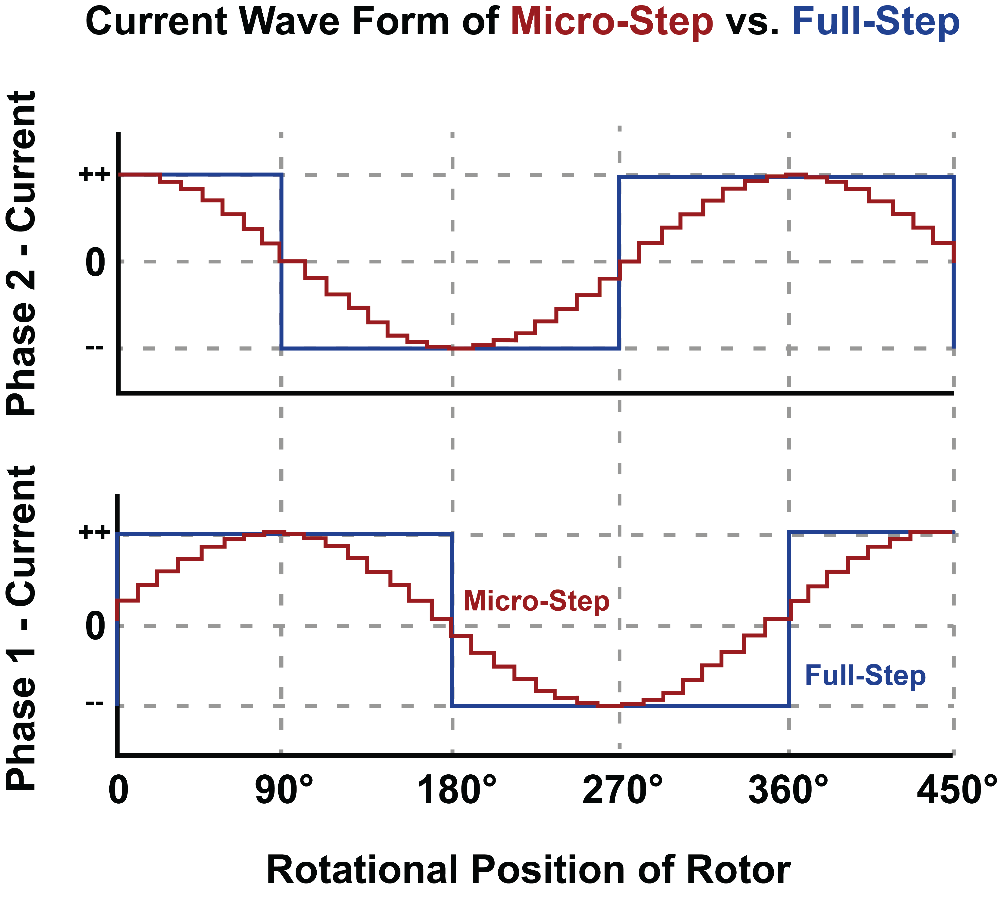

Supposons que l'autoreload register du timer (ARR) est 1000, le software devrait mettre le capture register (CCR) à la séquence suivante pour un step 1/4 :

```
uint16_t CCR_MicroStepping[] = {0, 383, 703, 924, 1000};
```

Pour un step 1/2 le CCR devrait être :
```
uint16_t CCR_MicroStepping[] = {0, 707, 1000};
```

Pour un step 1/8 le CCR devrait être :
```
uint16_t CCR_MicroStepping[] = {0,195,383, 557, 707, 832, 924, 981, 1000};
```

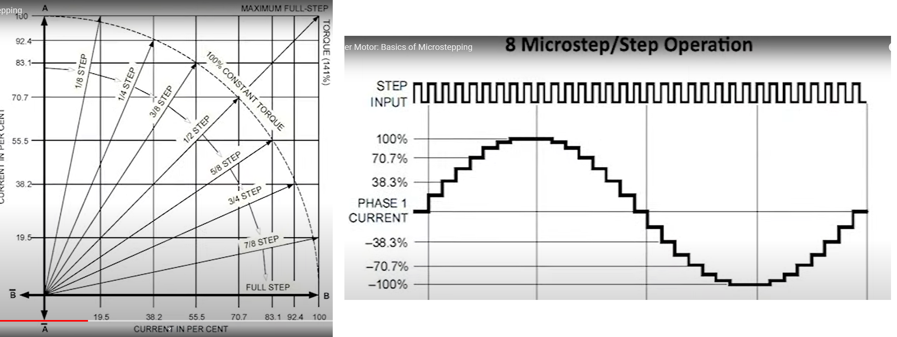

### Driving a Stepper Motor

Comme montré ci dessus :
On ne peux pas directement alimenter un moteur pas à pas à partir des broches GPIOs parce que les ports GPIOs ne peuvent pas fournir assez de courant requis par le moteur.
Il est important de séparer les deux parties (commandes et puissance).
La sortie maximum en courant d'une broche GPIO est de l'ordre de 10 mA. Le moteur utilisé ici a une resistance interne de 50 $\Omega$. Donc le moteur a besoin de $i=5V/50\Omega=100mA$
Le courant de sortie est donc pas assez fort pour alimenter le moteur.
Le software devrait aussi configurer les broches GPIOs en mode push-pull.

Une autre raison importante de ne pas brancher les GPIOs sur le moteur directement est que le moteur pourrait renvoyer sa force electromotrice dans le circuit quand ce dernier ralenti ou acclère.
Ceci génère une tension qui renvoi du courant qui est rebalancé dans la carte et qui pourrait endommager le microprocesseur.

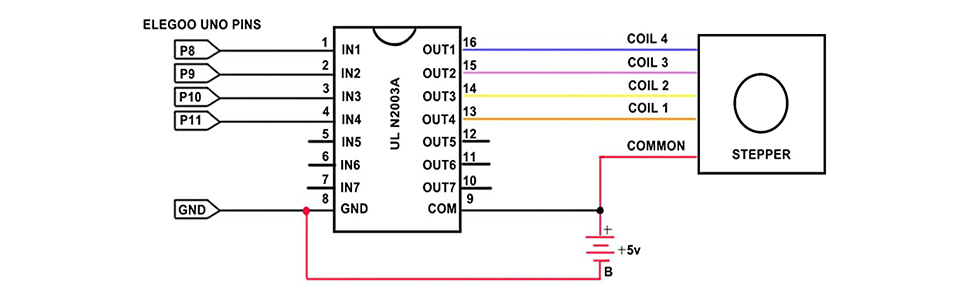

Dans le schéma nous pouvons utiliser aussi un driver 8 channel Darlington pour controler le moteur. (ULN2003 : https://www.st.com/resource/en/datasheet/uln2001.pdf)
L'ULN est un réseau de transistors Darlington haute tension et courant élevé, qui se compose de huit paires Darlington NPN. Chaque paire Darlington peut collecter des courants jusqu'à 500mA. La broche de sortie peut supporter au moins 50 V à l'état éteint.
Des diodes de suppression sont incluses pour la commande de charge inductive. Les sorties peuvent être mises en parallèle pour une capacité de courant élevée.

Pour chaque paire de darlington, si une tension positive élevée est appliquée à la broche d'entrée, la sortie correspondante est mise à la terre et elle peut tirer le courant électrique jusqu'à 500 mA.
Si la broche d'entrée a une alimentation basse tension, la broche de sortie correspondante ne peut pas drainer de courant, une broche d'entrée ne prend qu'environ 1 mA de courant.

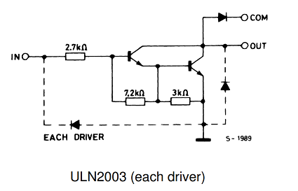

# Serial Communication Protocol

Nous allons introduire ici 4 protocoles de communications très importants dans les communications séries : il s'agit de l'universal asynchronous receiver and transmitter (UART), inter-integrated circuit (I2C), serial peripheral interface (SPI) et enfin l'universal serial bus (USB).
Les communications séries transfèrent seulement 1 bit à la fois et utilisent 1 seul fils par communication (direction). Il peuvent aussi partager un fil pour communiquer dans deux directions.
Ceci les différencies des communications parallèles qui utilisent plusieurs fils et qu'ils sont capable de transmettre des données en même temps.
En comparaison avec les communications parallèles, les communications séries sont plus lente, mais elles permettent d'utiliser des longeurs de cable plus importante et sont moins onéreuses.

## UART (universal asynchronous receiver and transmitter)

Une des fonctions les plus courantes de l'UART est de l'utiliser afin d'échanger en entrée sortie des données entre le processeur et le PC du développeur. Il sert en général d'un port de debug et de monitoring.
L'UART aussi est beaucoup utilisé dans d'autres périphériques, comme les imprimantes, les terminaux et les modems. Le mot clé universal signifie que l'interface série est programmable.
L'UART peut aussi communiquer en synchrone, dans ce cas on parle de USART.

La transmission asynchrone permet aux bits d'être transmis en série sans nécessiter que l'expéditeur fournisse un signal d'horloge au récepteur.
Cependant le transmetteur et le receveur doivent se mettre d'accord sur la vitesse de transmission des données avant que la communication commence. (Baudrate).
Dans les systèmes numériques le baud est le nombre de bit transmis par secondes.
Habituellement, l'interface UART peut tolérer un décalage d'horloge jusqu'à 10% pendant la transmission.
Dans certains systèmes analogiques, tels que les modems, le débit en bauds est supérieur au débit binaire correspondant lorsqu'il y a plus de deux niveaux de tension et qu'un signal de tension transmis peut représenter plusieurs bits.

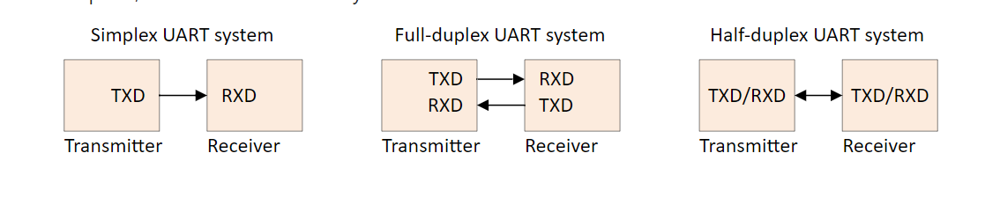

La transmission UART utilise deux canaux de communications (TX et RX) comme montré sur l'image ci dessus.
- En mode full duplex, les données sont transmises bit à bits depuis la ligne TX, et reçu par le receiver sur la ligne RX. Le receiver reconstruit le message.
- En mode half duplex, les données transmittent via un seul fil. TX est utilisé en tant qu'emmeteur et receveur. Dans ce mode il faut que le TX utilise un pull up de façon externe car les deux broches doivent être configuré en open drain.

Pour le mode synchrone il faut que la clock soit aussi relié entre les devices? Il faut aussi que le clear to send (CTS) soit connecté avec le request to send (RTS) sur l'autre device.

### UART Trame


La communication UART transmet ses données dans une trame. Une trame est l'unité la plus petite à l'echelle des communications. 
La trame UART se caracterise par la longueur des données (7,8, ou 9 bits), le bit de parité ( pair ou impair, ou pas de parité)optionnel, le nombre de bit de stop (0.5,1,1.5,2 bits), et l'ordre des données (MSB ou LSB first).

Chaques trames UART commence par un bit de start, représenté par un niveau bas.(après un état haut) Ensuite toutes les données sont envoyés à la suite. 
Le software se charge de définir l'ordre des bits.
Par exemple supposons que le LSB est envoyé en premier, quand l'UART envoit 0xE1, le bit stream est 0x10001111.
Le nombre de bit à envoyer est aussi configurable par le software.

Quand l'emmeteur envoi sa trame, l'emmeteur peut calculer un bit de parité et qui est envoyé au receveur afin de vérifier s'il y a eu des erreurs de transmissions.
Le bit de parité est dans un niveau haut pour representer une logique à 0. A l'état bas pour une logique à 1.
Le logiciel peut configurer la logique 1 sur le bit de parité pour représenter un nombre impair ou pair de bit à 1 dans les données transmises.
- Even parity : la combinaison des bits de données et du bit de parité contient un nombre pair de bit à 1.
- Odd parity : Le nombre total de 1 dans les données et dans le bit de parité contient un nombre impair de bit à 1.
Par exemple, si les données sont 0b00010001, le bit de parité sera à 1 si le odd parity est utilisé, 0 si l'even parity est utilisé.

Chaques trames termine par un bit de stop, représenté par un état haut.
Si la transmission est terminé le canal reste à l'état haut.
Si le receveur ne recoit pas d'état haut, il considère que le canal de transmission a été corrompue ou coupé.
Le nombre de bit de stop est configurable à 0.5,1,1.5, ou 2 bits par le software.

Comme les horloges de l'émetteur et du récepteur sont indépendantes l'une de l'autre, le suréchantillonnage est une approche efficace pour atténuer l'effet de la déviation d'horloge et éviter la corruption par le bruit à haute fréquence.
L'échantillonnage est habituellement de l'ordre de 8 à 16 fois plus rapide que le baudrate.
Le recepteur échantillonne ainsi chaques bits 8 à 16 fois et utilise les valeurs pour estimer une valeur au milieu du cycle qui permet une liaison plus robuste.

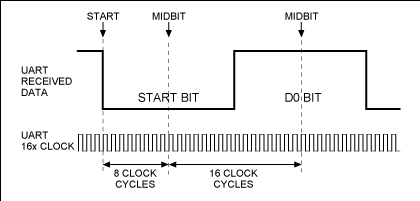

### Baud rate

Attention ne pas confondre baud rate et bit rate.
Le baud rate est le nombre de pulsation par secondes.

- En utilisant le déphasage et d'autres technologies, une impulsion sur les lignes téléphoniques peut représenter plusieurs bits binaires. résultant en un débit binaire supérieur au débit en bauds.
- Dans un système de communication numérique, étant donné que chaque impulsion représente un seul bit, le débit en bauds est le nombre de bits physiquement transférés par seconde, y compris le contenu réel des données et la surcharge du protocole, ce qui conduit à un débit binaire supérieur au débit en bauds.

Par exemple : si le baud rate est à 9600, avec 8-N-1 trames  ( 8 data bits, a start et stop bit, no parity).
Le taux de transmission des données réelles n'est pas de 9600 bits par seconde/8 = 1200 octets par seconde.
Les bits de démarrage et d'arrêt sont la surcharge du protocole.

### UART Standards

Les niveaux de tensions pour l'UART sont différents suivants les standards. (RS-232, RS-422 et le RS-485).
Le prefix RS signifie recommended standard.
Quand le niveau de tension de RS-422 et de RS-485 sont différents avec deux fils séparés, le RS-232 utilise un voltage asymétrique avec une masse partagée.

Expliquons d'abord la différence entre un signal asymétrique et différentiel.
Outre, la masse partagée, le signal asymétrique n'utilise qu'un fil pour transmettre sa donnée.
Les signaux différentiels utilises deux cables torsadés qui transmettent la même donnée mais en opposée.
Le bruit electrique peut être induit dans les fils ou être généré par une différence de masse.
Cependant le bruit agit de la même façon sur les deux paires de fils.
De cette façon on peut annuler le bruit au niveau du recepteur.

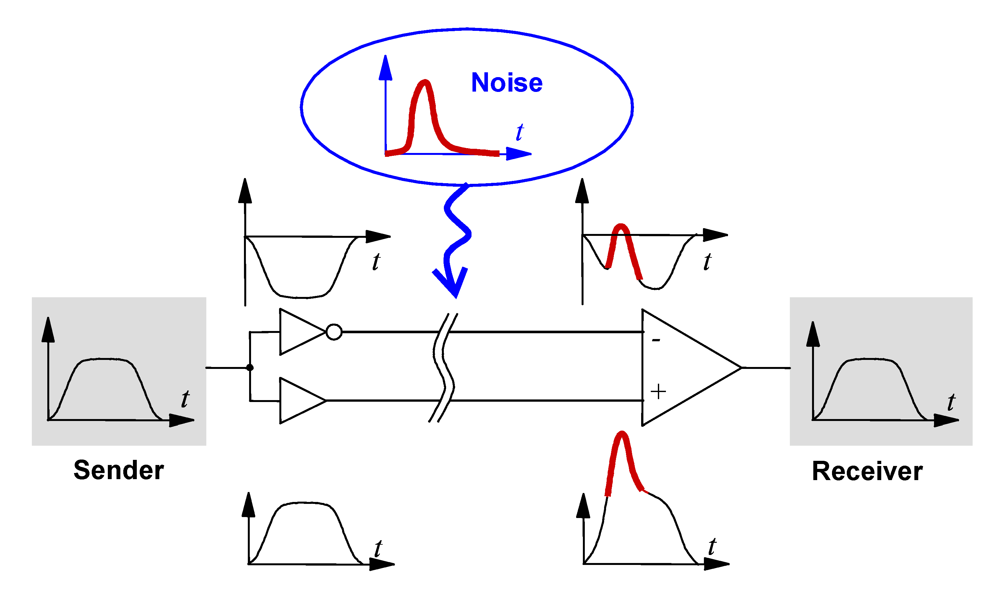

On peut aussi avec un signal differentiel transmettre sur une fréquence plus haute sur une plus grande distance.

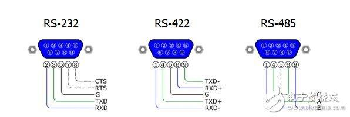

|   | RS-232          | RS-422          |  RS-485 |
| :--------------- |:---------------:|:---------------:|:---------------:|
| Voltage signal  |   Asymétrique (logique 1 : de +5V à +15V, logique 0 : de -5 à -15V)        | Différentiel (de -6V à +6V) | Différentiel (de -7V à +12V) |
| Max distance  | 15m             | 1200m | 1200m |
| Max speed  | 20Kbit/s           | 10Mbits/s | 10Mbits/s |
| Number of device  | 1 master, 1 receiver          | 1 master, 10 receiver | 32 master, 32 receiver |
| Mode  | Full duplex          | Full duplex, half duplex | Full duplex, half duplex |

Dans le RS-232, une logique 1 correspond à un niveau de voltage de +5V à +15V et un niveau bas à un niveau de tension de -5V à -15V.
Le receveur doit interpréter le signal comme une logique haute pour une tension entre +3V et +25V. Et un niveau de voltage de -3V à -25V comme une logique à 0.
Tout les niveaux de tensions entre -3V et +3V sont considérés comme données invalides.
Quand la ligne est en attente elle doit être mise à l'état basse.

Les PC ne fournissent pas de port UART, mais plutôt un port USB.
Cependant les PC les plus anciens possèdents entre un port RS-232.

Cependant même avec un RS-232 sur le PC on ne peux pas brancher un microprocesseur directement sur le port RS-232 dû à des incompatibilités de tensions.
Les microprocesseurs ne supportent que les signaux plus bas que 5V.
Les STM32 utilisent 0V pour une logique à l'état bas et 3V pour une logique à l'état haut.
Les composants comme le FT232R permet de convertir un UART vers un port USB standard.

### UART Polling mode

Todo

### UART Interrupt Mode

Todo

### UART DMA Mode

Todo

## I2C

L'I2C pour inter integrated circuit est un standard dans les bus de communications, introduits dans les années 1980 par Philips.
Il permet de faire communiquer deux périphériques en utilisant deux fils : un serial data line (SDA) et un serial clock line (SCL).
Les deux fils permet de réduire le nombre de broches physique, le rend bon marché et simple à interfacer.
Les données d'un tel bus peuvent être transmisse dans les 100Kbits/s dans le mode standard, 400Kbits/s pour le mode rapide, et plus de 3.4 Mbits/s pour le mode très rapide.

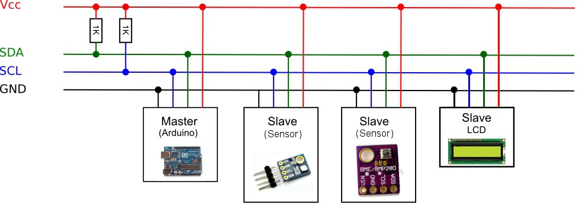

Chaques périphériques, y compris le périphérique maitre possède une unique addresse qui est typiquement sur 7,10, ou 16 bits. Suivant la fonction, chaques devices peut être emmeteur ou recepteur.
Par exemple une sonde de température numérique peut se comporter en éméteur.
Un écran LCD en recepteur.
Une mémoire peut être émétrice ou receptrice.

Le maitre configure l'itinitalisation du transfert des données sur le bus, il genère aussi le signal de l'horloge qui permet de transférer les données sur le bus, et aussi termine le transfer sur chaques infos demandés.
Les périphériques connectés aux maitres (master) sont appelées les esclaves (slaves).
Plusieurs maitres peuvent co-exister sur le même bus I2C. 
Lorsque plusieurs maîtres veulent contrôler le bus, une procédure d'arbitrage est alors effectuée.
La capacité du bus limite le nombre d'appareils pouvant être connectés au bus.

### I2C : Les broches I2C

Les broches utilisés pour les périphériques maitres et esclaves sont SDA et SCL. Ces derniers doivent être configuré en drain ouvert.
Le drain ouvert est une sortie spécial. La broche de sortie est connectée à une source de tension positive si un haut actif est configurée (logique 1).
La broche de sortie est dans un état d'impédance élevée si un état bas (0 logique) est configuré.
L'impédance élevée est souvent obtenue en maintenant la sortie en flottante, c'est à dire non connecté à la masse ou à une source de tension positive.

Le software peut configurer le SDA et le SCL en drain ouvert. Cependant la résistance de pull-up dans le processeur est trop grande, 
souvent de l'ordre de 100kohms. Une si grande résistance fournit une puissance de rappel trop faible pour I2C.
Pour réduire les temps de rise d'une ligne I2C on utilise souvent des résistances plus faible de l'ordre de 3kohms.

Comme montré dans la première image, la ligne SDA et SLC sont connecté au VCC avec deux résistances de pull up. Les valeurs de résistances conseillés sont 4.7Kohms pour du low speed, 3kohm pour du standard speed, et 1kohm pour du high speed.

### I2C : Le protocole.


Le protocole I2C comment toujours par un bit de start et termine par un bit de stop.

- Le bit de start est défini comme une transition d'un état haut vers bas de la ligne SDA, quand la ligne SCL est haute.
- Le bit de stop est défini comme une transition d'un état bas vers haut de la ligne SDA, quand la ligne SCL est haute.

C'est le maitre qui génère les bits de start et de stop.
Les périphériques eux sont capables de détecter ces états.
Après que le bit de start a été instancié, le maitre envoi les données bytes par bytes, Pour chaques bytes le MSB est transféré en premier.
Ensuite l'esclave envoi un acknowledge bit vers le maitre, pour informer le maitre de la bonne reception du byte.

Après qu'un byte a été transféré, le receveur doit répondre à l'emmeteur en emmettant un bit ACK ou NACK.
De ce fait, le transmetteur relache la ligne SDA durant la 9ième période d'horloge (ACK Clock period) donc le recepteur peut tirer SDA vers le bas.
Si le SDA est vers le bas, l'ACK est confirmé.
Si le SDA est vers le haut, on obtient un NACK.

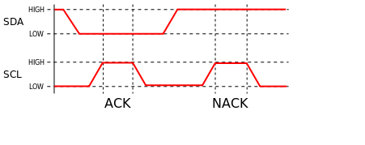

- Quand le maitre envoi une donnée à l'esclave, un NACK de l'esclave signifie que la communication a échoué. Dans ce cas le maitre doit alors envoyer un bit de stop du transfert courant et redémarrer le transfert avec un bit de start.
- Quand l'esclave envoi une donnée au maitre, un NACK du maitre signifie que le maitre a envoyé un bit de stop pour terminer la communication après que le bytes ai été transféré.

Bien que le signal d'horloge de transfert soit généré par le maître, l'esclave peut également contrôler indirectement la vitesse de transfert via l'étirement de l'horloge.
Si l'esclave est trop occupé pour recevoir un autre octet, il maintient la ligne SCL au niveau bas pour forcer le maître à attendre. 
En raison de la logique "AND" du fil, le maître ne peut pas piloter SCL haut si l'esclave maintient SCL à bas. 
Le maître reprend le transfert de données après que l'esclave a libéré SCL.

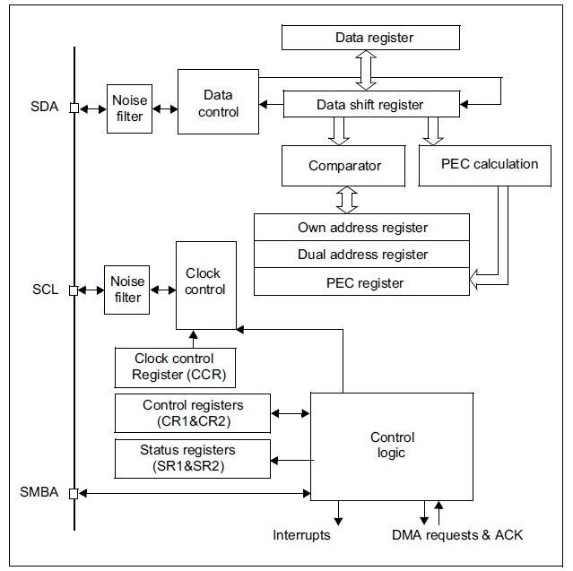

Les processeurs peuvent posséder plusieurs interfaces I2C. 
Sur l'image ci dessus on retrouve le block diagram d'un STM32.
Les octets stockés dans le registre de données sont décalés vers ou vers la ligne SDA via un registre de décalage de données interne, avec le MSB entrant ou sortant en premier.

- Quand le maitre transfert une donnée vers l'esclave, l'hardware du maitre set automatiquement le TxE (Transmitter buffer empty) flag dans le status register si le maitre a reçu un ACK de l'esclave.
Cela informe le software d'envoyer le byte suivant.
- D'autre part, si le master a reçu un byte avec succès, l'hardware du maitre set automatiquement le RxNE (Receiver buffer not empty) flag dans le status register.
Cela informe le software qu'il peut lire le bit reçu.

Si les interruptions sont utiliss, les interruptions I2C prennent places dans les conditions suivantes :
- L'I2C du master génère une interruption si le start bit est envoyé, une slave addresse est envoyée, l'hardware sets le flag Txe ou RxNE, ou que le transfert de toutes les données soit complété.
- L'I2C du slave gènère une interruption si l'addresse reçu correspond avec sa propre addresse, un bit de stop est reçu, l'hardware sets le flag Txe ou RxNE.

Quand il existe plusieurs périphériques sur le bus, le "clock synchronisation" et le "bus arbitration" est requis. Durant l'IDLE, le SCL et le SDA sont à l'état haut.
- Clock Synchronisation : L'interface SCL de tout les périphériques sont sur une logique "AND". Quand 1 maitre met le SCL à bas, aucun autre ne peux le mettre à haut.
- Bus arbitration : Sur un front descendant SCL, chaques maitre vérifient si le SDA correspond à ce qu'il a envoyé.
Chaque fois qu'un maître essaie de transmettre un niveau haut mais détecte un niveau bas sur SDA, ce maître perd l'arbitrage. 
Chaque maître perdant est immédiatement passé en mode esclave reçu car le maître gagnant peut être en train de l'adresser. 
Un maître perdant redémarrera le transfert après avoir détecté un bit STOP.

### I2C : Trames de données

Un slave peut avoir une addresse sur 7 ou 10 bits.

Dans le cas d'un slave qui a une addresse sur 7 bits.
1. Le maitre commence par envoyer un bit de start, le slave address, et un bit ($R/\overline{\rmW}$) qui représente la direction de transfert. Le slave a qui s'addresse la donnée renverra un bit ACK.
La direction de la donnée est représenté par le bit ($R/\overline{\rmW}$) : si le ($R/\overline{\rmW}$) bit est à 1, le master est en attente d'une data du slave. Si le ($R/\overline{\rmW}$) est à 0, le master redemande au slave de rester en écoute.
2. Après que le slave ai fait son ACK sur son addresse, la direction des données est donnée par le ($R/\overline{\rmW}$) bit. Les datas sont transférés octet par octet. Chaqu'un suivi d'un ACK ou d'un NACK.
Il faut donc 9 cycle pour envoyer 1 octet.
3. Le maitre termine la communication en envoyant le bit de stop à l'esclave.
Il se peut que le maitre génére un bit de start sans bit de stop avant. Cela permet au master de communiquer avec un autre slave ou avec le même esclave sans relacher le bus.
Par example, un maitre peut envoyer une commande à un slave puis immédiatement recevoir une donnée de l'esclave.


Dans le cas d'un slave qui a une addresse sur 10 bits la trame change légèrement.
- Après avoir envoyé le start bytes, le premier octet envoyé par le master correspond à une suite de 5 bits constants (0b11110) + les deux bits MSB de l'addresse de l'esclave. Ensuite il envoi un bit  ($R/\overline{\rmW}$).
Ensuite dans un second temps, le maitre envoi les 8 bits restant qui sont les bits de poids plus faible.
- Quand le master envoi les premiers bits, il se peut que plusieurs esclaves réponses. Plusieurs ACK peuvent donc apparaitre pour la première période.
- Quand le master envoi les bits suivants, au plus 1 device doit répondre. Plusieurs ACK n'est pas voulu lors de cette opération.


## SPI

Serial Periphical Interface (SPI) est un bus asynchrone dans les communications séries.
Ce dernier est très utilisé pour échanger des données entre un microprocesseur et un périphérique en utilisant 4 fils.
Par exemple, les caméras numériques utilisent souvent la liaison SPI pour communiquer et sauvegarder les photos dans une mémoire MMC ou une carte SD.

La liaison SPI est simple et consomme peut d'énergie, elle supporte aussi un haut débit.
Le déavantage d'une liaison SPI est qu'une telle liaison ne peux pas supporter plusieurs maitres, et les esclaves ne peuvent pas instancier une communication ou controler la vitesse de transmission des données.
Le master inititie et controle toute les communications.

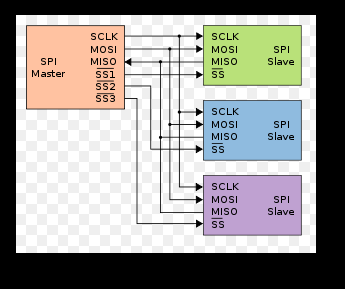

Une liaison SPI se constitue de 4 fils :
- Un master in slave out data line (MISO)
- Un master out slave in data line (MOSI)
- Un serial clock line (SCLK)
- Un active-low slave select line (SS)

Une liaison SPI ne supporte qu'un seul maitre sur la ligne et communique avec un ou plusieurs esclaves.
Quand le maitre veut discuter à un esclave il tire le signal à bas le signal SS du slave avec lequel il veut parler.
Ensuite le maitre cadence la transmission avec sa clock pour transmettre ses données sur MOSI et MISO.

L'échange des données peut se faire simultanéments dans les deux directions.
C'est une transmission en full duplex. Les données sont transmissent de façon synchrone sur les fils MOSI et MISO, avec un flux opposés sur les deux fils.
Prenons note que le SCLK est unidirectionnel, seul le maitre peut cadencer le signal.

Quand le maitre a choisi le périphérique avec lequel il souhaite discuter, le périphérique esclave en question écoute la clock et le signal MOSI.
Quand il n'y a qu'un seul esclave on peut relier le canal SS à la masse directement, ou le programme peut le tirer à la masse en permanence.

### SPI : Echanges des données

Le SPI est un procotocole asynchrone, l'esclave doit envoyer et récevoir ses données en se basant sur l'horloge du maitre.
Cela difféère d'un protocole asynchrone qui ne possède pas de signal d'horloge.
Les données SPI doivent êtres échangés à la même vitesse.

- Quand un bit sort du canal MISO depuis les registres de l'esclave pendant une période de clock. Une nouvelle donnée sort depuis la ligne MOSI à la même vitesse.
- Quand un périphérique écrit un bit vers la data line sur un front montant ou descendant. L'autre périphérique lui lit la donnée sur le front opposé sur la même période d'horloge.
- La taille des données transférés est habituellement un bytes (8 bits) ou un halfword(16 bits).

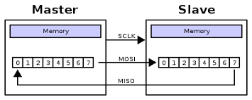

Les communications depuis le maitre vers l'esclage et la communication entre l'esclave et le master sont toujours dans un contexte concurentielle.
Dans chaques canaux (MISO ou MOSI), chaques périphériques envoi une donnée en même temps qu'il en reçoit une.
Aucun appareil ne peut être simplement un émetteur ou un récepteur.

Cependant, quand un esclave veut envoyer une donnée au master sur la ligne MISO, l'esclave doit attendre le signal d'horloge. 
En même temps le master doit envoyer des données factices via la ligne MOSI pour initialiser un tranfert de données.

Quand le maitre veut envoyer un signal à un périphérique "n", il soit mettre le signal Slave Select de l'esclave à l'état bas.
Pendant la communication le MSB est envoyé en premier.

Dans l'exemple ci dessous on lit la valeur du canal MOSI sur le front descendant, et le calnal MISO sur le front montant.

0b10100101 = 0xA5 = 165


### SPI : Configuration de l'horloge

La vitesse de l'horloge, défini la vitesse de transmission des données.
En général ceci se situe entre 1 et 20 MBits/s

Le maitre peut changer la vitesse de transmission de ces données en changeant les prescalers au niveau des prescalers register.
Pour les processeurs STM32L, le baud rate control factor est stocké dans le registre SPI Control Register (CR1) dans le BR[2:0].

La fréquence du SCLK est programmé en settant ce baud rate avec la formule :

```math
f_{SCLK} = f_{SYSCLK} / 2^{1+BR[2:0]}
```

Il existe 4 modes possibles pour la programmation de l'horloge au niveau de la polarité pour sampler les données.
Cela dépend du set de deux paramètres qui sont la clock phase (CPHA) et la clock polarity (CPOL).
Quand CPOL est à 0 cela signifie que la ligne SCLK est à bas quand elle est en attente.
Quand CPOL est à 1 cela signifie que la ligne SCLK est à haut quand elle est en attente.
Quand CPHA est à 0, la première transmission sur la clock (qu'elle soit sur un front montant ou descente) est la première donnée capturée.
Quand CPHA est à 1, La deuxième transmission d'horloge est le premier front de capture.

La combinaison de CPOL et CPHA sélectionne le front d'horloge pour la transmission et la capture de données. La capture du premier bit est retardée d'un demi-cycle en mode 0 et 2.

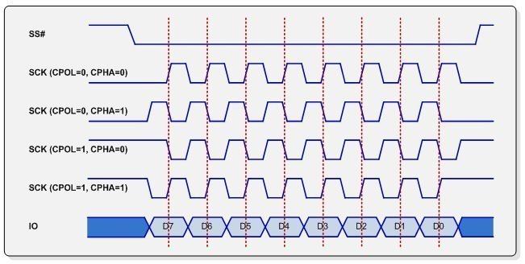

### SPI : Example with SMT32

Todo

## USB

Universal Serial bus : TODO

## Bluetooth

## L'endianness

En mode Big Endian, le most significant bit(MSB) est à l'addresse la plus basse.
En mode Little Endian, le less significant bit(LSB) est à l'addresse la plus basse.


Durant les transmissions en little endian le LSB est transmis en premier.
En big endian, c'est le bit le plus haut est est transmis en premier.


# Les systèmes exploitations embarqués :

## Processus de démarrage

Suivant le type de processeur et la complexité du matériel, le temps de boot du noyau dure de
deux à cinq secondes environ.
Le démarrage du processus init, les tâches administratives (montage systèmes de fichiers,
configuration paramètres de /proc (sous linux) , etc.) prennent une à deux secondes supplémentaires.
Le lancement de tous les services (réseau, authentification, environnement graphique, etc.)
peut demander une dizaine de secondes.


Plus précisément :

Que faut-il pour démarrer Linux sur un périphérique embarqué tel que Beaglebone Black ?
- Chargeur de démarrage ROM (RBL)
C'est une petite mémoire qui s'exécute sur le SOC. Le tout premier morceau de code à exécuter sur le SOC lorsque vous alimentez la carte . Ceci est écrit par le vendeur (il ne peut donc pas être modifié ) et il est stocké dans la section ROM du SOC. Le travail du chargeur de démarrage ROM est de charger et d'exécuter le chargeur de démarrage de 2ème étape qui est le SPL/MLO.
Il est en lecture seule et encapsulé par le fournisseur de matériel
- Secondary Program Loader (Memory LOader)
Son travail consiste à charger et à exécuter le chargeur de démarrage 3ème étape tel que U-boot .
il peut être modifié et écrit. Des personnalisations peuvent être réalisées à partir de ce point même, bien que le niveau de l'utilisateur (connaissance élevée du langage C + connaissance intime du support matériel est indispensable) ne soit pas favorable et que la zone d'accès (ce qui peut être fait à ce stade) soit limitée.
- U-boot
Le travail du 3ème chargeur de démarrage étape consiste à charger et exécuter le noyau Linux .

Qu'est-ce que uEnv.txt ?
U-boot essaie toujours de lire le fichier uEnv.txt à partir de la source de démarrage, et si uEnv.txt n'est pas trouvé , alors U-boot utilise les valeurs par défaut pour les variables d'environnement .

Comment écrire uEnv.txt à partir de zéro
Utilisez la commande de boot


Pour faire court : la commande de démarrage exécute toutes les commandes qui sont représentées par la variable d'environnement bootcmd (selon qu'elle a été définie)
En modifiant la valeur de la variable d'environnement 'bootcmd', vous pouvez modifier le mode de démarrage.

## Bootloader ou bootstrap
Un chargeur d'amorçage (ou bootloader) est un logiciel permettant de lancer un ou plusieurs systèmes d'exploitation (multiboot), 
c'est-à-dire qu'il permet d'utiliser plusieurs systèmes, à des moments différents, sur la même machine. En ce qui nous concerne: un petit programme qui charge un grand
programme et qui lui donne le contrôle.

Sous Windows ou Linux le plus répendu est "GNU GRUB"


### Sur une plateforme embarqué.

Sur une plateforme embarqué on utilise plutôt un de ces bootloaders :
- U-Boot (https://github.com/u-boot/u-boot)
- RedBoot
- Micro Monitor

#### U-Boot


Ce programme réside dans une zone spéciale de la mémoire flash et fournit un moyen pour :
- Effectuer les tests d’initialisation du matériel
- Charger une image du noyau et l’exécuter

Description
U-Boot (Universal Boot Loader) est le "BIOS" présent sur nos cartes.

Si aucun système d'exploitation n'est requis pour votre application, U-Boot peut être utilisé comme base de développement.

U-Boot est open source (GPL), sans royalties et bénéficie d'une communauté de développeurs importante et extrêmement active.

Les tâches principales d'U-Boot
Initialisation du matériel et plus particulièrement du contrôleur mémoire
Passage des paramètres de démarrage au noyau Linux
Lancement du noyau Linux
U-Boot permet aussi de :
Lire et écrire dans différentes zones mémoire
Charger des images binaires dans la RAM par cable série, Ethernet ou USB
Copier des images binaires de la RAM vers la FLASH
Programmer le FPGA

Pour compiler U-Boot ceci dépend de la plateform pour lequel il est destiné à savoir quelle est le processeur qui tourne derrière ? :
- Pour Beaglebone Black il faut lui donner le bonne config processeur : https://beagleboard.org/project/U-Boot+%28V1%29/

Utilisation de U-Boot : 
Cf : https://medium.com/geekculture/how-to-set-general-purpose-input-output-gpio-during-the-execution-of-u-boot-on-beaglebone-black-acd886307d49

## Boot

Le choix du mode de boot est défini par l'hardware par ordre de priorité ainsi par exemple dans le beaglebone black par exemple on boot suivant la séquence :

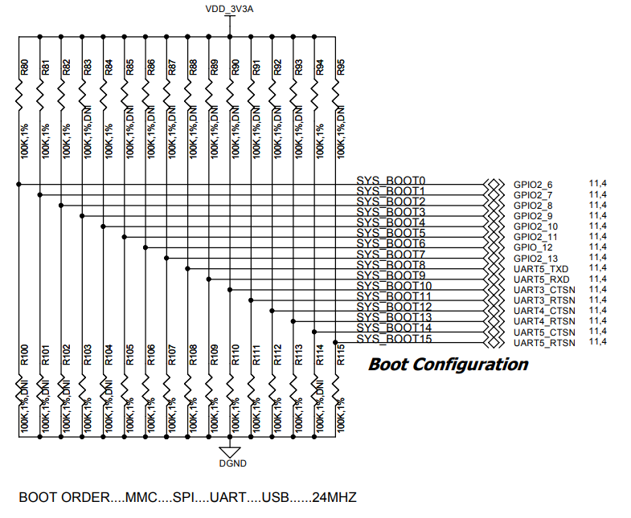

### Depuis l'UART :

En utilisant X-Modem et en uploadant dans l'ordre : le SPL, le U-Boot puis avec uboot via la commande Loady le Noyau.
Cf :
https://www.youtube.com/watch?v=3y1LMNPoaJI

# OS et code BareMetal
## BareMetal

La programmation BareMetal consiste à écrire du code pour faire tourner directement le hardware (ou via des library) sans aucunes autre abstraction comme un système d'exploitation.
Au minimum la programmation BareMetal doit avoir un minibootloader pour initialiser le processeur, les horloges, la mémoire (etc ...) et saute au programme principal.


## Linux embarqué


Sur un système à micro-contrôleur, le code métier(BareMetal Code) est le seul maître à bord, il accède à volonté aux périphériques, à la mémoire, etc. 
Au contraire, dans un système à micro-processeur, le code métier n'est qu'une petite partie de l'ensemble du logiciel. Il est soumis à l'ordonnancement et au sous-système de gestion mémoire du noyau. Il s'appuie sur des bibliothèques et des utilitaires externes.

<div id='middleware'/> 

# MiddleWare

On appelle MiddleWare, le code que l'on peut trouver entre la partie Driver et la partie Applicative (coté utilisateur).

TinyUSB : https://github.com/hathach/tinyusb
FatFS : 
## MiddleWare Cybersécurité
Les middleWare les plus populaire dans l'embarqué en terme de fonctions liés à la cybersécurité est la librarie MbedTLS.


### MbedTLS 
https://github.com/ARMmbed/mbedtls

### WolfSSL
https://github.com/wolfSSL/wolfssl

### OpenSSL
https://github.com/openssl/openssl

## MiddleWare TCP/IP
Dans les MiddleWare TCP/IP on trouve plusieurs alternatives possibles : il existe dans le monde de l'opensource lwip-tcpip/lwip
Payant on trouve aussi la Stack Treck ( https://treck.com/ ) qui permet de communiquer en utilisant les protocoles ethernets.

### LwIP : (LightWeight IP Stack)
https://github.com/lwip-tcpip/lwip

### MinnowServer (Embedded Web Server)
https://github.com/RealTimeLogic/MinnowServer

### OpenSSH
https://github.com/openssh/openssh-portable

### DropBear
https://github.com/mkj/dropbear

## MiddleWare Zip
https://github.com/nih-at/libzip

<div id='tools'/> 


# Les couches du modèles OSI

Le modèle OSI permet une représentation de l'informatique en "lasagne" par couche :
Chacune des couches supérieur utile sa couche inférieur.


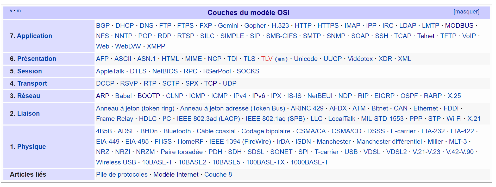

On retrouve le modèle OSI dans WireShark , ce dernier nous permet de décortiquer nos trames envoyés sur le réseau et d'y comprendre facilement le contenu

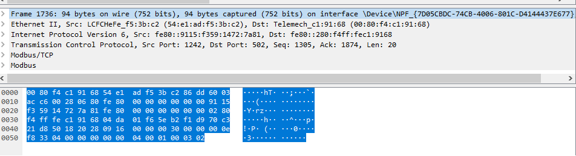


## La couche application

- Le protocole [Modbus](./PROTOCOL/7.APPLICATION/MODBUS/README.md)

## La couche transport

- Le protocole [TCP](./PROTOCOL/4.TRANSPORT/TCP/README.md)
- Le protocole [UDP](./PROTOCOL/4.TRANSPORT/UDP/README.md)

# FAQ :

Comment savoir ou est placer le code dans les différentes mémoires ? (Flash Interne, SRAM Interne ...)?
C'est le script du Linker qui est responsable du placement du code en mémoire.

Comment affecter les valeurs de l'addresse 0 (Stack Pointeur) et l'addresse 4 (Program Counter) ?
Via le fichier assembleur startup_xxx.s

# Outils de développement pour les systèmes embarqués :

```
Virtualisation
Eclipse
Code Composer Studio
IAR Embedded Workbench
Keil (Permet de mettre en place un environnement embarqué rapidement et facilement, possède un simulateur et une interface de debug très intuitive).
Quartus (FPGA Altera)
Vivado (FPGA Xilinx)
```
<div id='glossary'/> 

# Glossaire aux systèmes embarqués

```
Bootloader	Secteur d'amorçage (Permet de charger un noyau depuis un système de fichier ext2 ou
ext3/4)
ARM		Advanced RISC Machines (Société de conception de processeur basé à Cambridge)
CPU		Central Processing Unit
FPU		Floating Point Unit
MPU		Memory Protection Unit
GPIO 	General Purpose Input/Output
AHB		Advanced High-performance Bus
APB		Advanced Peripheral Bus
DMA		Direct Memory Access
GRUB	GRand Unified Bootloader
CAN 	Control Area Network (Bus de données)
CRC		Cyclic Redundancy Check
PWM		Pulse Width Modulation
SoC		System On Chip
ASICs	Application-specific integrated circuit
I2C		Inter-Integrated Circuit (Communication Série)
SPI		Serial Periphical Interface (Communication Série)
UART	Universal Asynchronous Transmitter Receiver (Communication Série)
USB		Universal Serial Bus (Communication Série)
BSP		Board Support Package (Logiciel bas niveau de support de cartes-mères, c'est-à-dire entre l'OS et la carte mère)
INTC	Interrupt Controler
DRIVER	Pilote (Permet de faire le lien entre le matériel et le logiciel)
GPP		General Purpose Memory Controller
FPGA	Field Programmable Gate Array
QNET	Quadnet Pile d'execution
RTOS	Real Time Operating System (Linux RT, FreeRTOS, VxWorks, Unix, OS/2 , Symbian, QNX , RTXC Quadros... )
RSTP	Rapid Spanning Tree Protocol
PLL 	Phase Locked Loop
RMII 	Reduced media-independent interface (Ethernet)
Modbus	TCP Modbus Protocol (Port 502)
SNMP	Simple Network Management Protocol
SNTP	Simple Network Time Protocol
LLDP	Link Layer Discovery Protocol
HPC	Host Proxy Component
EIP	EtherNet Industrial Protocol
TFTP	Trivial File Transfer Protocol
RTC	Real Time Clock
DSP	Digital Signal Processor
ΔΣ	ADC Analog to Digital Converter
TPM	Trusted Plateform Module	 
SPL	Secondary Prgram Loader 
NOR Flash	Mémoire non volatile
PMIC	Power management integrated circuit
SDRAM	Mémoire RAM volatile
IOC	 	Input Output Controler
NVIC	Nested Vectored Interrupt Controller
PBS	Product Breakdown Structure
JTAG Joint Test Action Group
OWASP Open Web Application Security Project (non-profit initiative to improving the security of web applications) : permet de corriger des risques de sécurités dans son code grâce à des outils : tel que Klocwork.
EXTI	External Interrupt
SVC		Software interrupt
ISR Interrupt Service Routine
```

# Références :
http://syst.univ-brest.fr/boukhobza/images/stories/Documents/Teachings/OSM/Cours/OSM_7_Boukhobza.pdf
https://www.youtube.com/channel/UCY0sQ9hpSR6yZobt1qOv6DA
