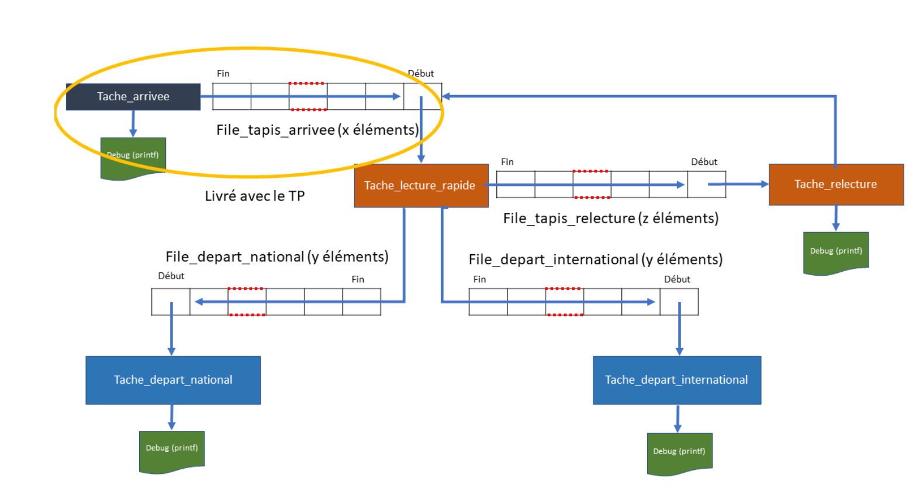

# Emulation d'un centre de tri des colis :

## Introduction :

Les colis arrivent grâce à une « tache_arrivee » de façon périodique sur un tapis roulant « file_arrivee »
et un système rapide de lecture « tache_lecture_rapide » de l’étiquette collée sur le colis. La
« tache_lecture_rapide » doit trier les colis suivant deux critères :
- Colis destinés à une distribution sur le marché national, ces colis sont envoyés sur un tapis
roulant national « file_depart_national »
- Colis destinés à une distribution sur le marché international, ces colis sont envoyés sur un tapis
roulant international « file_depart_international »
Parfois, l’étiquette n’est pas lisible et le colis doit être redirigé par la « tache_lecture_rapide » vers un
autre tapis roulant « file_tapis_relecture » pour être relu par un système plus sophistiqué
« tache_relecture » qui garantit une relecture avec un taux d’erreur nul. Ce système recolle une étiquette
lisible mais tout cela prend un certain temps, ce temps est paramétrable. Ainsi, ces colis devront
retourner de façon prioritaire sur le tapis roulant (« file_tapis_arrivee ») afin de repasser une deuxième et
dernière fois par le système rapide de lecture « tache_lecture_rapide » qui trie les colis.
Pour terminer :
- Une tache « tache_depart_national » récupère les colis de la file « file_depart_national » et
affiche le contenu de l’étiquette à l’écran, sortie debug (printf),
- Une tache « tache_depart_international » récupère les colis de la file « file_depart_international »
et affiche le contenu de l’étiquette à l’écran, sortie debug (printf),
L’écran, représenté par la sortie debug (printf), doit être géré comme une ressource partagée entre les
différentes tâches afin que les messages en cours d’affichage par une tâche ne soient pas interrompus par
des messages venant d’une autre tâche.
Toutes les tâches ont le même niveau de priorité.
Vous devrez gérer les débordements des files en affichant un message d’erreur avec le contenu du
message.

## Description de la trame colis :

La « tache_arrivee » publie périodiquement et de façon cyclique des messages dans la
« file_tapis_arrivee ». Chaque message est codé sur 32 bits et représente l’étiquette du colis.
B31 -- B3 B2 B1 B0
- Le bit 31 est le bit de poids fort et le bit 0 est le bit de poids faible.
Les bits de B31 à B3 représentent un compteur qui est incrémenté par la « tache-arrivée » à chaque colis
déposé sur le tapis roulant.
- Le bit B2, s’il est à 1 cela indique que le colis est passé par la « tache-relecture » à cause d’une étiquette
non lisible, c’est la « tache_relecture » qui positionnera le bit B2 à 1. Il est initialisé à 0 par défaut par la
« tache_arrivee ».
- Le bit B1, s’il est à 1 cela indique que l’étiquette n’est pas lisible et que le colis devra passer par la
« tache_relecture ». La « tache_relecture » positionne ce bit à zero pour indiquer que la relecture et le réétiquetage
ont été effectués. Il est initialisé, soit à 0, soit à 1, par la « tache_arrivee ».
- Le bit B0, s’il est à 1 cela indique que le colis est pour le marché international, s’il est à 0 cela indique
que le colis est pour le marché national. Il est initialisé, soit à 0, soit à 1, par la « tache_arrivee ».

