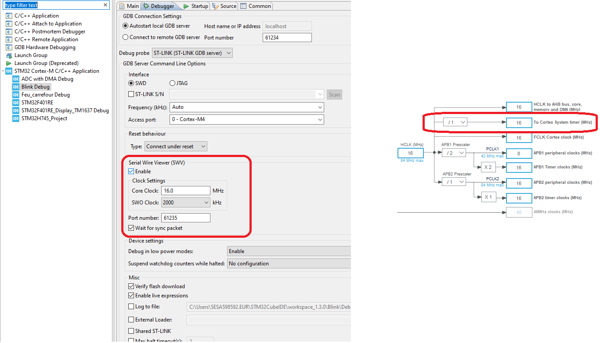
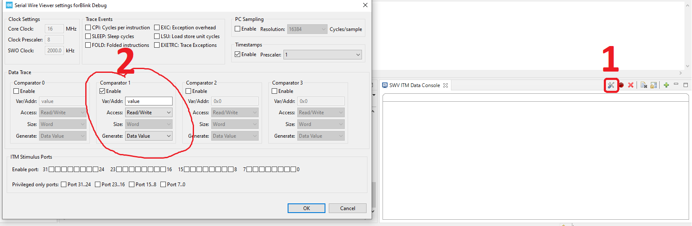
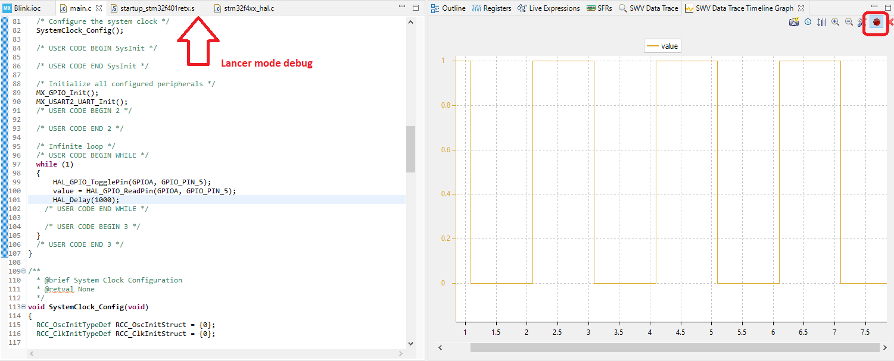

# Microcontroleurs STM32

## Memory map
Les processeurs Cortex-M ont un bus d'adressage mémoire de 32 bits et donc ont 4 Go de mémoire espace. 
Son espace mémoire est unifié, ce qui signifie les instructions et les données partagent même espace d'adressage.
L'espace mémoire de 4 Go est divisé en plusieurs régions.


La configuration d’un microcontrôleur se fait à travers des registres qui sont lus comme une mémoire avec son adresse associé à sa fonctionalité.


La configuration du STM32 peut être soit en big endian, ou en little endian, il faut lire la specificiation du microcontroleur pour le savoir. (L'information est disponible dans le programming manual).

# CubeMx

STM Electronic propose une solution pour générer la base du code source par des outils logiciels afin de configurer le processeur :
Ainsi STM32 CubeMX nous permettra de gagner un temps considérable au début de notre projet.

Télécharger CubeMX sur le site officiel de STM Electronic:
https://www.st.com/content/st_com/en/products/development-tools/software-development-tools/stm32-software-development-tools/stm32-configurators-and-code-generators/stm32cubemx.html#get-software

# STM32CubeIDE

STM32CubeIDE est une interface de développement qui intègre l'outil CubeMX et facilite ainsi l'intégration logicielle.

STM32 offre comme Keil la possibilité d'afficher de façon graphique l'état d'une variable. Ceci peut être utile pour avoir une vision plus précise de ce qui se passe.
Pour cela : il faut brancher en SW (USB) la carte STM32. Et aller dans la configuration de DEBUG : et adapter les paramètres en fonctions de la core clock disponible dans la clock configuration.



Ensuite dans le panel SWV entrer dans le mode de configuration et mettre le nom de la variable ou l'addresse de la variable à observer.


Lancer l'enregistrement et lancer le mode debug : on peut ainsi observer la valeur évoluer sur le graph temporel.


Ici l'exemple d'un basculement simple de LED de l'état haut à l'état bas.
Ce dernier peut permettre de comprendre le fonctionnement des systèmes.

# Keil

## Simulation avec le logiciel Keil

Une fois le logiciel Keil installé :

Dans la partie droite du Pack Installer, si les éléments STM32F1xx_DFP, STM32NUCLEO_BSP, CMSIS et MDK-Middleware ne sont pas Up to date cliquez sur Install et attendez la fin de la mise à jour.


Si vous souhaitez envoyer ça sur un STM32 réel il faudra aussi le ST-Link disponible ici qui permettra de dialoguer avec la carte :
https://www.st.com/en/development-tools/stsw-link009.html

Pour savoir si le driver est bien installé, branchez la carte Nucleo via un câble USB et consultez l'état du périphérique via Windows.
Pour se lancer dans l'écriture de code sous µVision, la première chose à faire est de créer un projet et de le configurer.


Pour créer un projet, il vous suffit de sélectionner New µVision Project dans le menu Project, puis de suivre les différentes étapes en faisant attention aux éléments suivants :
- Choisir la bonne puce : lors de la création du projet, ou en sélectionnant Options for target (d) puis l'onglet Device. Ensuite, vous devez choisir le microcontrôleur qui correspond à votre carte pour ma part le STM32F401RE dans la liste STMicroelectronics puis dans la série STM32F4 serie.
- Inclure les fichiers de démarrage : les fichiers de démarrage sont sélectionnés lors de la création du projet ou a posteriori via le Manage Run-Time Environement (d). Il faut au minimum cocher startup dans Device et CORE dans CMSIS pour pouvoir lancer la carte.

Vous devriez avoir dans le répertoire Device du projet les fichiers startup_stm32f10x_md.s et system_stm32f10x.c.


## Compiler son premier code en simulation :
Une fois le projet construit, il s'agit maintenant d'y ajouter vos premières lignes de code puis de les compiler. Vous allez simplement écrire une procédure main et réalisez le « Hello World » du programmeur de carte en faisant clignoter une LED. Pour cela, copiez simplement le code ci-dessous.

[](player.vimeo.com/video/231943880?color=7451eb)
```
#include "STM32f10x.h"
int main (void) 
{
    RCC->APB2ENR |=  RCC_APB2ENR_IOPAEN ;
    GPIOA->CRL = GPIOA->CRL & ~(0xF << 4*5); 
    GPIOA->CRL = GPIOA->CRL | (0x01 << 4*5);
    while(1) 
    { 
        GPIOA->ODR ^= (1 << 5);
    } 
    return 0; 
} 
```

Pour intégrer ce code et mettre en place notre environnement on peut cliquer sur les cubes  qui nous permette de renommer le groupe Target et le dossier source comme on le veux.

Pour ajouter un nouveau fichier, sélectionnez New dans le menu File ou bouton New () puis enregistrez le fichier avec la bonne extension (.c ou .h). Ensuite, ajoutez le fichier au projet (sinon il ne sera pas compilé) : allez dans l'arborescence du projet,  faites un clic droit sur le dossier des sources et choisissez Add New Files to Group (ou double clic sur le répertoire contenant les sources du projet). Vous pouvez aussi faire cela en passant par Manage Project Items ().

[](https://player.vimeo.com/video/231944955?color=7451eb)

