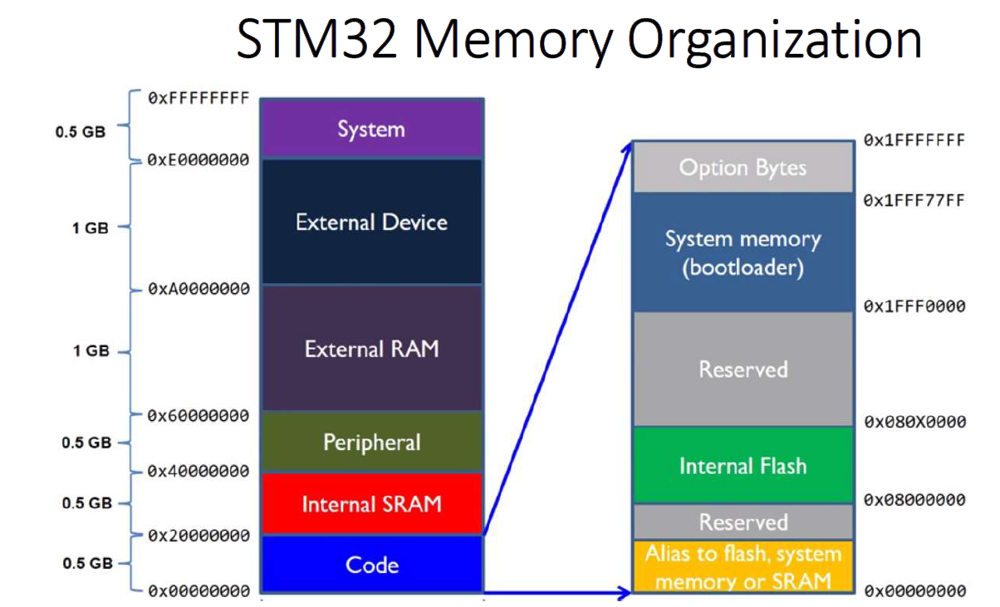
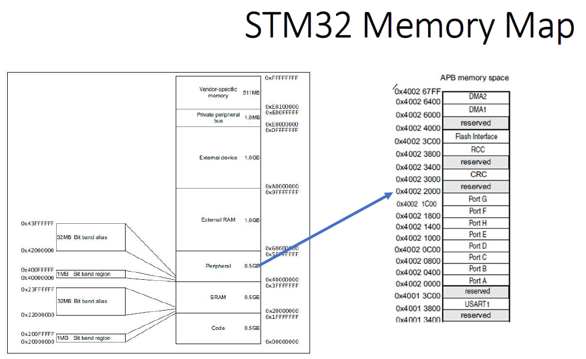

# Microcontroleurs STM32

## Memory map
Les processeurs Cortex-M ont un bus d'adressage mémoire de 32 bits et donc ont 4 Go de mémoire espace. 
Son espace mémoire est unifié, ce qui signifie les instructions et les données partagent même espace d'adressage.
L'espace mémoire de 4 Go est divisé en plusieurs régions.

La configuration d’un microcontrôleur se fait à travers des registres qui sont lus comme une mémoire avec son adresse associé à sa fonctionalité.

La configuration du STM32 peut être soit en big endian, ou en little endian, il faut lire la specificiation du microcontroleur pour le savoir. (L'information est disponible dans le programming manual).

