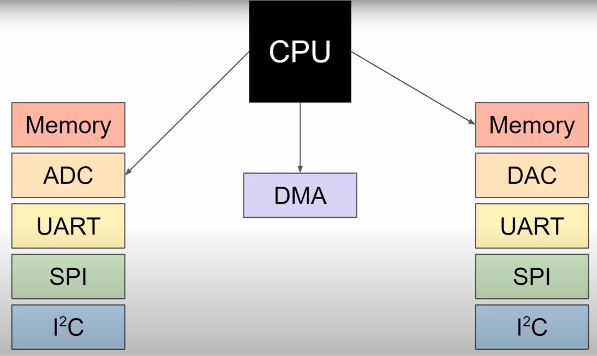
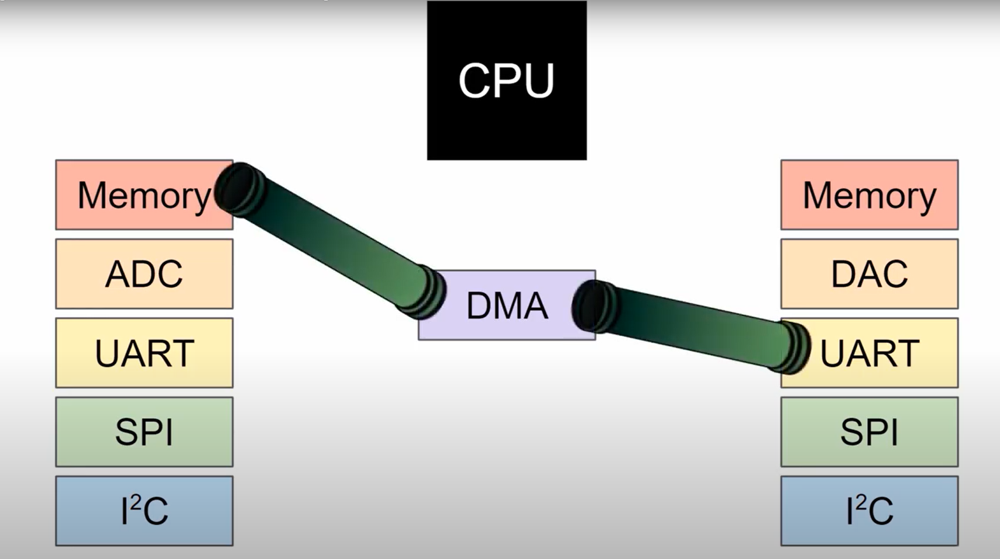
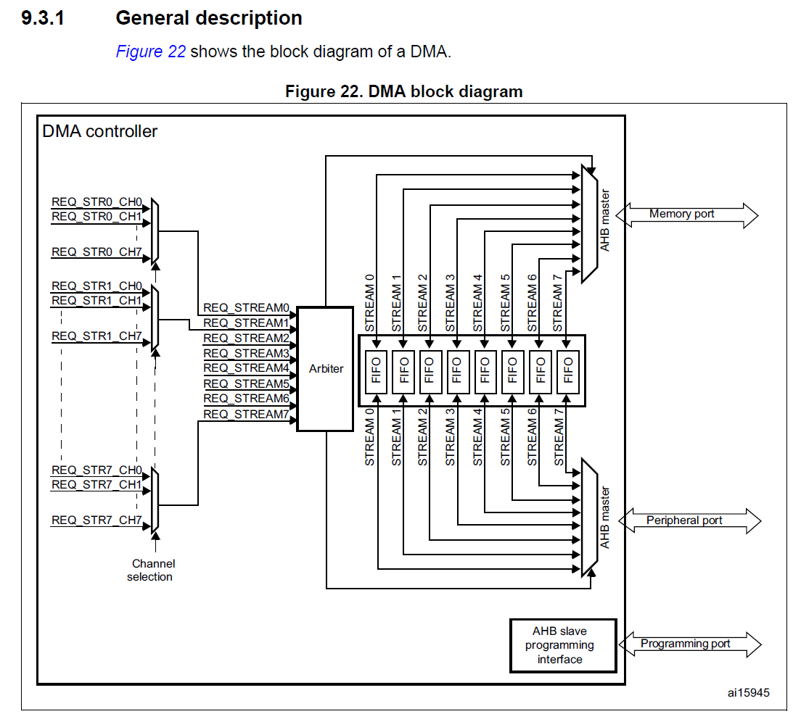
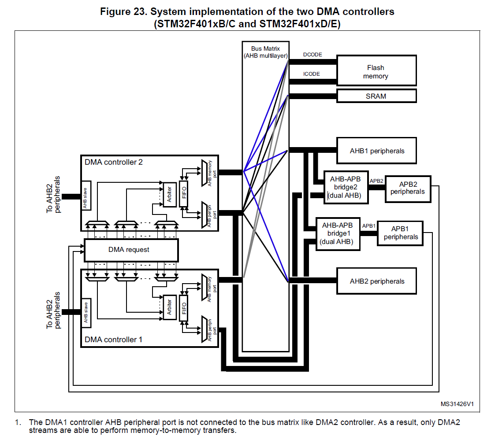
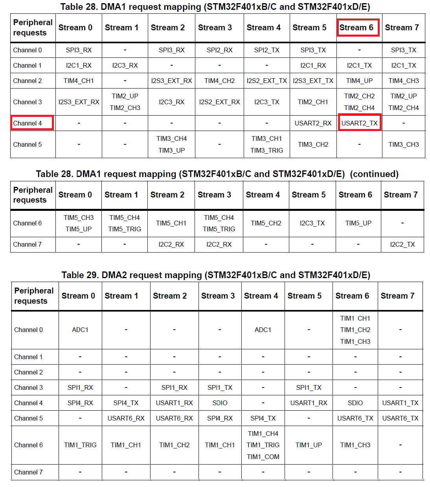
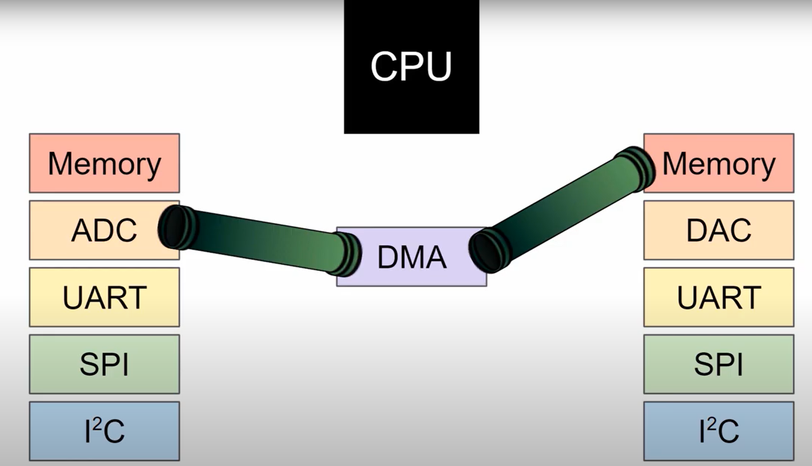
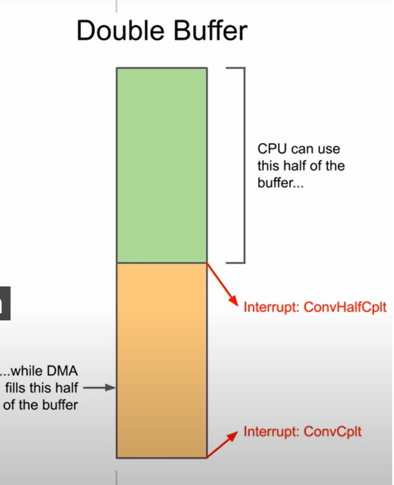

# Le mode DMA dans le STM32.

Imaginons que nous avons un nombre considérable de donnée à traiter où que le traitement doit être rapide : valable par exemple pour la musique, pour les modules d'accélération hardware.

On ne veux pas charger le CPU, donc on va déléguer à un autre périphérique nommé DMA.
De cette façon dans ce tutoriel on va transférer la donnée directement de l'ADC vers un buffer de mémoire.

Ci dessous une vue très simplifiée de l'architecture du microcontrôleur : les périphériques peuvent être interne comme la mémoire, l'ADC, I²C, SPI ...
Normalement tout les données doivent passer par le CPU. 
Par exemple dans le cas de l'ADC on lit la mémoire et on transmet la donnée dans le module UART en passant par le CPU.
Ceci fonctionne très bien mais peut surcharger rapidement le CPU si trop de données sont à transmettre.
Notre STM32 possède un DMA interne qui va nous permettre de faire le travail du CPU.
On prend juste quelques cycles pour configurer le contrôleur DMA en indiquant les différents périphériques.
Dans notre exemple nous transmettrons les données venant de l'ADC vers la mémoire interne du microcontrôleur.



De cette manière le DMA va créer un pipe de donnée entre l'ADC et la Mémoire qui va permettre aux datas de transiter sans utilisation du CPU.
Le contrôleur DMA va continuer de transmettre les données à la mémoire tant que jusqu'à qu'on lui dise de s'arrêter.
Ou qu'on lui a donné des conditions d'arrêt, comme :
- Un buffer complet.

Pour commencer démarrons par un transfert de la mémoire vers un module UART pour que ceci soit plus parlant.

## De la mémoire vers l'UART.

L'objectif est de transmettre un buffer de la mémoire vers l'UART le plus rapidement possible et sans surcharger le CPU.



Il va donc falloir configurer le DMA pour permettre un tel transfert.
Si on regarde dans le Reference Manual : Il y a un chapitre entier qui est dédié à ce module :
Le block diagram nous permet de voir plus clair :



On peut noter que le STM32F401RE a deux périphériques. (DMA1 & DMA2) chacun possède 7 canaux ou channel on peut voir ça comme notre pipe ci dessus.
Attention seulement un channel peut communiquer à la fois !
On peut notter qu'on peut assigner différentes priorités aux canaux. C'est le rôle de l'Arbitrer comme présente ce shémas :



Le second contrôleur DMA fonctionne de manière analogue mais ce dernier est connecté à des périphériques différents.
Il peut être utilisé pour faire du transfert de la mémoire vers la mémoire.
Mais dans l'architecture STM32 , un transfert périphérique vers périphérique n'est pas possible.
Afin de transferer les données de la mémoire regardons la table DMA1 :


On peut voir que le channel 4 est connecté au Stream 6 pour faire de l'émission sur USART2_TX.
C'est ce que l'on va donc utiliser.

Dans STM32CubeIDE on ouvre un nouveau projet CubeMX: en ouvrant un nouveau projet USART2_TX et USART2_RX est déjà initialisé pour nous.
On va utiliser la LED verte du STM32 connecté à la broche PA5 pour s'assurer que le callback d'interruption est bien appelé.

Dans "Pinout & Configuration" aller dans System Core & DMA.
Rajouter une nouvelle requête DMA dans le DMA1 , et selectionner le USART2_TX.
Sauvegarder et générer le code.

On peut noter que dans l'initialisation du DMA, le DMA1,Channel4 est configuré par interruption.
Ce qui veut dire qu'une interruption arrive lorsque le transfert est terminé.

Dans la fonction main déclarer une chaine de caractère en mémoire :
```
char msg[] =  "Long boat holystone pirate log driver hulk nipperkin cog. " \
                "Buccaneer me lass poop deck spyglass maroon jib spike. Come" \
                "about maroon skysail Corsair bilge water Arr long clothes " \
                "transom.\r\n";
```

Ensuite enregister la Callback de la fin de transfert DMA :
HAL_DMA_XFER_CPLT_CB_ID est référencé dans le driver et permet d'indiquer que la callback (DMATransferComplete) est appelée à la fin du transfert.
```
HAL_DMA_RegisterCallback(&hdma_usart2_tx, HAL_DMA_XFER_CPLT_CB_ID,
                            &DMATransferComplete);
```

Dans la boucle While demander un transfert toutes les secondes en scrutation:
huart2.Instance->CR3 |= USART_CR3_DMAT; indique à l'UART qu'on va transmettre les données par DMA.
Il ne faut pas oublier de déactiver cette fonctionalité dans la callback afin de pouvoir utiliser l'UART dans d'autres cas plus commun.
HAL_DMA_Start_IT permet de transmettre le message vers l'USART2_TX (TDR : Transmit Data Register) avec une longeur strlen(msg).
```
while (1)
  {
    huart2.Instance->CR3 |= USART_CR3_DMAT;
    HAL_DMA_Start_IT(&hdma_usart2_tx, (uint32_t)msg,
                    (uint32_t)&huart2.Instance->TDR, strlen(msg));

    HAL_Delay(1000);
```

Rajouter la CallBack DMATransferComplete que l'on a référencé au départ et on fait un toggle sur HAL_GPIO_TogglePin(LD2_GPIO_Port, LD2_Pin) qui indique que le transfert est terminé:

```
void DMATransferComplete(DMA_HandleTypeDef *hdma) {

  // Disable UART DMA mode
  huart2.Instance->CR3 &= ~USART_CR3_DMAT;

  // Toggle LD2
  HAL_GPIO_TogglePin(LD2_GPIO_Port, LD2_Pin);
}
```

Si tout va bien dans le terminal série la phrase doit s'afficher toute les secondes comme demandé :


On peut aussi voir la LED clignoter toute les secondes qui indique que la callback est bien appelée et les données bien affichée.

## ADC vers la mémoire.
Si on reproduit le même résonnement que pour la mémoire vers ADC on remarque que l'ADC1 est sur le DMA2, Stream0.



Reproduire le montage avec l'ADC :


D'après notre Block Diagram : Notre ADC1 est sur un bus APB2 cadencé à 84MHz.
La résolution de notre ADC est de 12 bits : Prend un 2.5 cycles pour sampler une donnée et 12.5 cycles pour faire la converssion. (soit 15 ADC Clock cycles)
Avec une clock de 80MHz on obtient alors un max de 84/15 = 5.6Msample/sec.
Nous allons ensuite activer le mode de convertion continue qui va permettre à l'ADC de convertir continuellement les données d'un channel et les stocker dans la mémoire.
Si on ne lis pas assez rapidement il va simplement renvoyer une erreur, ou écris par dessus la valeur des registres.
De plus avec le DMA on peut garder toutes ces valeurs en mémoire.

Il faut alors se rendre dans "SystemCore" et activer la requête DMA sur le périphérique ADC1.
Dans le mode normal le transfert DMA va stopper lorsqu'il a fini de remplir le buffer.
On peut mettre le mode en mode Circular afin de répéter circulairement l'opération.
Soyez sur de lire assez rapidement la donnée sinon elle sera perdue.
On veut incrémenter l'addresse mémoire à chaques lecture. 
Mais on laisse l'addresse du périphérique décoché car il n'existe qu'un registre d'ou provient la donnée ADC.
La taille de la donnée est donnée pour un "Half Word" soit 16 bits. Ce qui fonctionne car notre résolution ADC est donnée à 12 bits.
Donc c'est une bonne taille pour nos données.
Dans le module ADC il faut maintenant activer DMA Continuous Request. 

Sauvegarder et générer le code.

On va donc définir une taille de donnée pour stocker nos valeurs :
```
#define ADC_BUF_LEN 4096
```

On va créer un tableau de buffer de 16 bits pour stocker ces valeurs :
```
uint16_t adc_buf[ADC_BUF_LEN];
```

La library HAL nous donne une fonction qui nous permet de lancer le DMA attaché à l'ADC. 
On a juste à lui donner une instance ADC , le buffer et la taille du buffer :
```
HAL_ADC_Start_DMA(&hadc1, (uint32_t*)adc_buf, ADC_BUF_LEN);
```

Maintenant il faut rajouter des callbacks qui seront appelée lorsque le buffer est plein :
HAL_ADC_ConvHalfCpltCallback() et HAL_ADC_ConvCpltCallback(). Le premier est appelé chaque fois que l’ADC (et le DMA) remplit la moitié du tampon. La seconde fonction est appelée chaque fois que la seconde moitié du tampon est remplie.
Comme nous sommes en mode circulaire ceci va nous permettre de détecter le remplissage de la moitié du buffer.



Si on met un point d'arrêt sur le Half, on s'apperçoit que le buffer est entièrement remplis. Ce qui veux dire que même si le CPU est arrété, le transfert des données continue.
Si on observe ceci à l'oscilloscope via l'état de la LED : (Adresse : 0x40020019)
On s'aperçoit en réalité (il faut un oscilloscope) pour le voir que pour remplir un buffer de 2048: 16 bits il faut environs 472us.


En comparaison il nous fallait 9us pour lire 1 bytes sur un ADC sans DMA. Si on multiplie cette valeur par 2048 : il nous faudrait alors 18432us pour remplir un buffer de 16 bits x 2048.
Le gain de temps est conséquent et le CPU est tranquille pendant ce laps de temps :).

Une façon d'accélérer encore le transfert est de réduire la résolution de l'ADC : pour transmettre moins de donnée et être encore plus rapide.


