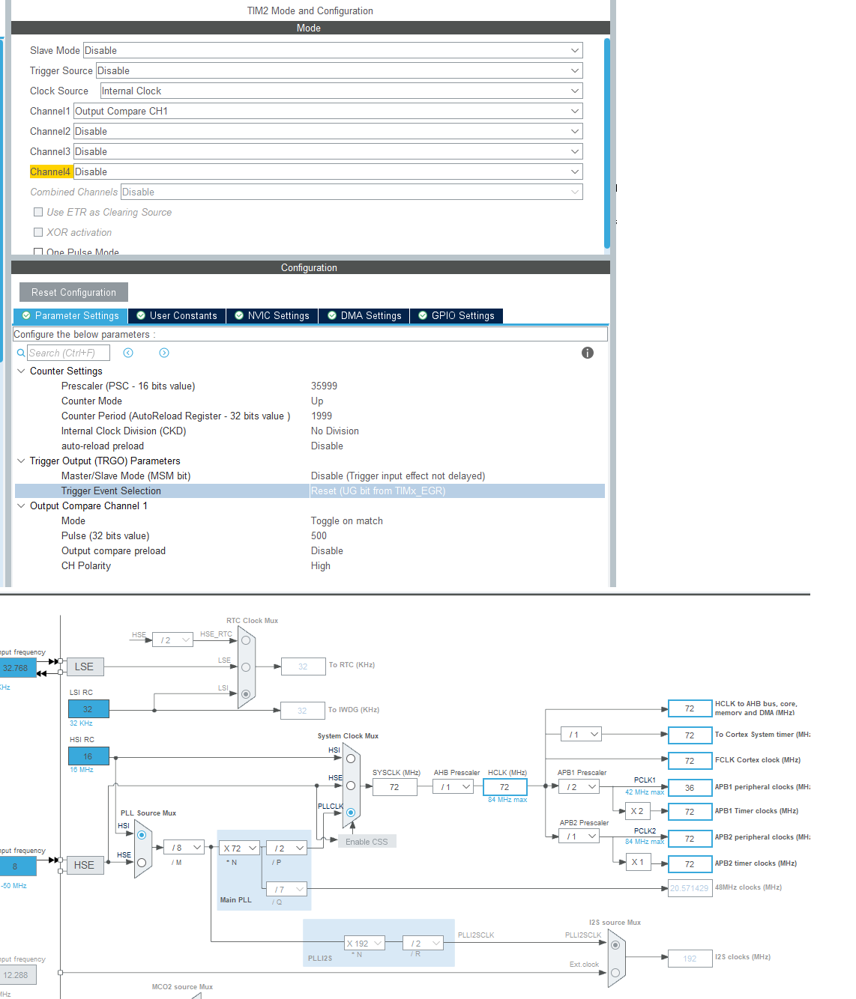

# STM32 Compare Output Mode

Après avoir setté la LED sur TM2_CH1 on peut faire un toggle hardware avec les paramètres suivants.
Et en appelant l'OC (Output compare dans la fonction main).




```
int main(void)
{
  /* USER CODE BEGIN 1 */

  /* USER CODE END 1 */

  /* MCU Configuration--------------------------------------------------------*/

  /* Reset of all peripherals, Initializes the Flash interface and the Systick. */
  HAL_Init();

  /* USER CODE BEGIN Init */

  /* USER CODE END Init */

  /* Configure the system clock */
  SystemClock_Config();

  /* USER CODE BEGIN SysInit */

  /* USER CODE END SysInit */

  /* Initialize all configured peripherals */
  MX_GPIO_Init();
  MX_USART2_UART_Init();
  MX_TIM2_Init();
  /* USER CODE BEGIN 2 */
  HAL_TIM_OC_Start(&htim2, TIM_CHANNEL_1);
  /* USER CODE END 2 */

  /* Infinite loop */
  /* USER CODE BEGIN WHILE */
  while (1)
  {
    /* USER CODE END WHILE */

    /* USER CODE BEGIN 3 */
  }
  /* USER CODE END 3 */
}
```