# Timers et Interruptions

Les timers est une fonctialités très intéréssante dans les microcontroleurs.
Les timers sont permettent de :
- De compter le nombre de coup d'horloge.
- Créer des délais
- Générer des interruptions périodiques.
- Mesurer le temps entre deux événements.
- Créer des signaux PWM par exemple

Le but de ce dossier est de créer un timer basique à base de STM32.

Les Timers commence par utiliser le "Main CPU Clock" qui correspond à HCLK (dans la datasheet) autrement dit l'horloge du CPU principal.
Ce dernier signal est connecté à un Prescaler qui permet de diviser la fréquence de l'horloge.
Le signal de sortie permet d'alimenter un Timer counter qui va compter à la fréquence de 1MHz soit une incrémentation tout les 1/1MHz = 1us.
Et compte jusqu'à une valeur maximale qu'on lui a donné.

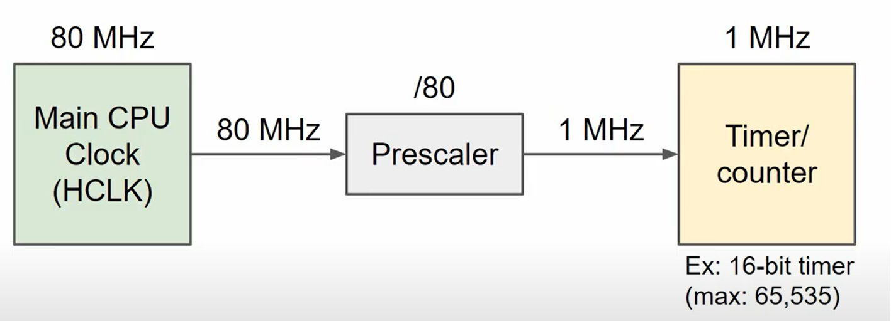

Le STM32 possède plusieurs timers qui sont utilisable pour différentes utilisations en parralèle.
Celui que je compte utiliser possède un compteur 16 bits ce qui signifie que le timer counter est capable de compter que jusqu'à 65535 (2^16-1).

Ainsi pour ce tutoriel je vais utiliser le NUCLEO-F401RE. Si je regarde la datasheet de ce microcontroleur : (disponible dans le dossier NUCLEO-F401RE ou sur site constructeur)
Dans le Menu 3.24 : Timers and watchdogs :

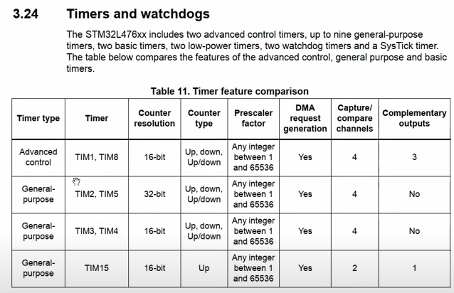

On peut voir qu'on a une multitude de Timer à notre disposition.
Je vais choisir pour ce cas le Timer10 qui possède des fonctionalités limités mais qui me suffise.
On peut noter dans la datasheet juste en dessous : que le microcontrôleur possède d'autres timers comme des timers de Watchdog qui permette de détecter les anomalies et d'eventuellement reset la carte en cas d'anomalie.
On peut aussi voir un Timer nommé SysTick, ce dernier est une référence pour la fonction delay : on ne veux donc pas intéferer avec ce dernier.
Il est particulièrement utilise dans une utilisation temps réel, car il sert de base pour scheduler/ordonnancer les tâches.

Il faut donc maintenant voir comment connecter les clocks : ainsi dans la datasheet on trouve le menu "Clock and startup" qui permet de comprendre comment tout ça est relié.
On a encore le Block Diagram (Qui permet d'avoir une vue d'ensemble des branchements du microcontrôleur)

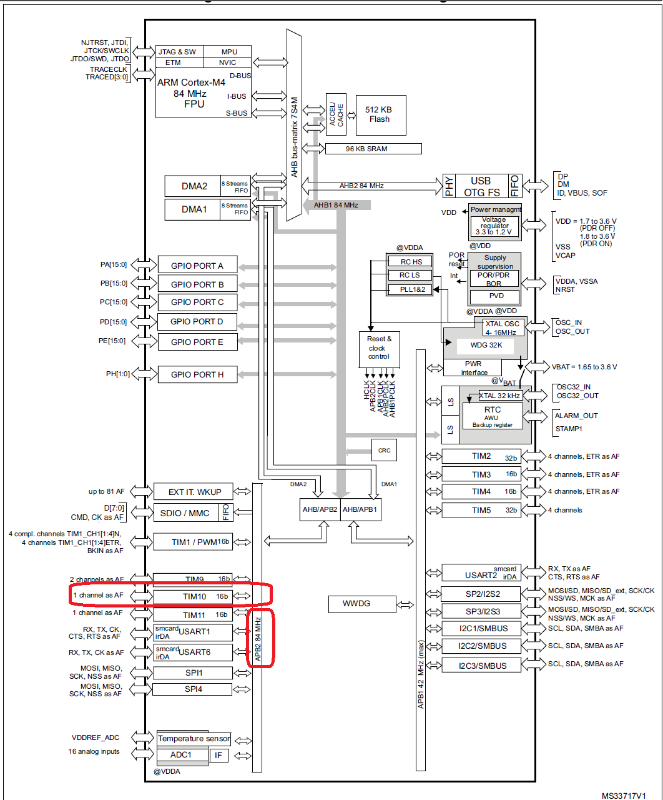

On trouve aussi que le Timer 10 est bien adapté à notre besoin car ils sont sur des canaux différents:
These timers are based on a 16-bit auto-reload upcounter and a 16-bit prescaler.
TIM10 and TIM11 feature one independent channel.
Sont on cherche plus d'informations dans le Reference Manual du NUCLEO-F401RE : on trouve le block diagram suivant
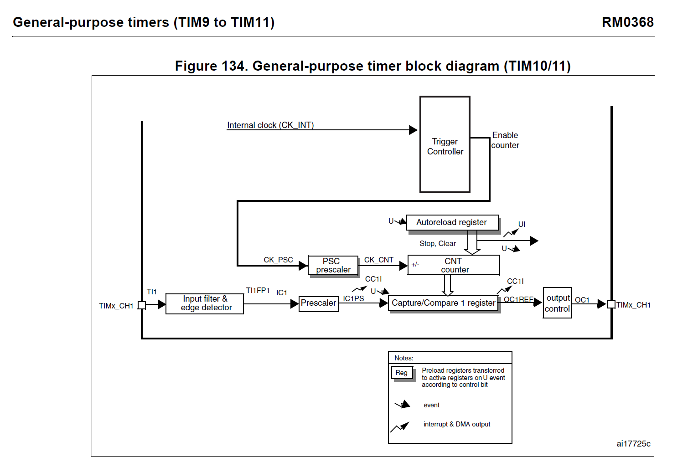

Ce dernier nous permet de voir que le TIM10 est cadencé par l'internal clock CK_INT et que le prescaler est le CK_PSC.
Ce qui est confirmé par la suite : The internal clock source is the default clock source for TIM10/TIM11.

Maintenant qu'on a compris le fonctionnement d'un Timer il faut configurer ce dernier, les registres de configurations sont référencés dans un memery map aussi disponible dans le Reference Manual :
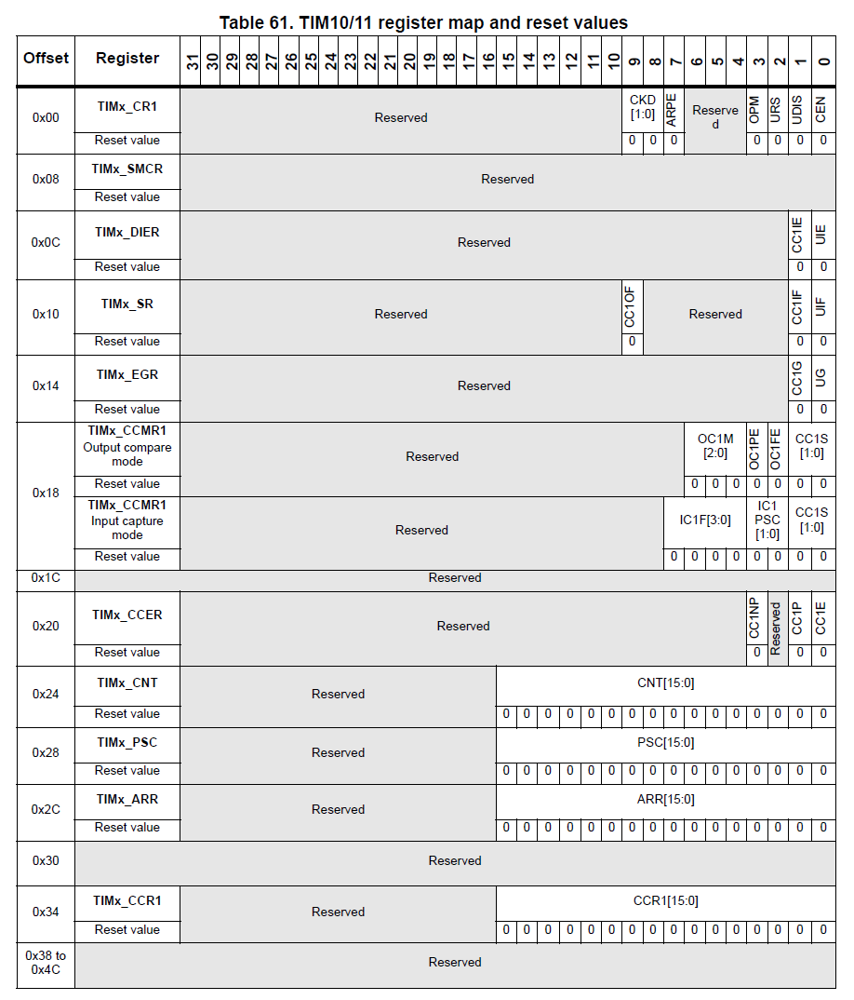

Dans notre cas on va aller plus rapidement car CubeMX va configurer tout ça pour nous, mais il est utile de noter l'addresse de ces registres.
Qui pourront par la suite nous être très utile : je pense par exemple au registre : TIMx_CNT à l'addresse 0x40014400 + l'offset à 0x24 = 0x40014424 qui va nous permettre de récupérer la valeur du compteur.

## Création du projet CubeMX.

Dans l'onglet Clock Configuration on retrouve la fréquence de l'horloge principale du CPU : HCLK on sait que notre Timer est relié au bus APB2 on identifie alors quels sont les valeurs à modifier si besoin :
Dans cette partie on peut modifier la configuration des Prescaler mais attention cela peut changer aussi la fréquence de d'autres périphériques : voir le block diagram général.

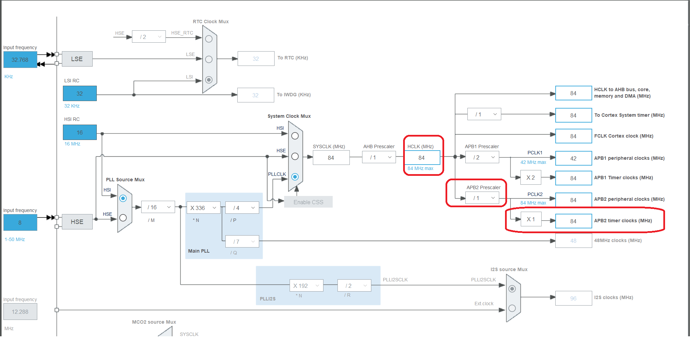

Pour notre cas nous allons laisser la config à 84 MHz : On remarque qu'on utilise une PLL qui nous permet de monter en fréquence.
Dans le "Pinout & Configuration" il faut maintenant activer notre TIMER10 :

Dans Timers : Cliquer sur enable pour activer le Timer10, et rentrer les valeurs souhaitées afin d'avoir un comptage à la fréquence voulue.
L'onglet Channel, nous permet de faire une connection Hardware avec d'autres composants. Et ceci est relatif au Timer Selectionné c'est à titre le TIMER10.
Par exemple :
- Input Capture nous permet de stocker automatiquement la valeur du compteur quand un événement arrive sur une broche.
- Output Compare nous permet de faire basculer une pin quand la valeur du compteur atteint une certaine valeure.
- PWM nous permet de basculer une PIN suivant une durée de cycle basé sur une valeur de compteur. (Requiert l'utilisation d'une pin spécifique). Peut être très pratique car ces fonctions hardware ne seront pas traité par le CPU par la suite.

Pour notre cas nous n'utiliseront aucune de ces fonctions mais elles existent !
Nous allons pour notre cas mettre un Prescaler à 84-1 : Car la valeur 0 signigie une division par 1, 1 une division par 2, 2 une division par 3 (etc ...).
Ainsi en sortie de notre Prescaler on aura un signal à 1MHz.
L'autoReload Register est l'endroit qui nous permet de rentrer la valeur maximale que peut compter le compteur.
Ne pas mettre 0 : sinon le compteur ne comptera pas.
Pour notre cas on veut qu'il compte jusqu'à sa valeur maximale.
65535 soit pour 1Mhz : 65535us = 65.535ms.

On laisse les autres paramètres par défaut.
On peut maintenant sauvegarder le tout en faisant CTRL+S et ouvrir le fichier main.c disponible dans le dossier "Core".

Parce que l'on veux afficher la valeur dans le terminal série on commence par inclure : `#include <stdio.h>`
On commence ensuite à déclarer un buffer dans la fonction main pour faire un affichage :
Ainsi qu'une variable remettant d'engistrer la longeur du buffer, et enfin un uint16 qui permettra de stocker la valeur du compteur.
```
uint16_t timer_val;
```

Dans la phase d'initialisation rajouter :
```
//Start Timer
HAL_TIM_Base_Start(&htim10);
```
Dans la boucle while rajouter :
```
	  /* USER CODE END WHILE */
	  timer_val = __HAL_TIM_GET_COUNTER(&htim10);

	  //Wait 50ms
	  HAL_Delay(1);
```

On remarque qu'on obtient un graph en marche d'escalier en effet: dans notre boucle on procède par scrutation en lisant la valeur du timer tout les ms.
Le retour à 0 est géré par l'autoreload (à 65335) et permet de revenir à 0.
On remarquera que l'utilisation de fonction HAL_Delay revient en scrutation et ne permet pas de faire autre chose en attendant. On perd donc du temps CPU.
Comme le montre ce graph :

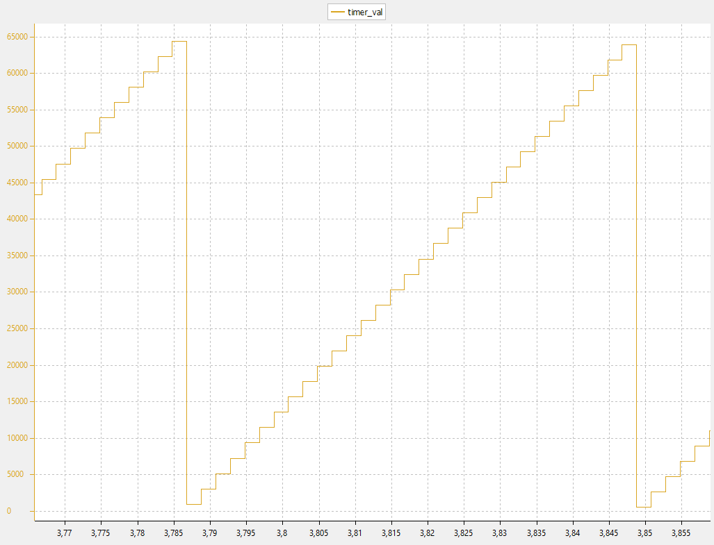

D'où l'intérêt de procéder par interruption, de plus qu'être plus précis, on ne fonctionne pas sous scrutation et on libère ainsi de la charge CPU.

Pour un second exemple toujours en scrutation avec un prescaler à 8400 : 84MHz/8400 = 10kHz = 0.0001seconde = 0.1ms
Si on souhaites faire un toggle après 1 seconde et le reste dans le second état on peut écrire le code suivant : 10000 correspond à 10000x0.1ms = 1s
```
timer_val = __HAL_TIM_GET_COUNTER(&htim10);
while(1)
{
	if (__HAL_TIM_GET_COUNTER(&htim10) - timer_val >= 10000)
	{
		HAL_GPIO_TogglePin(GPIOA,GPIO_PIN_5);
		timer_val = __HAL_TIM_GET_COUNTER(&htim10);
	}
}
```
Le bit qui change ici est à l'addresse 0x40020014+5 (GPIO_PIN_5) = 0x40020019 nous permet de voir le graph et la LED évoluer en réel suivant le graph.

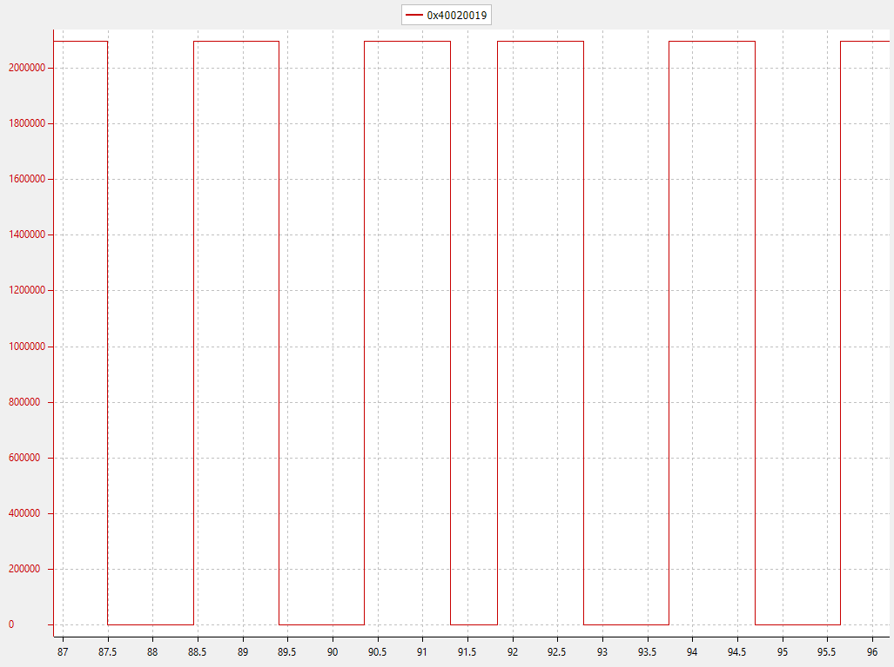

On remarque que si l'on change l'autoreload register à 20000-1 on obtiendra alors une temporisation parfaite à 1seconde.

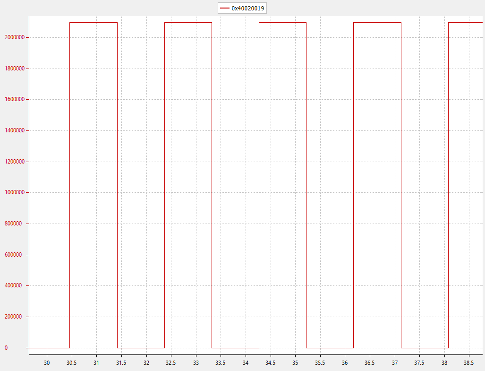

On va maintenant faire la même chose mais en interruption :
A chaques fois que le compteur reviens à 0. On va détecter ce retour à 0 et déclencher un événement ou callback.
Qui va nous permettre alors de changer l'état de la LED par exemple.

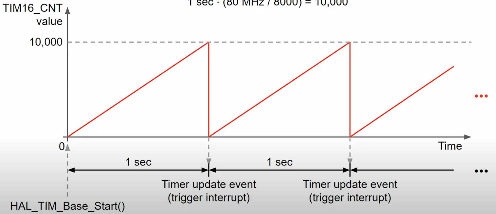

Pour notre cas on va changer le Counter Period à 10000 afin d'obtenir un retour à 0 toutes les secondes.
Ensuite dans les NVICs settings il faut Enable le TIM10 global interrupt. Qui va nous permettre de le relier à la CallBack.
 
Il faut donc mettre dans le code l'appelle d'une interruption sur Timer avec la fonction :
```
HAL_TIM_Base_Start_IT(&htim10);
```

La table des interruptions nous donne ce prototype de fonction :
```
/**
  * @brief This function handles TIM1 update interrupt and TIM10 global interrupt.
  */
void TIM1_UP_TIM10_IRQHandler(void)
{
  /* USER CODE BEGIN TIM1_UP_TIM10_IRQn 0 */

  /* USER CODE END TIM1_UP_TIM10_IRQn 0 */
  HAL_TIM_IRQHandler(&htim10);
  /* USER CODE BEGIN TIM1_UP_TIM10_IRQn 1 */

  /* USER CODE END TIM1_UP_TIM10_IRQn 1 */
}
```

Lorsqu'on rentre ainsi dans cette fonction on va dans la fonction générique : `HAL_TIM_IRQHandler(&htim10);`

Lorsqu'on lit le code il y a plusieurs sources d'interruption :
Pour notre cas nous sommes dans le cas d'un event mise à jour :
```
/* TIM Update event */
  if (__HAL_TIM_GET_FLAG(htim, TIM_FLAG_UPDATE) != RESET)
  {
    if (__HAL_TIM_GET_IT_SOURCE(htim, TIM_IT_UPDATE) != RESET)
    {
      __HAL_TIM_CLEAR_IT(htim, TIM_IT_UPDATE);
#if (USE_HAL_TIM_REGISTER_CALLBACKS == 1)
      htim->PeriodElapsedCallback(htim);
#else
      HAL_TIM_PeriodElapsedCallback(htim);
#endif /* USE_HAL_TIM_REGISTER_CALLBACKS */
    }
```

Ainsi la fonction nous renvoi vers une autre fonction appelée `HAL_TIM_PeriodElapsedCallback(htim);`

Que nous devons déclarer.
Ce que nous allons faire dans le main :
```
/* USER CODE BEGIN 4 */
void HAL_TIM_PeriodElapsedCallback(TIM_HandleTypeDef *htim)
{
	if(htim == &htim10){
		HAL_GPIO_TogglePin(GPIOA, GPIO_PIN_5);
	}
}
/* USER CODE END 4 */
```

On obtient ainsi ce que l'on recherche :
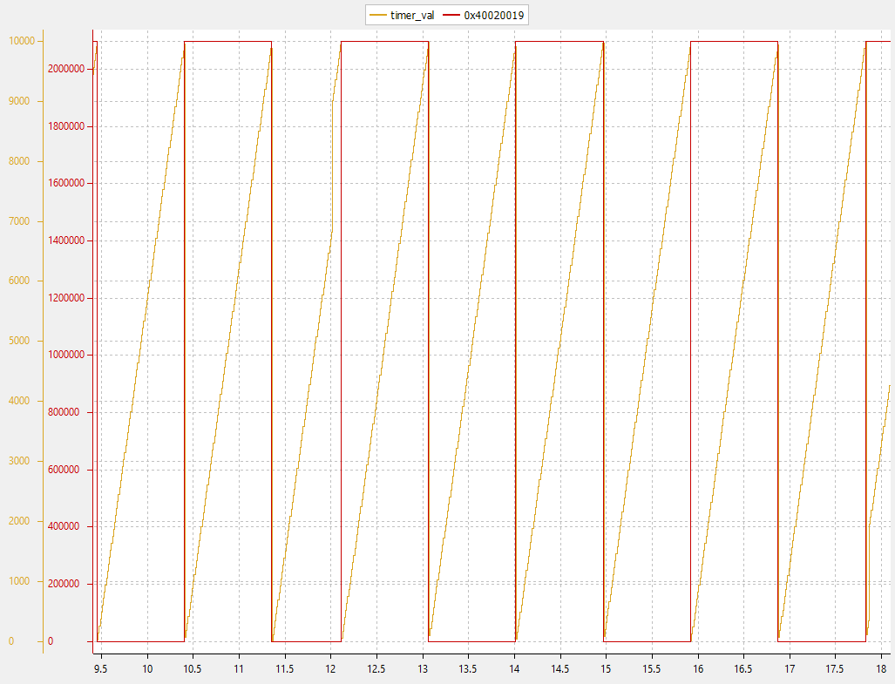

Afin d'obtenir cette affichage j'ai rajouté dans le main pour scruter la valeur du timer:
```
timer_val = __HAL_TIM_GET_COUNTER(&htim10);
HAL_Delay(10);
```


Référence : Tutoriel digikey : https://www.youtube.com/watch?v=VfbW6nfG4kw


